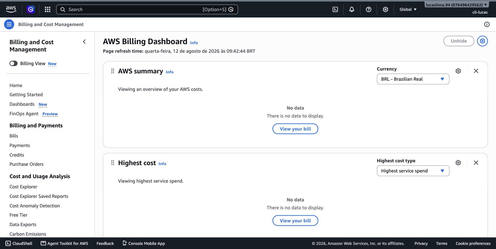
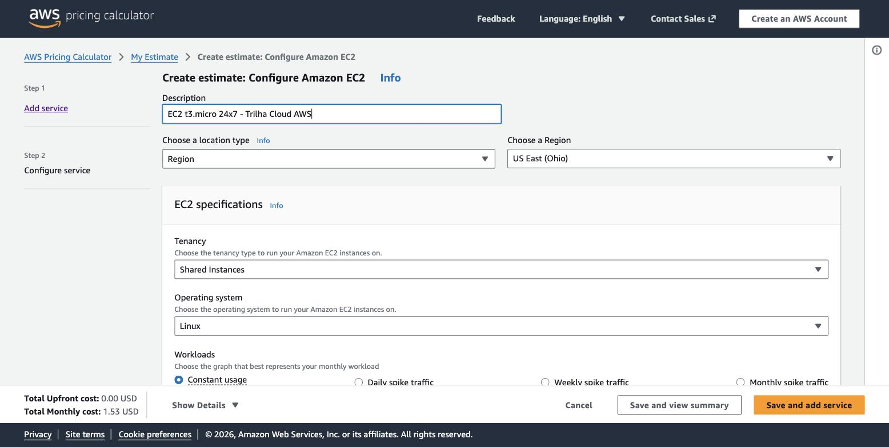
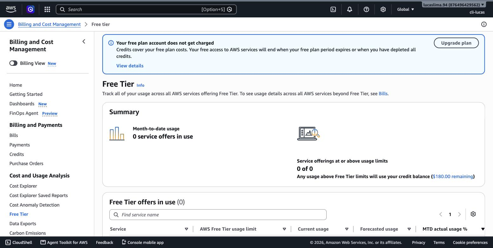
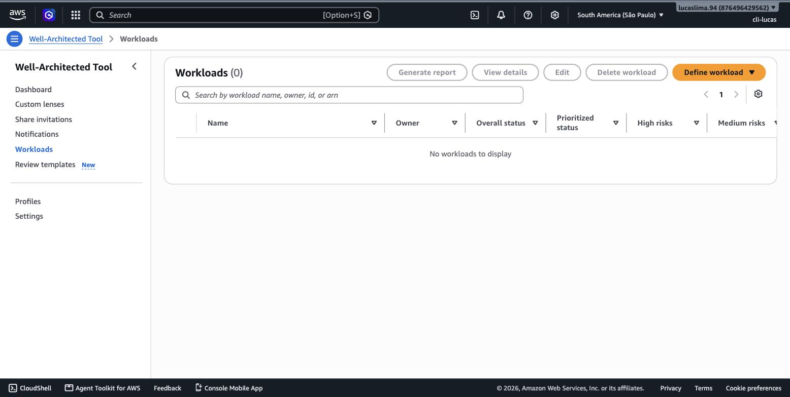

# Módulo 01 — Visão Geral dos Conceitos de Nuvem

> **Objetivo**: entender o que a computação em nuvem é de fato — não como uma lista de serviços, mas como uma mudança de modelo econômico e operacional — e reconhecer o vocabulário (implantação, serviço, responsabilidade) que sustenta todo o resto da trilha. E, desde já, colocar as mãos no Console real da AWS: este módulo não é só leitura.
>
> **Pré-requisitos**: nenhum. Este é o primeiro módulo — mas você precisa ter concluído a seção "Antes do módulo 1" do `00_indice.md` (conta Free Tier criada, MFA na root, usuário IAM administrativo, billing alarm configurado) antes de começar, porque os prints abaixo assumem que você já está logado.
>
> **Tempo de referência (não prazo)**: uma a duas semanas em ritmo moderado.
>
> Este módulo corresponde ao **Domínio 1 — Cloud Concepts** do exame CLF-C02 (24% do conteúdo pontuado), principalmente às Task Statements 1.1 (benefícios da AWS Cloud) e 1.4 (economia de nuvem). Página oficial: https://docs.aws.amazon.com/aws-certification/latest/cloud-practitioner-02/cloud-practitioner-02-domain1.html. Lembrando o que já está registrado no índice: toda esta trilha segue o **CLF-C02**, a versão vigente do exame desde que substituiu o CLF-C01, aposentado em 18 de setembro de 2023.

---

## Por que começar por aqui

É tentador pular direto para "como eu crio uma máquina virtual na AWS", porque isso parece o conhecimento útil de verdade. O problema é que sem entender por que a nuvem existe — que problema ela resolve e que trade-off ela introduz — você aprende os serviços como uma lista de nomes decorados, e decoreba não passa em prova nem sobrevive ao primeiro projeto real. Este módulo constrói o vocabulário conceitual que todos os módulos seguintes vão usar sem reexplicar, e já começa a te colocar dentro do Console, porque é ali que esse vocabulário vira prática.

## O problema que a nuvem resolve

Antes de existir "a nuvem" como a conhecemos hoje, uma empresa que precisava rodar um sistema tinha, essencialmente, duas escolhas: comprar e manter seus próprios servidores num datacenter próprio, ou alugar espaço e equipamento de um provedor. Em ambos os casos, a decisão de capacidade tinha que ser tomada com meses ou anos de antecedência. Se uma loja virtual esperava vender bem no fim de ano, ela precisava comprar servidores suficientes para aguentar o pico da Black Friday — e esses mesmos servidores, no resto do ano, ficavam ociosos, consumindo espaço, energia e manutenção sem gerar valor proporcional. Errar essa previsão para baixo significava site fora do ar na hora que mais importava; errar para cima significava dinheiro parado em hardware subutilizado. Não havia meio-termo confortável, porque hardware físico não se ajusta em tempo real à demanda real.

A computação em nuvem resolve exatamente esse problema: ela transforma capacidade computacional — processamento, armazenamento, rede, banco de dados — em um recurso que pode ser provisionado e liberado sob demanda, pago pelo uso real, e não pela capacidade máxima que alguém teve que comprar antecipadamente "por garantia".

> `[TEORIA]` Para a prova: a definição formal de computação em nuvem é a entrega sob demanda de recursos de TI pela internet, com um modelo de pagamento por uso. O que define "nuvem" tecnicamente não é onde o hardware está — é o modelo de consumo: elástico, sob demanda, medido e self-service. Um servidor alugado por contrato fixo de anos, sem elasticidade nenhuma, não é computação em nuvem nesse sentido técnico, mesmo estando "na internet".

## Vendo o pagamento por uso na prática: o painel de billing

A melhor forma de entender "pagamento por uso" não é ler a definição — é abrir o painel que mede esse uso em tempo real. É para isso que existe o **AWS Billing and Cost Management**, o painel central onde a AWS mostra, com granularidade de serviço e de dia, exatamente quanto sua conta está consumindo.

> `[PRINT]` Passo a passo para capturar: logado no AWS Management Console com o usuário IAM administrativo, clicar no nome da conta no canto superior direito e selecionar "Billing and Cost Management" (ou buscar "Billing" na barra de busca do Console). Capturar a tela inicial do painel, mostrando o card de "Custo total do mês até agora" (ou equivalente em português) e o gráfico de tendência de gastos — mesmo que os valores estejam zerados por não haver recursos criados ainda.

Repare que esse painel existe independentemente de você já ter criado algo: ele é a prova de que a AWS mede consumo antes mesmo de você gerar consumo. Esse é o "medidor" físico da virada econômica que a próxima seção explica.

## De CAPEX para OPEX: a virada que financia tudo

A diferença entre comprar hardware e alugar capacidade sob demanda não é só operacional, é contábil, e essa distinção contábil é o motivo real pelo qual empresas migram para a nuvem em massa. Quando uma empresa compra servidores, esse gasto entra no balanço como **CAPEX** (capital expenditure, despesa de capital): um investimento grande, feito de uma vez, que se deprecia ao longo de anos. CAPEX exige capital disponível antecipadamente, trava esse capital em um ativo que perde valor com o tempo, e obriga a empresa a acertar a previsão de capacidade com anos de antecedência.

Quando, em vez disso, a empresa paga pela AWS conforme usa os recursos, esse gasto vira **OPEX** (operational expenditure, despesa operacional): um custo recorrente, proporcional ao uso, sem imobilização de capital antecipado. Isso muda o cálculo de risco de um projeto inteiro. Uma startup testando uma ideia nova não precisa levantar capital para comprar servidores antes de saber se o produto vai vingar — ela paga centavos por hora enquanto testa, e pode desligar tudo sem prejuízo se a ideia não funcionar.

Para ver esse número de forma concreta, a AWS disponibiliza a **AWS Pricing Calculator**, uma ferramenta separada do Console (não precisa estar logado nela) que simula o custo mensal de qualquer combinação de serviços antes de você criar um único recurso real.

> `[PRINT]` Passo a passo para capturar: acessar `calculator.aws` em uma aba do navegador, clicar em "Create estimate", buscar e adicionar o serviço "Amazon EC2", configurar uma instância do tipo `t3.micro`, sistema operacional Linux, região "South America (São Paulo)", uso de 730 horas por mês (equivalente a 24x7). Capturar a tela mostrando o resumo da estimativa com o custo mensal calculado, no painel lateral ou inferior da ferramenta.

Compare mentalmente esse número mensal com o custo de comprar um servidor físico equivalente: o hardware em si (capital imobilizado de uma vez, CAPEX), mais energia, resfriamento, espaço físico e alguém para mantê-lo fisicamente — custos que não aparecem na calculadora da AWS porque, no modelo OPEX, eles já estão embutidos no preço por hora que a AWS cobra.

> `[TEORIA]` Para a prova: CAPEX é gasto de capital antecipado que se deprecia ao longo do tempo; OPEX é gasto operacional recorrente, proporcional ao uso. A adoção de nuvem pública desloca o modelo predominante de CAPEX para OPEX — essa é a frase-chave que costuma aparecer nas alternativas do exame sobre economia de nuvem.

## Os benefícios centrais da AWS

A AWS costuma organizar sua proposta de valor em um punhado de benefícios que, juntos, formam a lógica completa por trás de "por que usar nuvem em vez de infraestrutura própria". Vale entender cada um não como slogan de marketing, mas como consequência direta do modelo de pagamento por uso que acabamos de ver funcionando no painel de billing.

**Elasticidade** é a capacidade de aumentar ou reduzir a capacidade computacional automaticamente, em minutos, em resposta à demanda real — e não à demanda prevista. Isso é o que resolve o problema da Black Friday: em vez de comprar servidores suficientes para o pico do ano inteiro, a infraestrutura cresce quando o tráfego cresce e encolhe quando ele cai. O módulo 6 vai mostrar exatamente o mecanismo técnico por trás disso (Auto Scaling), mas o conceito nasce aqui.

**Agilidade** é a velocidade com que uma nova ideia pode virar infraestrutura funcionando — minutos em vez de semanas de aprovação de compra de hardware.

**Alcance global** decorre diretamente da infraestrutura física da AWS, espalhada por dezenas de regiões no mundo — o assunto central do módulo 2, que começa exatamente de onde este módulo termina.

**Economia de escala** é o benefício menos intuitivo, mas talvez o mais estrutural: como a AWS agrega a demanda de milhões de clientes, ela compra hardware, energia e conectividade em volumes que nenhuma empresa individual conseguiria negociar sozinha, e repassa parte dessa eficiência em preços mais baixos ao longo do tempo.

`[APROFUNDAMENTO]` A AWS lista formalmente seis vantagens da nuvem em seu material oficial (trocar CAPEX por OPEX; economia de escala; parar de adivinhar capacidade; velocidade e agilidade; parar de gastar dinheiro mantendo datacenters; e ir global em minutos). Para o Cloud Practitioner, basta reconhecer e explicar cada uma; uma análise quantitativa de TCO (Total Cost of Ownership) comparando nuvem versus datacenter próprio, com todas as variáveis de negócio, já é um exercício de nível Solutions Architect.

## Confirmando que você não vai gastar mais do que deveria: o Free Tier

Antes de qualquer laboratório desta trilha te pedir para criar um recurso de verdade, vale conhecer a ferramenta que garante que a prática vai custar zero (ou perto disso): o **AWS Free Tier dashboard**, dentro do próprio Billing and Cost Management, mostra exatamente quanto do limite gratuito mensal cada serviço já consumiu.

> `[PRINT]` Passo a passo para capturar: dentro de "Billing and Cost Management", no menu lateral esquerdo clicar em "AWS Free Tier" (ou buscar "Free Tier" na barra de busca do Console). Capturar a tela mostrando a tabela de serviços com colunas de limite gratuito, uso atual e previsão de uso — mesmo que todos os valores estejam em 0% de uso.

Esse painel vai ser sua referência de segurança em todos os laboratórios práticos futuros desta trilha: sempre que um módulo pedir para criar um recurso, o hábito certo é checar aqui depois, não só confiar na memória.

## Modelos de implantação: onde a infraestrutura mora

Nem toda adoção de nuvem significa "tudo na AWS e mais nada". Existem três modelos de implantação, e a diferença entre eles é sobre *onde* a infraestrutura fisicamente roda e *quem* a compartilha com você.

Na **nuvem pública**, a infraestrutura é de um provedor (a AWS, por exemplo) e é compartilhada entre múltiplos clientes, com isolamento lógico garantido por software. É o modelo padrão, o mais barato por unidade de capacidade, e o que esta trilha usa em todos os laboratórios — é literalmente o que você acabou de ver no painel de billing acima: sua conta compartilhando a mesma infraestrutura física da AWS que milhões de outras contas, sem que uma veja a outra.

Na **nuvem privada**, a infraestrutura é dedicada a uma única organização, sem compartilhamento com outros clientes — comum em setores com exigências regulatórias rígidas sobre onde e como os dados podem ser processados.

O **modelo híbrido** combina os dois: parte da infraestrutura permanece on-premises e parte roda na nuvem pública, conectadas entre si. Empresas em transição — que não migraram tudo de uma vez, ou que têm um sistema legado impossível de mover — vivem nesse modelo por anos. O módulo 4 vai mostrar os mecanismos técnicos que viabilizam essa ponte (VPN e Direct Connect).

> `[TEORIA]` Para a prova: os três modelos de implantação são pública, privada e híbrida — não confundir com os modelos de *serviço* (IaaS, PaaS, SaaS) da próxima seção. São dois eixos independentes: um responde "onde a infraestrutura está", o outro responde "quem gerencia cada camada da pilha". A prova costuma testar exatamente essa confusão colocando as duas categorias na mesma alternativa.

## Modelos de serviço: onde termina a sua responsabilidade

Se o modelo de implantação responde "onde", o modelo de serviço responde "quem cuida de quê". Pense numa pilha de tecnologia como camadas empilhadas: infraestrutura física, virtualização, sistema operacional, runtime, dados e aplicação. Em uma operação totalmente on-premises, a própria empresa cuida de todas essas camadas. Os três modelos de serviço em nuvem são diferentes pontos de corte nessa pilha.

**Infrastructure as a Service (IaaS)**: o provedor cuida da infraestrutura física, virtualização e rede; você recebe um servidor "cru" e instala o resto. Mais controle, mais responsabilidade operacional. Uma instância EC2 (módulo 9) é o exemplo canônico de IaaS na AWS.

**Platform as a Service (PaaS)**: o provedor também cuida do sistema operacional e do runtime; você só se preocupa com código e dados. Mais velocidade, menos controle sobre a camada de baixo. AWS Elastic Beanstalk é um exemplo.

**Software as a Service (SaaS)**: você usa a aplicação pronta; o provedor cuida de tudo por baixo. Você só é responsável pelos seus dados e por como os usa.

Essa hierarquia de "quem cuida de quê" é a mesma lógica por trás do **Shared Responsibility Model**, que organiza inteiramente o módulo 3: em qualquer um desses três modelos, existe uma linha exata onde a responsabilidade da AWS termina e a sua começa, e essa linha se desloca conforme você sobe de IaaS para SaaS.

> `[TEORIA]` Para a prova: quanto mais alto no modelo de serviço (IaaS → PaaS → SaaS), menos você gerencia, mas também menos você controla. Não existe uma tabela rígida de "serviço X é sempre IaaS" — muitos serviços da AWS são gerenciados o bastante para ficar numa zona cinzenta entre PaaS e "IaaS com automação por cima". O que a prova cobra é o princípio, não uma lista decorada.

## Um primeiro olhar no Well-Architected Framework

Toda decisão de arquitetura em nuvem envolve trade-offs. Para dar um vocabulário comum a essas decisões, a AWS organiza boas práticas em seis pilares, coletivamente chamados de **AWS Well-Architected Framework**. O módulo 5 é inteiramente dedicado a desenvolvê-lo em profundidade, mas dá para ver a lista real agora mesmo, direto na ferramenta que a AWS disponibiliza para avaliar arquiteturas contra esses seis pilares.

> `[PRINT]` Passo a passo para capturar: no Console, buscar "Well-Architected Tool" na barra de busca e abrir o serviço. Clicar em "Define workload" (ou equivalente) para iniciar a criação de uma revisão — sem precisar concluir o cadastro. Capturar a tela em que os seis pilares aparecem listados (Excelência Operacional, Segurança, Confiabilidade, Eficiência de Performance, Otimização de Custos, Sustentabilidade), geralmente visível ao avançar para a etapa de seleção de pilares ou no painel de navegação lateral.

> `[TEORIA]` Para a prova: os seis pilares são excelência operacional, segurança, confiabilidade, eficiência de performance, otimização de custos e sustentabilidade. Vale decorar os seis nomes agora — o módulo 5 explica o que cada um significa na prática.

## Erros comuns nesta fase

Vale nomear diretamente os dois deslizes mais frequentes de quem está começando: tratar "nuvem" como sinônimo vago de "internet" ou "terceirização", sem entender o mecanismo de elasticidade e pagamento por uso que a define tecnicamente; e misturar os eixos de modelo de implantação com modelo de serviço, como se fossem a mesma pergunta. Os dois pontos aparecem marcados como `[TEORIA]` acima justamente porque aparecem com frequência desproporcional nas provas oficiais.

## Conexão com os módulos seguintes

| Conceito deste módulo | Aparece novamente em |
|---|---|
| Elasticidade | Auto Scaling — módulo 6 |
| Alcance global | Infraestrutura Global da AWS — módulo 2 |
| Responsabilidade por camada (IaaS/PaaS/SaaS) | Shared Responsibility Model — módulo 3 |
| Well-Architected Framework (visão geral) | Arquitetura de Nuvem — módulo 5 |
| Modelo híbrido | VPN e Direct Connect — módulo 4 |
| CAPEX vs. OPEX / pagamento por uso | Modelos de compra do EC2 — módulo 9; Billing e revisão final — módulo 16 |
| Free Tier dashboard | Referência de custo em todo laboratório futuro da trilha |

## `[REFERÊNCIA]`

- AWS — *What is Cloud Computing?*: https://aws.amazon.com/what-is-cloud-computing/
- AWS — *Overview of Amazon Web Services* (whitepaper): https://docs.aws.amazon.com/whitepapers/latest/aws-overview/aws-overview.html
- AWS Skill Builder — *AWS Cloud Practitioner Essentials*, módulo "Introduction to the Cloud": https://explore.skillbuilder.aws/learn/course/external/view/elearning/134/aws-cloud-practitioner-essentials
- AWS — Domínio 1 do exame CLF-C02 (Cloud Concepts): https://docs.aws.amazon.com/aws-certification/latest/cloud-practitioner-02/cloud-practitioner-02-domain1.html
- AWS — *AWS Well-Architected Framework*: https://docs.aws.amazon.com/wellarchitected/latest/framework/welcome.html

## Checklist de saída

Você está pronto para o módulo 02 quando consegue, sem consultar:

- [ ] Explicar, com suas próprias palavras, por que "pagamento por uso" muda a lógica de risco de um projeto, comparado a comprar hardware antecipadamente.
- [ ] Diferenciar CAPEX de OPEX e dizer qual dos dois a nuvem pública desloca.
- [ ] Listar e explicar os três modelos de implantação: pública, privada e híbrida.
- [ ] Listar e explicar os três modelos de serviço (IaaS, PaaS, SaaS) em termos de qual camada da pilha técnica cada um abstrai.
- [ ] Nomear os seis pilares do Well-Architected Framework, mesmo sem aprofundar em nenhum ainda.
- [ ] Ter navegado, no Console real, pelo Billing and Cost Management, pela AWS Pricing Calculator, pelo Free Tier dashboard e pelo Well-Architected Tool.
