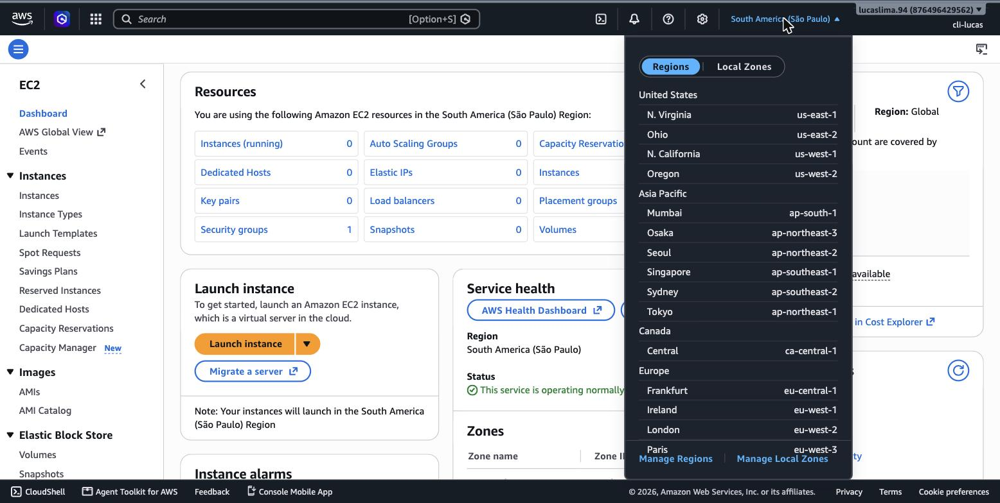
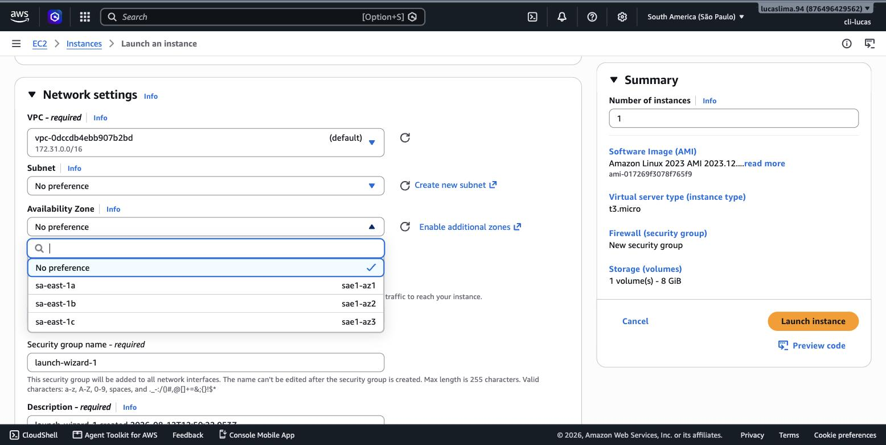
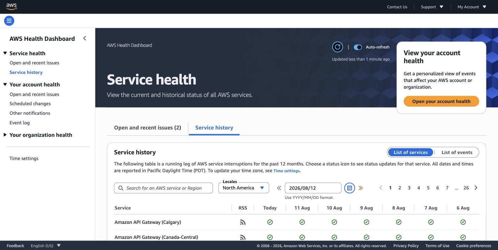

# Módulo 02 — Infraestrutura Global da AWS

> **Objetivo**: entender como a AWS organiza fisicamente seus datacenters ao redor do mundo, e por que essa organização geográfica é a base técnica de benefícios que você já conhece do módulo 01 — alcance global e alta disponibilidade não são promessas abstratas, são consequência direta de como essa infraestrutura é desenhada. E ver essa hierarquia com os próprios olhos, direto no Console.
>
> **Pré-requisitos**: módulo 01 (Visão Geral dos Conceitos de Nuvem) — em particular, a ideia de que elasticidade e alcance global são benefícios estruturais da nuvem pública, não conveniências de marketing.
>
> **Tempo de referência (não prazo)**: uma semana em ritmo moderado.
>
> Este módulo corresponde ao **Domínio 1 — Cloud Concepts** do exame CLF-C02 (24% do conteúdo pontuado), especificamente à Task Statement 1.1, que cobra entender "os benefícios da infraestrutura global (por exemplo, velocidade de implantação, alcance global)". Página oficial: https://docs.aws.amazon.com/aws-certification/latest/cloud-practitioner-02/cloud-practitioner-02-domain1.html. Como reforço do que já está no índice: esta trilha segue o **CLF-C02** vigente, não o CLF-C01, aposentado em 18 de setembro de 2023.

---

## Por que a geografia física importa numa tecnologia "virtual"

Existe uma tentação de pensar na nuvem como algo etéreo — "está lá em algum lugar, não importa onde". Isso é um erro caro. Toda a computação que você vai usar nesta trilha roda em servidores físicos, dentro de prédios reais, em cidades reais, e a AWS não esconde essa geografia: ela a expõe deliberadamente como um controle que você usa. Quando você lança um servidor, um banco de dados ou qualquer outro recurso na AWS, a primeira decisão que você toma — mesmo sem perceber, porque o Console já vem com uma região pré-selecionada — é *onde no mundo* esse recurso vai fisicamente existir.

Vamos começar exatamente por esse ponto de decisão, olhando para o seletor de região que fica sempre visível no canto superior direito do Console.


> `[PRINT]` Passo a passo para capturar: logado no AWS Management Console, clicar no nome da região atualmente selecionada (aparece no canto superior direito, ao lado do nome da conta — por exemplo "N. Virginia"). Capturar a tela com o dropdown aberto, mostrando a lista completa de regiões agrupadas por continente/área geográfica.

Repare como cada região é identificada por localização geográfica ("Leste dos EUA", "São Paulo", "Irlanda"), não por um número neutro — a AWS quer que essa escolha seja consciente, não um detalhe técnico escondido.

## A hierarquia: Regions, Availability Zones e Edge Locations

A AWS organiza sua infraestrutura física em três níveis, cada um respondendo a um problema diferente.

No topo está a **Region** (região): um agrupamento de datacenters numa área geográfica específica. Cada região é completamente independente das demais: os dados que você armazena em São Paulo não são automaticamente replicados para a Virgínia, os preços podem variar de uma região para outra, e nem todo serviço da AWS está disponível em toda região. Essa independência é proposital: ela existe para dar ao cliente controle explícito sobre onde seus dados residem, essencial para atender exigências de soberania de dados — uma empresa europeia sujeita ao GDPR, por exemplo, pode escolher manter todos os seus dados numa região dentro da União Europeia, e a AWS nunca vai mover esses dados para outra região sem uma ação explícita do cliente.

Dentro de cada região, a AWS mantém múltiplas **Availability Zones** (Zonas de Disponibilidade, quase sempre abreviadas como AZs). Uma AZ não é um servidor nem um prédio isolado — é um ou mais datacenters fisicamente distintos, com energia, resfriamento e conectividade de rede independentes uns dos outros, mas interligados entre si por uma rede privada de altíssima velocidade. Vamos ver isso concretamente: toda tela de criação de um recurso na AWS que envolve computação pede para você escolher uma AZ dentro da região selecionada. Vamos abrir o assistente de criação de uma instância EC2 só para observar esse campo — sem precisar concluir a criação.


> `[PRINT]` Passo a passo para capturar: com a região São Paulo (sa-east-1) selecionada no Console, buscar "EC2" na barra de busca e abrir o serviço. Clicar em "Launch instance" (ou "Instances" → "Launch instances"). Na seção de configuração de rede ("Network settings"), expandir as opções e clicar no dropdown de "Subnet" (que mostra a AZ de cada subnet disponível). Capturar a tela com o dropdown aberto, mostrando as opções com sufixo `sa-east-1a`, `sa-east-1b`, `sa-east-1c`. Não é necessário concluir o lançamento da instância — fechar a aba ou navegar para outra tela sem clicar em "Launch instance" ao final.

Esse sufixo de letra (`a`, `b`, `c`) é como a AWS identifica cada AZ dentro da região. A maioria das regiões AWS tem no mínimo três AZs, e esse número mínimo não é acidental: com três zonas independentes, é possível distribuir uma aplicação de forma que a perda completa de qualquer uma delas — uma falha de energia, um incêndio, um desastre natural localizado — não derrube o sistema inteiro, porque as outras continuam operando. Essa é a base técnica exata da alta disponibilidade em AWS, e é o assunto que o módulo 11 (Projetando para Uptime) vai aprofundar tecnicamente: por ora, o que importa é entender que "múltiplas AZs" é o mecanismo, e "alta disponibilidade" é a consequência.

> `[TEORIA]` Para a prova: fixe a hierarquia — uma região contém várias AZs; cada AZ pode conter, por trás da abstração, mais de um datacenter físico; e nunca é o contrário — uma AZ nunca abrange mais de uma região. Confundir "região" com "zona de disponibilidade" é o erro de definição mais cobrado neste tópico.

O terceiro nível são as **Edge Locations** e os **Points of Presence**, muito mais numerosos que regiões e AZs (a AWS mantém centenas deles espalhados pelo mundo, em cidades que sequer têm uma região completa). Diferente de uma AZ, uma Edge Location não roda sua aplicação nem seu banco de dados — ela existe para aproximar fisicamente o conteúdo do usuário final. É a infraestrutura por trás do Amazon CloudFront, que o módulo 4 vai explicar em detalhe: quando alguém no Japão acessa um vídeo armazenado originalmente numa região nos Estados Unidos, o CloudFront pode entregar uma cópia em cache a partir de uma Edge Location em Tóquio, evitando que cada requisição atravesse o oceano.

## Como a escolha de região afeta você na prática

Três critérios costumam decidir em qual região colocar um recurso, e vale ter cada um internalizado, porque a prova gosta de testar cenários em que apenas um deles é o fator decisivo.

O primeiro é **latência**: quanto mais perto fisicamente do usuário final o recurso estiver, menor o tempo que os dados levam para viajar. Uma aplicação usada majoritariamente por brasileiros deveria, via de regra, rodar na região de São Paulo, e não na Virgínia, mesmo que a Virgínia tenha mais serviços disponíveis — a menos que outro critério pese mais.

O segundo é **custo**: o preço de um mesmo serviço pode variar de forma não trivial entre regiões, porque o custo de operar um datacenter varia com o país. Uma carga de trabalho que não depende de latência baixa para um público específico pode ser deliberadamente colocada numa região mais barata — é possível comparar isso na mesma AWS Pricing Calculator usada no módulo 01, trocando a região selecionada e observando a diferença de estimativa.

O terceiro é **conformidade legal e regulatória**: leis de proteção de dados de vários países exigem, ou fortemente recomendam, que dados de cidadãos permaneçam dentro de fronteiras específicas. Esse critério costuma sobrepor os outros dois quando está em jogo.

> `[TEORIA]` Para a prova: os três critérios de escolha de região são latência, custo e conformidade legal/regulatória. Quando um cenário de prova menciona uma exigência legal específica de residência de dados, esse é o critério decisivo, independentemente de latência ou custo apontarem para outra região.

`[APROFUNDAMENTO]` Uma decisão de arquitetura mais avançada, do nível Solutions Architect Associate, é rodar uma aplicação em múltiplas regiões simultaneamente (arquitetura *multi-region*), seja para disponibilidade extrema, seja para servir usuários em continentes diferentes com baixa latência em todos. Isso introduz complexidade real de replicação de dados entre regiões e de roteamento de tráfego, e foge do escopo do Cloud Practitioner.

## Infraestrutura ainda mais próxima: Local Zones, Wavelength e Outposts

Além da hierarquia clássica de região, AZ e edge location, a AWS oferece três variações voltadas a cenários em que "perto" precisa significar algo além do que uma região inteira consegue entregar.

**AWS Local Zones** colocam um subconjunto dos serviços AWS fisicamente muito mais perto de grandes centros populacionais que não têm uma região completa — útil para aplicações sensíveis a latência, como edição de vídeo em tempo real ou jogos.

**AWS Wavelength** leva a infraestrutura AWS para dentro da rede de operadoras de telecomunicação 5G, colocando computação no caminho do tráfego de dispositivos móveis antes mesmo de esse tráfego sair da rede da operadora — cenário típico: realidade aumentada ou veículos autônomos.

**AWS Outposts** inverte a lógica: em vez de aproximar a AWS do cliente, ela entrega hardware físico da AWS para ser instalado dentro do datacenter do próprio cliente, rodando os mesmos serviços e sendo gerenciado pelo mesmo Console — para quem precisa manter dados ou processamento fisicamente on-premises por razão regulatória, mas ainda quer a experiência operacional unificada da AWS.

> `[TEORIA]` Para a prova: o nível exigido sobre esses três é reconhecer nome e cenário de uso típico — Local Zones (mais perto de uma cidade sem região própria), Wavelength (dentro da rede 5G, latência ultrabaixa para dispositivos móveis), Outposts (hardware AWS dentro do seu próprio datacenter). Configurar qualquer um deles é conteúdo de certificações mais avançadas.

## Acompanhando a saúde da infraestrutura

Com uma infraestrutura tão distribuída, a AWS mantém um painel público mostrando o status operacional de cada serviço em cada região: o **AWS Service Health Dashboard**.


> `[PRINT]` Passo a passo para capturar: acessar https://health.aws.amazon.com/health/status em uma aba do navegador (não precisa estar logado — é um painel público). Capturar a tela mostrando a lista de serviços com indicador de status (normalmente verde, indicando operação normal) e o filtro de região disponível.

Vale conhecer essa ferramenta desde já, porque ela é o primeiro lugar a checar quando algo parece errado com sua aplicação e você precisa descartar (ou confirmar) que o problema é da própria AWS, não do seu código ou da sua configuração — uma distinção que se conecta diretamente ao Shared Responsibility Model que o módulo 3 vai desenvolver.

## Indo além do Console: consultando a mesma informação por linha de comando

Tudo que você acabou de ver no Console — a lista de regiões, as AZs de uma região específica — também pode ser consultado por texto, via AWS CLI ou AWS CloudShell (o módulo 7 ensina isso em profundidade). É um caminho complementar, útil quando você já sabe exatamente o que quer e prefere não navegar telas, mas não substitui a familiaridade visual que os prints acima constroem:

```
aws ec2 describe-regions --output table
aws ec2 describe-availability-zones --region sa-east-1 --output table
```

`[CUSTO]` Nenhuma das ações deste módulo cria um recurso cobrável. Abrir o seletor de região, navegar até o campo de AZ no assistente do EC2 sem concluir o lançamento, consultar o Service Health Dashboard e rodar os comandos `describe-*` acima são todas operações de leitura, sem custo. Mesmo assim, é boa prática fechar o assistente de lançamento do EC2 sem clicar em "Launch instance" — é o único passo deste módulo onde um clique a mais geraria cobrança.

## Práticas

### Prática isolada

Usando o CloudShell, rode `aws ec2 describe-availability-zones --region <regiao> --output table` para três regiões diferentes — por exemplo `sa-east-1` (São Paulo), `us-east-1` (Norte da Virgínia) e `eu-west-1` (Irlanda). Monte uma tabela simples (à mão, num arquivo de texto) comparando o número de AZs disponíveis em cada uma. Depois, rode `aws ec2 describe-regions --output table` sem o filtro de região nenhuma vez, e conte quantas regiões aparecem na lista completa retornada. O objetivo é sair da abstração "a AWS tem regiões e AZs" e ver, em números reais, que essa infraestrutura não é uniforme — algumas regiões têm mais AZs que outras, e isso é parte do que se leva em conta numa decisão de arquitetura de alta disponibilidade.

### Contribuição ao projeto integrador

Nenhum recurso novo ainda, mas a segunda decisão formal do TrilhaShop: registre, no mesmo documento de decisão iniciado no módulo 1, a região oficial do projeto (**São Paulo — `sa-east-1`**, pelo critério de latência para um público brasileiro) e as duas Availability Zones que a VPC do módulo 4 vai usar (`sa-east-1a` e `sa-east-1b` — duas é o mínimo para viabilizar a redundância que os módulos 6 e 11 vão explorar). Antes de seguir para o módulo 3, vale um último passo prático: abrir o Service Health Dashboard (visto acima) e confirmar que não há nenhum incidente em aberto para `sa-east-1` — um hábito de checagem que vale manter no início de cada sessão de estudo daqui em diante, não só agora.

## Erros comuns nesta fase

Vale reforçar, fora do fluxo de leitura, os dois deslizes mais comuns: primeiro, assumir que dados ou recursos criados numa região aparecem automaticamente em outra — cada região é um universo isolado; segundo, subestimar o critério de conformidade legal na escolha de região, tratando-a como uma decisão puramente técnica, quando na prática ela costuma ser a primeira pergunta que uma área jurídica ou de compliance faz antes de qualquer arquitetura ser aprovada.

## Conexão com os módulos seguintes

| Conceito deste módulo | Aparece novamente em |
|---|---|
| Múltiplas AZs | Alta disponibilidade e Auto Scaling — módulo 6; estratégias de uptime — módulo 11 |
| Isolamento por região | Shared Responsibility Model e conformidade — módulo 3 |
| Edge Locations | CloudFront e CDN — módulo 4 |
| Escolha de região (latência, custo, legal) | Toda decisão de onde provisionar um recurso, a partir do módulo 4 em diante |
| Service Health Dashboard | Diagnóstico de incidentes, retomado implicitamente no módulo 3 (responsabilidade) |

## `[REFERÊNCIA]`

- AWS — Domínio 1 do exame CLF-C02 (Cloud Concepts), com todos os task statements: https://docs.aws.amazon.com/aws-certification/latest/cloud-practitioner-02/cloud-practitioner-02-domain1.html
- AWS — *Global Infrastructure* (mapa oficial de regiões, AZs e edge locations): https://aws.amazon.com/about-aws/global-infrastructure/
- AWS — *Overview of Amazon Web Services* (whitepaper), seção sobre infraestrutura global: https://docs.aws.amazon.com/whitepapers/latest/aws-overview/aws-overview.html
- AWS Skill Builder — *AWS Cloud Practitioner Essentials*, módulo "Going Global": https://explore.skillbuilder.aws/learn/course/external/view/elearning/134/aws-cloud-practitioner-essentials
- AWS — *AWS Service Health Dashboard*: https://health.aws.amazon.com/health/status

## Checklist de saída

Você está pronto para o módulo 03 quando consegue, sem consultar:

- [ ] Explicar a hierarquia Region → Availability Zone → Edge Location, e dizer o que cada nível resolve.
- [ ] Explicar por que uma região precisa de múltiplas AZs para viabilizar alta disponibilidade, e o que torna as AZs de uma mesma região independentes entre si.
- [ ] Listar os três critérios principais de escolha de região (latência, custo, conformidade legal) e dar um exemplo de cenário em que cada um seria o fator decisivo.
- [ ] Reconhecer, no nível de "o que é e quando se usa", Local Zones, Wavelength e Outposts.
- [ ] Ter visto, no Console real, o seletor de região, o campo de AZ no assistente do EC2 e o Service Health Dashboard.
- [ ] Ter comparado o número de AZs entre pelo menos três regiões via CLI.
- [ ] Ter registrado a região e as duas AZs oficiais do TrilhaShop no documento de decisão.
