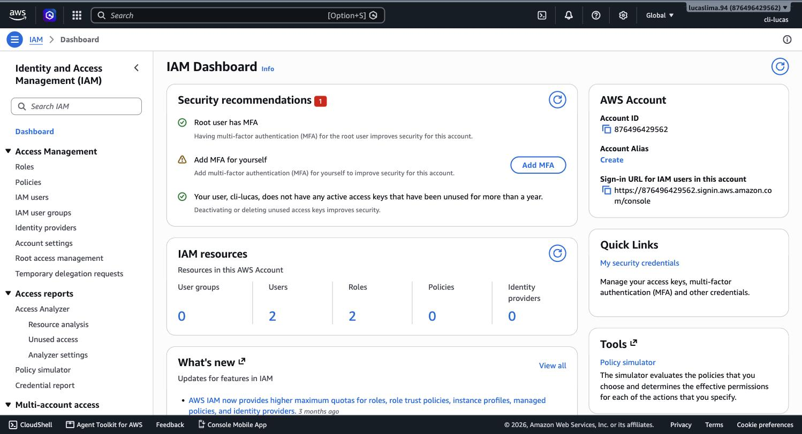
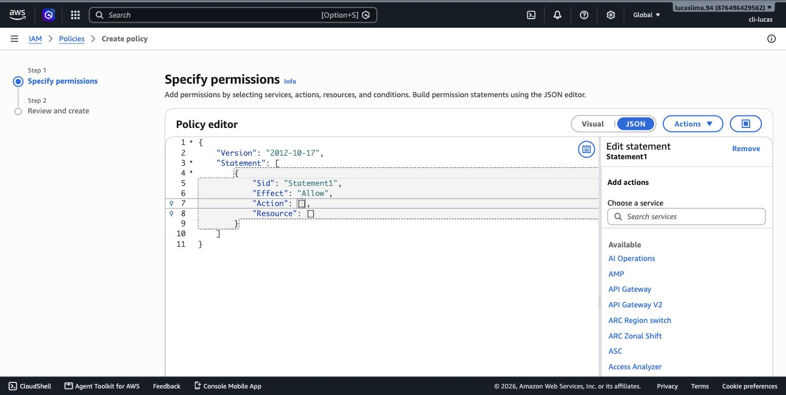
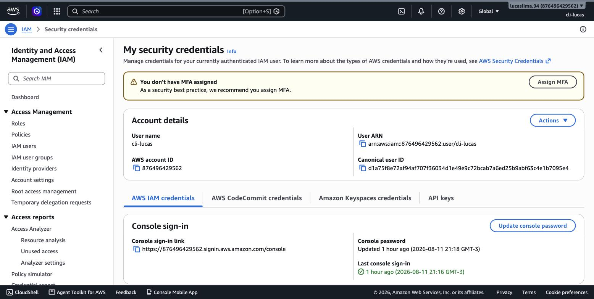
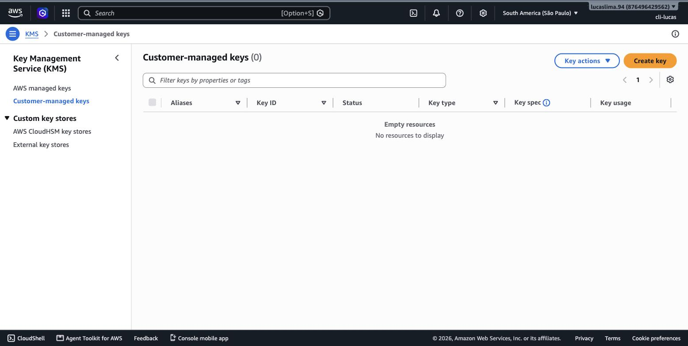
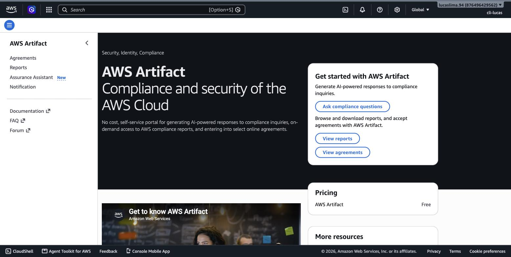
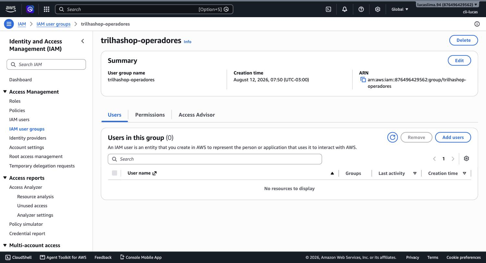
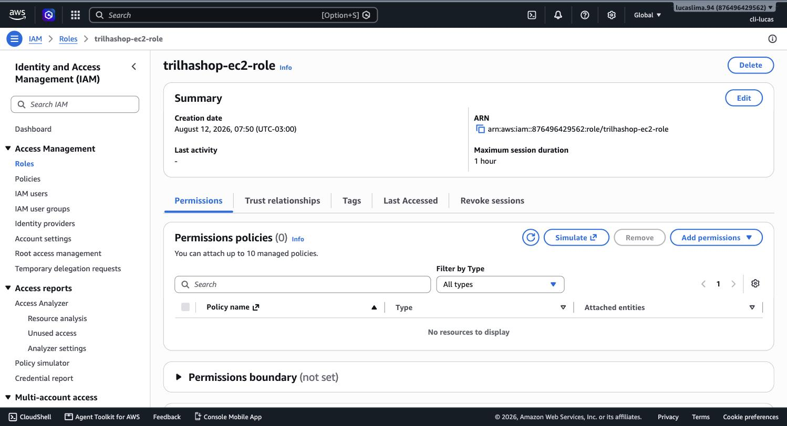

# Módulo 03 — Segurança na Nuvem AWS

> **Objetivo**: entender exatamente onde termina a responsabilidade de segurança da AWS e onde começa a sua, e sair deste módulo sabendo operar IAM na prática — criar usuários, grupos, políticas e MFA com entendimento do princípio por trás de cada clique, não só copiando passo a passo.
>
> **Pré-requisitos**: módulo 01 (modelos de serviço IaaS/PaaS/SaaS — a base conceitual da responsabilidade compartilhada) e módulo 02 (regiões — a segurança também varia com onde o dado está).
>
> **Tempo de referência (não prazo)**: uma a duas semanas em ritmo moderado — é o domínio de maior peso na prova, vale o tempo extra.
>
> Este módulo corresponde ao **Domínio 2 — Security and Compliance** do exame CLF-C02, o de **maior peso entre os quatro (30% do conteúdo pontuado)**. Página oficial, com os quatro task statements completos: https://docs.aws.amazon.com/aws-certification/latest/cloud-practitioner-02/cloud-practitioner-02-domain2.html. Trilha construída sobre o CLF-C02 vigente, não o CLF-C01 (aposentado em 18/09/2023).

---

## Por que este é o domínio mais pesado da prova

Não é acidente que segurança seja quase um terço do exame. Na nuvem pública, você está confiando parte da sua infraestrutura a uma empresa terceira — e ao mesmo tempo continua sendo integralmente responsável por proteger seus próprios dados, credenciais e configurações dentro dela. Errar essa divisão de responsabilidade é, de longe, a causa mais comum de incidentes de segurança em nuvem — não porque a AWS tenha uma falha, mas porque o cliente deixou algo mal configurado do seu lado da linha. Este módulo existe para deixar essa linha nítida.

## O Shared Responsibility Model

A AWS descreve a divisão de responsabilidade com uma frase que vale memorizar: a AWS é responsável pela segurança **da** nuvem, e o cliente é responsável pela segurança **na** nuvem. "Segurança da nuvem" significa proteger a infraestrutura física que roda todos os serviços da AWS — os datacenters, o hardware, a virtualização, a rede global, tudo que você conheceu no módulo 2. Você nunca vê essa camada, nunca precisa corrigi-la, e não tem acesso a ela — é inteiramente responsabilidade da AWS. "Segurança na nuvem" é tudo que você configura em cima disso: quem tem acesso a quê, como os dados são criptografados, como a rede dentro da sua conta está desenhada, se o software que você instalou numa instância está com patch em dia.

A parte que mais confunde iniciantes é que essa linha divisória **se move** dependendo do serviço. Numa instância EC2 (IaaS), você é responsável pelo sistema operacional, por aplicar atualizações de segurança, por configurar o firewall (Security Group) e por gerenciar as credenciais de acesso — a AWS só cuida do hardware físico e da virtualização por baixo. Já num serviço gerenciado como o Amazon RDS ou o AWS Lambda, a AWS assume a responsabilidade pelo sistema operacional e pelo patching da engine do banco de dados ou do runtime — você continua responsável por configurar o acesso corretamente, gerenciar as credenciais e proteger os dados que trafegam, mas não precisa aplicar patch de segurança no PostgreSQL rodando por baixo do RDS. Repare que essa não é uma regra nova — é exatamente a mesma lógica de "quem cuida de quê" que os modelos IaaS/PaaS/SaaS do módulo 1 já anteciparam, agora aplicada especificamente à pergunta "quem protege o quê".

> `[TEORIA]` Para a prova: a frase oficial é "AWS é responsável pela segurança **da** nuvem; o cliente é responsável pela segurança **na** nuvem". Cenários de prova costumam dar um serviço específico (EC2, RDS, Lambda, S3) e pedir para identificar de quem é a responsabilidade por um item concreto (patch de SO, configuração de firewall, criptografia de dados, controle de acesso a um bucket). A regra prática: quanto mais gerenciado o serviço, mais responsabilidade migra para a AWS — mas configuração de acesso e proteção dos dados em si são **sempre** do cliente, em qualquer serviço.

## IAM: quem pode fazer o quê

O **AWS Identity and Access Management (IAM)** é o serviço que resolve, tecnicamente, a metade "na nuvem" da responsabilidade compartilhada relacionada a acesso. Vale abrir o Console real e ver a estrutura de que o IAM é composto, porque você já usou parte dela sem perceber: o usuário administrativo que você criou na preparação da conta (seção "Antes do módulo 1" do índice) já é um recurso IAM.


> `[PRINT]` Passo a passo para capturar: abrir o IAM direto em https://console.aws.amazon.com/iam/home (ou buscar "IAM" na barra de busca do Console). Capturar a tela inicial ("Dashboard"), mostrando o resumo de recursos (Users, User groups, Roles, Policies) e, se visível, o painel de "Security recommendations" ou "IAM Access Analyzer".

O IAM organiza controle de acesso em quatro peças que se combinam entre si. Um **usuário (user)** representa uma identidade específica — uma pessoa ou uma aplicação — com suas próprias credenciais. Um **grupo (group)** é uma coleção de usuários que devem ter as mesmas permissões, o que evita ter que repetir a mesma configuração usuário por usuário. Uma **política (policy)** é um documento (em formato JSON) que declara explicitamente o que é permitido ou negado — qual ação, em qual recurso, sob qual condição. E uma **role (função)** é parecida com um usuário, mas não pertence a uma pessoa fixa: é assumida temporariamente por quem precisa dela, seja um serviço da AWS agindo em seu nome (por exemplo, uma instância EC2 que precisa ler de um bucket S3), seja um usuário federado vindo de outro sistema de identidade.


> `[PRINT]` Passo a passo para capturar: dentro do IAM, ir em "Policies" → "Create policy", trocar para a aba "JSON" do editor. Colar ou visualizar um exemplo simples de política restrita, por exemplo permitindo apenas `s3:GetObject` num bucket específico. Capturar a tela mostrando o editor JSON com a política visível, sem precisar salvar a política de fato (pode fechar sem criar).

Note a estrutura de uma política: ela nomeia um efeito (permitir ou negar), uma ação específica (o verbo — o que pode ser feito) e um recurso específico (sobre o que essa ação pode ser feita). Essa granularidade é o que viabiliza o **princípio do menor privilégio**: em vez de dar a um usuário ou aplicação acesso amplo "por garantia", você concede exatamente as permissões necessárias para a tarefa dele, nem uma a mais. É tentador, especialmente no início, dar permissão de administrador para tudo "para não travar" — mas cada permissão a mais concedida é uma superfície de ataque a mais, caso essa credencial vaze ou seja comprometida.

> `[TEORIA]` Para a prova: princípio do menor privilégio significa conceder apenas as permissões estritamente necessárias para realizar uma tarefa, nada além disso. É citado quase sempre em conjunto com IAM e é um dos conceitos mais testados do domínio de segurança.

## Protegendo a identidade mais poderosa: a conta root

Toda conta AWS nasce com um usuário **root**, criado no momento do cadastro, e esse usuário tem acesso irrestrito a absolutamente tudo — incluindo a capacidade de fechar a conta inteira. Diferente de um usuário IAM comum, o root não pode ter suas permissões limitadas por política alguma. Por isso a orientação da AWS (e desta trilha, desde a preparação da conta) é: nunca use o root no dia a dia, proteja-o com MFA, e guarde suas credenciais como se fossem a chave-mestra de um cofre — porque, na prática, são.


> `[PRINT]` Passo a passo para capturar: dentro do IAM, acessar "Dashboard" ou "Security credentials" e localizar a seção que mostra o status de MFA da conta root (geralmente aparece como um alerta se o MFA ainda não estiver ativado, ou uma confirmação verde se já estiver). Se o MFA já foi configurado na preparação da conta (seção "Antes do módulo 1"), a captura deve mostrar o status "Ativado"/"Enabled".

Existe uma pequena lista de operações que só o usuário root pode realizar — mudar o plano de suporte da conta, fechar a conta, alterar configurações de conta muito sensíveis — e é exatamente por isso que o root nunca deve ser excluído ou esquecido, apenas guardado com o máximo de proteção e usado com a menor frequência possível.

> `[TEORIA]` Para a prova: existem tarefas que só o root pode executar (por exemplo, encerrar a conta AWS, alterar o plano de suporte, algumas mudanças de conta). MFA na conta root é considerado prática obrigatória de segurança, não opcional.

## Além de usuário e senha: outras formas de autenticação

MFA (autenticação multifator) exige uma segunda prova de identidade além da senha — normalmente um código gerado por um aplicativo autenticador ou um dispositivo físico — e deveria estar ativado em qualquer usuário com privilégio relevante, não só no root. Para organizações maiores, existe o **AWS IAM Identity Center** (antigo AWS SSO), que centraliza o gerenciamento de acesso para múltiplas contas AWS a partir de um único login, e viabiliza **identidade federada** — usuários que já existem num diretório corporativo (como Active Directory) acessando a AWS sem precisar de um usuário IAM separado para cada pessoa. E para credenciais que aplicações precisam usar programaticamente (senhas de banco de dados, chaves de API de terceiros), a AWS recomenda o **AWS Secrets Manager** em vez de deixar essas credenciais fixas em código ou variáveis de ambiente sem proteção.

> `[TEORIA]` Para a prova: reconhecer os termos "IAM Identity Center", "identidade federada" e "Secrets Manager" no nível de "o que resolvem" — Identity Center centraliza acesso multi-conta; federação conecta um diretório de identidade externo à AWS sem duplicar usuários; Secrets Manager armazena credenciais de forma segura, em vez de expostas em texto plano.

## Criptografia: protegendo o dado em si

Independentemente de quem tem acesso a um recurso, existe uma segunda camada de proteção que atua sobre o próprio dado: a criptografia. **Criptografia em trânsito** protege dados enquanto trafegam pela rede (por exemplo, entre o navegador do usuário e um servidor, usando HTTPS/TLS). **Criptografia em repouso** protege dados enquanto estão armazenados (num disco EBS, num bucket S3, num banco de dados), de forma que, mesmo que alguém obtivesse acesso físico ao meio de armazenamento, os dados permaneceriam ilegíveis sem a chave correta.

O serviço que gerencia essas chaves de criptografia na AWS é o **AWS Key Management Service (KMS)** — ele cria, armazena e controla o acesso às chaves usadas para criptografar dados em praticamente todos os outros serviços da AWS (S3, EBS, RDS, entre outros).


> `[PRINT]` Passo a passo para capturar: abrir o KMS direto em https://console.aws.amazon.com/kms/home?region=sa-east-1 (ou buscar "KMS" na barra de busca do Console). No menu lateral, clicar em "AWS managed keys" (ou "Customer managed keys" se já existir alguma). Capturar a tela mostrando a lista de chaves, mesmo que sejam apenas as chaves gerenciadas automaticamente pela AWS para outros serviços.

## Detectando e reagindo a ameaças

Além de controlar acesso e criptografar dados, a AWS oferece um conjunto de serviços dedicados a monitorar continuamente sua conta em busca de comportamento suspeito. O **Amazon GuardDuty** analisa logs de rede, de acesso e de atividade de conta em busca de padrões que indiquem comprometimento — por exemplo, uma instância EC2 se comunicando com um endereço IP conhecido por hospedar malware. O **Amazon Inspector** varre suas instâncias EC2 e imagens de containers em busca de vulnerabilidades conhecidas de software. O **Amazon Macie** usa aprendizado de máquina para encontrar e classificar dados sensíveis (como informações pessoais) armazenados em buckets S3, ajudando a evitar exposição acidental. E o **AWS Security Hub** funciona como um painel central que agrega os achados de todos esses serviços (e de ferramentas de terceiros) num único lugar, dando uma visão consolidada da postura de segurança da conta.


> `[PRINT]` Passo a passo para capturar: abrir o Security Hub direto em https://console.aws.amazon.com/securityhub/home?region=sa-east-1 (ou buscar "Security Hub" na barra de busca do Console) (pode ser necessário clicar em "Go to Security Hub" ou habilitar o serviço na primeira vez, sem precisar concluir nenhuma configuração paga). Capturar a tela do resumo/dashboard, mostrando os cartões de contagem de achados por severidade, mesmo que estejam todos zerados por não haver histórico ainda.

`[APROFUNDAMENTO]` Dois serviços adicionais aparecem no radar de segurança em nível mais avançado: **AWS WAF** (Web Application Firewall), que filtra tráfego HTTP malicioso antes que ele chegue à sua aplicação, e **AWS Shield**, que protege contra ataques de negação de serviço (DDoS) — o Shield Standard vem incluído automaticamente para todo cliente AWS, sem custo adicional, enquanto o Shield Advanced é um plano pago com proteção e suporte reforçados. Para o Cloud Practitioner, basta reconhecer os nomes e o propósito geral; configurar regras de WAF é conteúdo de nível mais avançado.

## Governança em múltiplas contas: AWS Organizations

Empresas raramente operam com uma única conta AWS — é comum separar ambientes de desenvolvimento, teste e produção em contas distintas, por isolamento e controle de custo. O **AWS Organizations** permite agrupar múltiplas contas AWS sob uma hierarquia administrada centralmente, com **faturamento consolidado** (uma fatura única, muitas vezes com descontos por volume agregado) e **Service Control Policies (SCPs)** — políticas que definem o teto máximo de permissões que qualquer usuário ou role dentro de uma conta-membro pode ter, mesmo que uma política do IAM dentro daquela conta tente conceder mais.

> `[TEORIA]` Para a prova: SCPs atuam como um limite superior (guardrail) aplicado no nível da organização — mesmo que uma política do IAM dentro de uma conta permita uma ação, se a SCP da organização a negar, ela permanece bloqueada. SCPs não concedem permissão por si só, apenas restringem o que já foi concedido. Faturamento consolidado é o outro benefício central do Organizations a memorizar.

## Onde encontrar prova de conformidade: AWS Artifact

Empresas em setores regulados frequentemente precisam comprovar, para auditores ou reguladores, que a infraestrutura que usam atende a certificações específicas (ISO 27001, SOC 2, PCI DSS, entre outras). O **AWS Artifact** é o portal onde a AWS disponibiliza esses relatórios de conformidade e acordos legais diretamente para download, sem precisar abrir chamado de suporte.


> `[PRINT]` Passo a passo para capturar: abrir o AWS Artifact direto em https://console.aws.amazon.com/artifact/home (ou buscar "Artifact" na barra de busca do Console). Clicar na aba "Reports" (Relatórios). Capturar a tela mostrando a lista de relatórios de conformidade disponíveis (ISO, SOC, PCI, entre outros), sem necessidade de baixar nenhum.

## Práticas

### Prática isolada

O cenário: um estagiário de marketing precisa conseguir ver as imagens de produto armazenadas num bucket S3 específico (`trilhashop-product-images`, o mesmo que o módulo 12 vai criar de verdade), mas não deve conseguir apagar, sobrescrever, nem ver nenhum outro bucket da conta. Escreva do zero uma política JSON que concede exatamente isso — nem mais, nem menos:

```json
{
  "Version": "2012-10-17",
  "Statement": [
    {
      "Sid": "SomenteLeituraDeUmBucketEspecifico",
      "Effect": "Allow",
      "Action": [
        "s3:GetObject",
        "s3:ListBucket"
      ],
      "Resource": [
        "arn:aws:s3:::trilhashop-product-images",
        "arn:aws:s3:::trilhashop-product-images/*"
      ]
    }
  ]
}
```


> `[PRINT]` Passo a passo para capturar: no IAM, "Policies" → "Create policy" → aba "JSON", colar a política acima (ajustando o nome do bucket se necessário). Capturar a tela com o JSON visível no editor antes de salvar. Nomear a política como `trilhashop-leitura-imagens-produto` ao salvar.

Crie um usuário de teste descartável (`teste-estagiario`, sem console access, só para este exercício), anexe essa política a ele, e use o **IAM Policy Simulator** (ou tente de fato, se já tiver um bucket de teste qualquer) para confirmar que uma ação como `s3:DeleteObject` é negada e `s3:GetObject` é permitida. Ao terminar, exclua o usuário de teste e a política — este exercício não deixa nada persistente.

`[ATENÇÃO]` Um erro comum ao escrever policies do zero é esquecer o segundo ARN (`.../*`) — sem ele, `s3:ListBucket` funciona mas `s3:GetObject` falha, porque um se aplica ao bucket como recurso e o outro aos objetos dentro dele. É uma pegadinha frequente tanto na prova quanto no uso real.

### Contribuição ao projeto integrador

Aqui nasce a identidade real do TrilhaShop dentro do IAM — grupo, usuário de operação e duas roles que os módulos seguintes vão assumir como já existentes.


> `[PRINT]` Passo a passo para capturar: no IAM, "User groups" → "Create group". Nomear como `trilhashop-operadores`. Capturar a tela antes de concluir. Concluir a criação (sem anexar nenhuma policy ampla — este grupo existe para você adicionar usuários de projeto conforme precisar, com policies específicas, seguindo o mesmo princípio de menor privilégio da prática isolada acima).

Mais importante que o grupo são as duas **roles de serviço** que o TrilhaShop vai precisar — roles, não usuários, porque quem vai assumi-las são serviços da AWS, não pessoas:


> `[PRINT]` Passo a passo para capturar: no IAM, "Roles" → "Create role". Selecionar "AWS service" como trusted entity type, e "EC2" como use case. Nomear como `trilhashop-ec2-role`. Não anexar nenhuma policy ainda (o módulo 9, quando as instâncias reais forem lançadas, volta aqui para anexar exatamente a permissão que elas precisarem — por exemplo, acesso de leitura ao bucket de imagens). Concluir a criação.

Repita o mesmo processo criando uma segunda role, `trilhashop-lambda-role`, desta vez com "Lambda" como use case — ela vai ser assumida pela função de pedidos do módulo 14 e pela função de IA do módulo 15. Nenhuma dessas duas roles gera custo por existir — IAM é gratuito — então elas podem ficar criadas, vazias de permissão, até o módulo que efetivamente precisar delas.

`[CUSTO]` Nada neste módulo gera cobrança: usuários, grupos, roles e policies do IAM não têm custo. Se precisar pausar o projeto por um tempo, não há nada a fazer aqui — ver a tabela de pausa em `00_indice.md`.

## Erros comuns nesta fase

O deslize mais caro deste módulo é presumir que, por a AWS ser responsável pela "segurança da nuvem", isso cobre configurações que na verdade são suas — um bucket S3 configurado como público por engano, uma política IAM excessivamente permissiva, uma instância sem patch de segurança aplicado, todos esses são incidentes causados pelo lado do cliente na responsabilidade compartilhada, não falhas da AWS. O segundo erro comum é usar o usuário root no dia a dia por comodidade, expondo a identidade mais privilegiada da conta a um risco desnecessário toda vez que ela é usada.

## Conexão com os módulos seguintes

| Conceito deste módulo | Aparece novamente em |
|---|---|
| Shared Responsibility Model | Toda decisão de configuração de serviço, a partir daqui |
| IAM roles | Permissões de EC2 para outros serviços — módulo 9; execução de funções Lambda — módulo 14 |
| Security Groups (mencionados de leve aqui) | Detalhamento completo em VPC — módulo 4 |
| KMS / criptografia em repouso | Criptografia de S3, EBS, RDS — módulos 12 e 13 |
| AWS Organizations / SCPs | Billing consolidado — módulo 16 |
| GuardDuty, Security Hub | Monitoramento contínuo, complementar ao CloudWatch — módulo 6 |

## `[REFERÊNCIA]`

- AWS — Domínio 2 do exame CLF-C02 (Security and Compliance): https://docs.aws.amazon.com/aws-certification/latest/cloud-practitioner-02/cloud-practitioner-02-domain2.html
- AWS — *Shared Responsibility Model*: https://aws.amazon.com/compliance/shared-responsibility-model/
- AWS — *IAM User Guide*: https://docs.aws.amazon.com/IAM/latest/UserGuide/introduction.html
- AWS Skill Builder — *AWS Cloud Practitioner Essentials*, módulo "Security": https://explore.skillbuilder.aws/learn/course/external/view/elearning/134/aws-cloud-practitioner-essentials
- AWS — *AWS Artifact*: https://aws.amazon.com/artifact/

## Checklist de saída

Você está pronto para o módulo 04 quando consegue, sem consultar:

- [ ] Recitar a frase do Shared Responsibility Model e aplicá-la a três serviços diferentes (EC2, RDS, S3), dizendo o que é da AWS e o que é seu em cada um.
- [ ] Explicar a diferença entre usuário, grupo, política e role no IAM, e por que role é diferente de usuário.
- [ ] Explicar o princípio do menor privilégio com um exemplo prático.
- [ ] Listar pelo menos três tarefas que só o root pode fazer, e por que o root não deve ser usado no dia a dia.
- [ ] Diferenciar criptografia em trânsito de criptografia em repouso, e dizer o papel do KMS.
- [ ] Nomear GuardDuty, Inspector, Macie e Security Hub e dizer, em uma frase, o que cada um faz.
- [ ] Explicar o que são SCPs no AWS Organizations e por que elas são um "teto", não uma concessão de permissão.
- [ ] Ter navegado, no Console real, pelo IAM (dashboard, editor de política, status de MFA), pelo KMS, pelo Security Hub e pelo AWS Artifact.
- [ ] Ter escrito e testado a policy de leitura restrita da prática isolada, e excluído o usuário/policy de teste depois.
- [ ] Ter criado, de verdade, o grupo `trilhashop-operadores` e as roles `trilhashop-ec2-role` e `trilhashop-lambda-role` (ainda sem permissões anexadas).
