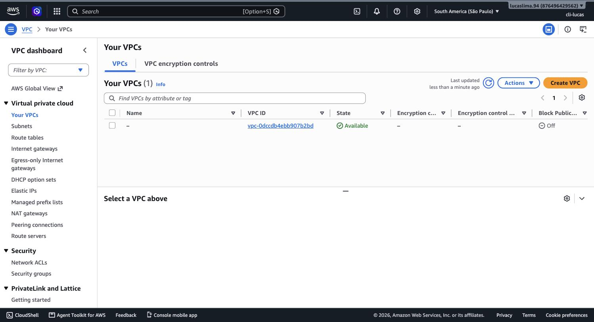
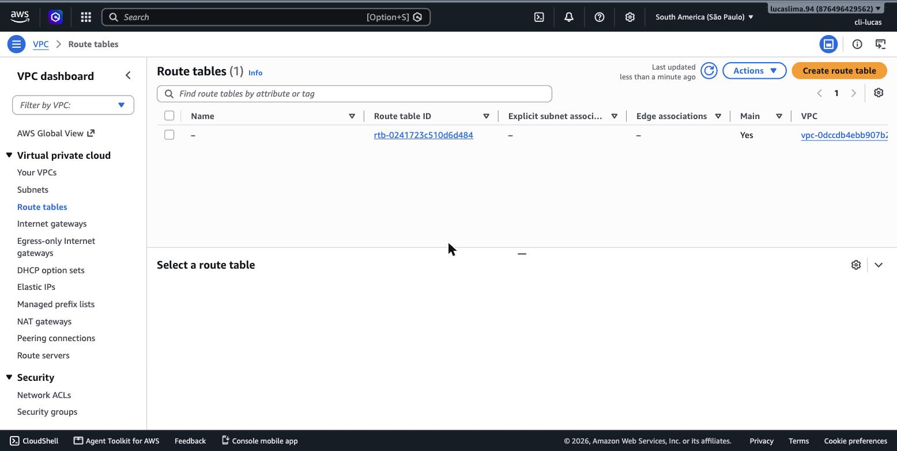
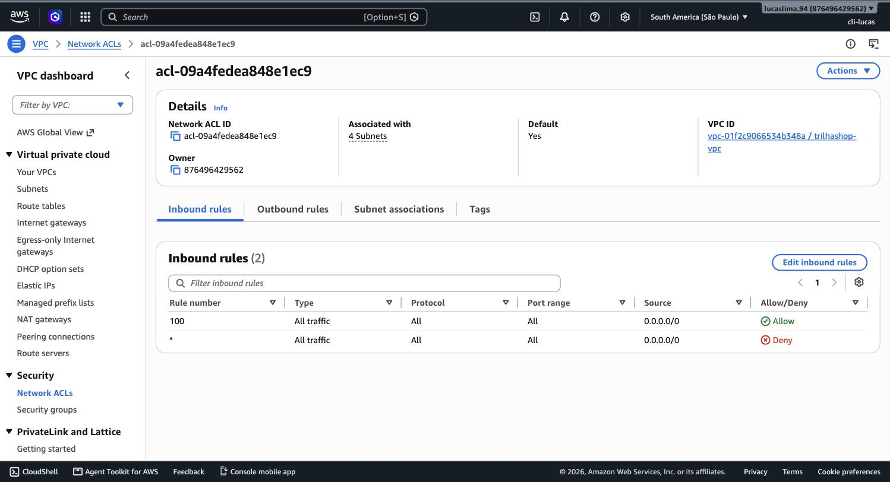
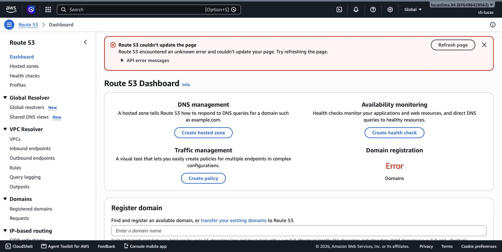
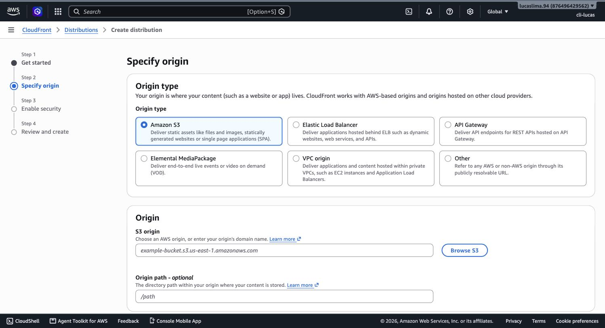

# Módulo 04 — Redes e Entrega de Conteúdo

> **Objetivo**: entender como uma conta AWS constrói sua própria rede privada dentro da nuvem pública, como ela se protege em duas camadas de firewall diferentes, e como o tráfego encontra o caminho certo — do DNS até a entrega de conteúdo cacheado perto do usuário final.
>
> **Pré-requisitos**: módulo 02 (Availability Zones — as subnets desta trilha vivem dentro delas) e módulo 03 (Shared Responsibility Model — a rede dentro da sua VPC é território seu, não da AWS).
>
> **Tempo de referência (não prazo)**: uma a duas semanas em ritmo moderado.
>
> Este módulo corresponde à Task Statement 3.5 do **Domínio 3 — Cloud Technology and Services** (34% do conteúdo pontuado), que cobra especificamente componentes de VPC, segurança de rede, Route 53 e opções de conectividade. Página oficial do domínio: https://docs.aws.amazon.com/aws-certification/latest/cloud-practitioner-02/cloud-practitioner-02-domain3.html. Trilha sobre o CLF-C02 vigente, não o CLF-C01 (aposentado em 18/09/2023).

---

## Por que sua conta AWS precisa da própria rede

Quando você cria uma instância EC2 ou um banco de dados RDS, esse recurso não fica solto no meio da internet pública da AWS — ele vive dentro de uma rede privada isolada, exclusivamente sua, chamada **Amazon VPC (Virtual Private Cloud)**. A ideia por trás da VPC é replicar, dentro da nuvem, o mesmo tipo de controle de rede que uma empresa teria num datacenter próprio: você decide o intervalo de endereços IP, decide quais partes da rede podem falar com a internet e quais não podem, e decide exatamente como o tráfego se move de um ponto a outro. Toda conta AWS nasce com uma VPC padrão em cada região, já configurada para funcionar imediatamente — mas entender o que existe por trás dessa configuração padrão é o que separa "sei clicar em lançar uma instância" de "sei desenhar uma rede seguindo boas práticas".

> `[PRINT]` Passo a passo para capturar: com a região São Paulo selecionada, buscar "VPC" no Console e abrir o serviço. No menu lateral, clicar em "Your VPCs" para ver a VPC padrão, depois em "Subnets" para ver a lista de subnets (uma por AZ da região). Capturar a tela de "Subnets" mostrando as subnets com suas respectivas AZs (`sa-east-1a`, `sa-east-1b`, `sa-east-1c`) e faixas de IP.

## Subnets, route tables e os dois portões para fora

Uma VPC sozinha é só um espaço de endereçamento — ela precisa ser dividida em **subnets** para que os recursos dentro dela possam ser organizados e isolados. A divisão mais importante conceitualmente é entre **subnet pública** e **subnet privada**, e essa diferença não é uma propriedade técnica especial da subnet em si — é definida inteiramente por uma tabela de rotas.

Uma **route table (tabela de rotas)** é, literalmente, uma lista de instruções de "para chegar a este destino, saia por este caminho". Uma subnet é considerada pública quando sua tabela de rotas tem uma rota apontando para um **Internet Gateway (IGW)** — o componente que conecta a VPC à internet pública. Sem essa rota, mesmo que um recurso na subnet tenha um IP público atribuído, ele não consegue trocar tráfego com a internet, porque não existe caminho de saída configurado.

Isso cria um problema interessante: e se um recurso numa subnet **privada** — por exemplo, um banco de dados que nunca deveria ser acessível diretamente da internet — ainda assim precisar baixar uma atualização de segurança da internet? É para esse cenário que existe o **NAT Gateway**: ele fica numa subnet pública, e permite que recursos em subnets privadas iniciem conexões de saída para a internet (por exemplo, para baixar um pacote), sem nunca permitir que a internet inicie uma conexão de entrada até eles. É uma via de mão única por design.

> `[PRINT]` Passo a passo para capturar: dentro do console da VPC, clicar em "Route Tables" no menu lateral, selecionar a tabela de rotas associada à VPC padrão e abrir a aba "Routes". Capturar a tela mostrando a linha de rota com destino `0.0.0.0/0` (todo o tráfego) apontando para um target do tipo Internet Gateway (`igw-...`).

> `[TEORIA]` Para a prova: o que torna uma subnet "pública" ou "privada" é a presença (ou ausência) de uma rota para um Internet Gateway na sua tabela de rotas — não é uma configuração marcada diretamente na subnet. NAT Gateway permite saída para a internet a partir de subnets privadas, mas nunca permite entrada iniciada de fora.

## Duas camadas de firewall: Security Groups e Network ACLs

A VPC oferece dois mecanismos de controle de tráfego que, à primeira vista, parecem redundantes, mas operam em níveis diferentes e com comportamentos bem distintos.

O **Security Group** atua no nível da instância (ou de outro recurso individual, como um banco RDS) e é **stateful** — se você permite uma conexão de entrada numa porta, a resposta de saída correspondente é automaticamente permitida, sem precisar de uma regra explícita para o retorno. Security Groups só têm regras de "permitir"; não existe uma regra explícita de "negar" — tudo que não está explicitamente permitido é, por padrão, negado.

A **Network ACL (NACL)** atua no nível da subnet inteira — toda instância dentro daquela subnet é afetada pelas mesmas regras — e é **stateless**: uma regra de entrada e a regra de saída correspondente precisam ser configuradas separadamente, porque a NACL não guarda memória da conexão. Diferente do Security Group, a NACL suporta regras explícitas de "negar", processadas em ordem numérica.

> `[PRINT]` Passo a passo para capturar: dentro do console da VPC, abrir "Security Groups" no menu lateral, selecionar o security group padrão e capturar a aba "Inbound rules". Em seguida, abrir "Network ACLs", selecionar a NACL padrão da VPC e capturar a aba "Inbound rules", mostrando as regras numeradas com coluna de "Allow/Deny". Se possível, montar as duas capturas lado a lado numa única imagem para reforçar visualmente o contraste.

> `[TEORIA]` Para a prova: Security Group é stateful, atua na instância, só permite (nunca nega explicitamente). NACL é stateless, atua na subnet inteira, permite e nega, processada em ordem numérica. Esse par de definições é um dos mais cobrados do domínio de rede.

## Como o tráfego encontra seu destino: Amazon Route 53

Antes mesmo de o tráfego chegar à sua VPC, ele precisa saber para onde ir — e isso é resolvido por DNS. O **Amazon Route 53** é o serviço de DNS da AWS: ele traduz nomes legíveis por humanos (como `www.seusite.com`) para endereços IP que os computadores usam para rotear tráfego de fato. Além da função básica de DNS, o Route 53 também funciona como **registrador de domínios** (você pode comprar um domínio diretamente por ele) e oferece políticas de roteamento mais sofisticadas — como rotear com base em latência (enviar o usuário para a região mais rápida para ele) ou fazer failover automático caso um endpoint pare de responder, um mecanismo que o módulo 11 vai explorar em profundidade dentro da estratégia geral de uptime.

> `[PRINT]` Passo a passo para capturar: no Console, buscar "Route 53" e abrir o serviço. Clicar em "Hosted zones" no menu lateral. Capturar a tela, mesmo que a lista esteja vazia (sem nenhum domínio configurado) — o importante é mostrar a interface e o botão "Create hosted zone".

## Aproximando conteúdo do usuário: CloudFront

O módulo 2 já introduziu as Edge Locations como o nível mais numeroso e mais próximo do usuário na hierarquia de infraestrutura da AWS. O **Amazon CloudFront** é o serviço que efetivamente usa essa malha de Edge Locations: ele funciona como uma **CDN (Content Delivery Network)**, guardando cópias em cache de conteúdo (imagens, vídeos, arquivos estáticos de um site, e até respostas de API) fisicamente perto de onde o usuário está, em vez de fazer cada requisição viajar até a região onde o conteúdo original está armazenado. O resultado prático é menor latência percebida pelo usuário e menos carga direta na origem (o servidor ou bucket S3 real).

> `[PRINT]` Passo a passo para capturar: no Console, buscar "CloudFront" e abrir o serviço. Clicar em "Create distribution". Capturar a tela do assistente de criação, mostrando o campo "Origin domain" (onde se configuraria um bucket S3 ou outro endpoint como origem). Não é necessário concluir a criação da distribuição.

## Conectando o mundo de fora: VPN e Direct Connect

Para empresas no modelo híbrido (módulo 1), é preciso conectar a rede on-premises à VPC na AWS de forma segura. O **AWS Site-to-Site VPN** cria um túnel criptografado sobre a internet pública entre o datacenter do cliente e a VPC — rápido de configurar, mas sujeito à variabilidade da internet pública em termos de latência e banda. O **AWS Direct Connect** é uma conexão de rede física dedicada entre o datacenter do cliente e a AWS, contratada através de um parceiro de telecomunicação — mais previsível em performance e mais adequado para volumes grandes de dados, mas mais caro e mais lento de contratar e instalar.

> `[TEORIA]` Para a prova: VPN é rápido de configurar, roteia sobre a internet pública, criptografado por padrão. Direct Connect é uma conexão física dedicada, mais previsível e com mais banda, mas de contratação mais lenta e custo mais alto. Um cenário de prova que menciona "conexão dedicada de baixa latência para grandes volumes de dados" costuma apontar para Direct Connect; "conectividade rápida via internet" aponta para VPN.

`[APROFUNDAMENTO]` É comum combinar VPN e Direct Connect: a VPN funciona como caminho de contingência (failover) caso a conexão física do Direct Connect falhe. Desenhar essa redundância combinada é conteúdo de nível Solutions Architect Associate.

## Uma primeira palavra sobre API Gateway

Nem todo tráfego que entra numa aplicação AWS é um usuário navegando num site — cada vez mais, é uma aplicação chamando uma API. O **Amazon API Gateway** é o serviço que expõe endpoints de API de forma gerenciada, cuidando de autenticação, limitação de taxa de requisições (throttling) e roteamento da chamada para o serviço de back-end correto — frequentemente uma função Lambda, que o módulo 14 vai explorar em detalhe, formando um dos padrões arquiteturais mais comuns da AWS moderna (API Gateway na frente, Lambda processando, DynamoDB armazenando).

`[CUSTO]` Este módulo, do jeito que os prints foram roteirizados, não cria nenhum recurso cobrável — visualizar a VPC padrão, as route tables, os security groups, as NACLs, e abrir os assistentes de criação do Route 53 e do CloudFront sem concluir são todas ações sem custo. O ponto de atenção fica para quando você for além da exploração: criar um **NAT Gateway** de verdade tem custo por hora e por dado processado, mesmo dentro do Free Tier — diferente de um Internet Gateway, que não tem custo próprio. Se em algum momento futuro desta trilha você criar um NAT Gateway para um laboratório, lembre de excluí-lo ao final.

## Erros comuns nesta fase

O erro mais comum é confundir Security Group com NACL, especialmente o detalhe de "stateful vs. stateless" — lembre que Security Group "lembra" da conexão (você não precisa liberar a resposta manualmente) e NACL não. O segundo erro é achar que uma subnet é pública ou privada por alguma marcação especial nela mesma; na verdade é sempre a tabela de rotas associada que decide isso, e essa tabela pode, tecnicamente, ser trocada depois — o que muda o comportamento da subnet sem precisar recriá-la.

## Conexão com os módulos seguintes

| Conceito deste módulo | Aparece novamente em |
|---|---|
| Subnets públicas e privadas | Onde colocar EC2, bancos de dados — módulos 9, 13 |
| Security Groups | Configuração de acesso a instâncias EC2 — módulo 9 |
| Route 53 (failover) | Estratégias de disaster recovery — módulo 11 |
| CloudFront / Edge Locations | Revisitado como parte de arquitetura de uptime — módulo 11 |
| API Gateway | Padrão serverless com Lambda — módulo 14 |
| VPN / Direct Connect | Cenários híbridos em revisão final — módulo 16 |

## `[REFERÊNCIA]`

- AWS — Domínio 3 do exame CLF-C02 (Cloud Technology and Services), Task 3.5: https://docs.aws.amazon.com/aws-certification/latest/cloud-practitioner-02/cloud-practitioner-02-domain3.html
- AWS — *Amazon VPC User Guide*: https://docs.aws.amazon.com/vpc/latest/userguide/what-is-amazon-vpc.html
- AWS — *Comparison of Security Groups and Network ACLs*: https://docs.aws.amazon.com/vpc/latest/userguide/vpc-security-comparison.html
- AWS — *Amazon Route 53 Developer Guide*: https://docs.aws.amazon.com/Route53/latest/DeveloperGuide/Welcome.html
- AWS Skill Builder — *AWS Cloud Practitioner Essentials*, módulo "Networking": https://explore.skillbuilder.aws/learn/course/external/view/elearning/134/aws-cloud-practitioner-essentials

## Checklist de saída

Você está pronto para o módulo 05 quando consegue, sem consultar:

- [ ] Explicar o que define uma subnet como pública ou privada (a rota para o Internet Gateway na route table), não uma propriedade marcada na subnet.
- [ ] Explicar a função do NAT Gateway e por que ele permite saída mas não entrada.
- [ ] Diferenciar Security Group de Network ACL em stateful/stateless, nível de aplicação (instância vs. subnet) e capacidade de negar explicitamente.
- [ ] Explicar o que o Route 53 faz além de DNS básico (registro de domínio, roteamento por latência, failover).
- [ ] Explicar o que é uma CDN e por que o CloudFront usa Edge Locations para isso.
- [ ] Diferenciar VPN de Direct Connect em velocidade de contratação, previsibilidade e custo.
- [ ] Ter visto, no Console real, a VPC padrão e suas subnets, uma route table, um Security Group e uma NACL lado a lado, e os assistentes de Route 53 e CloudFront.
