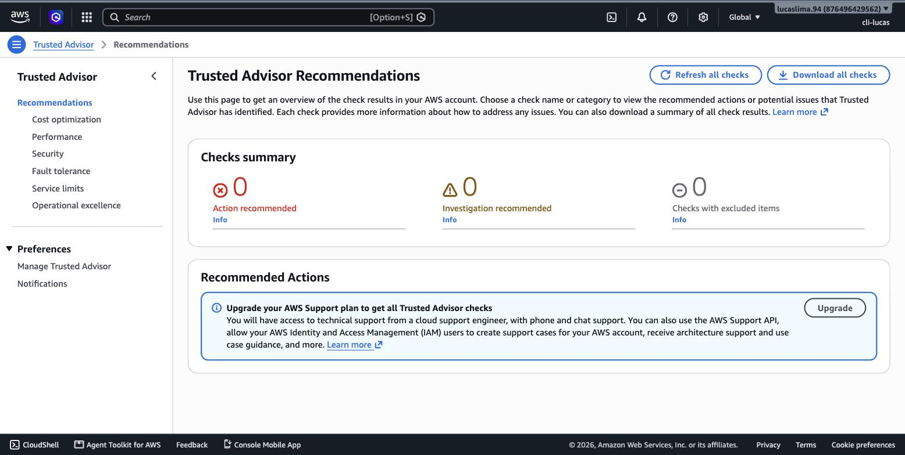
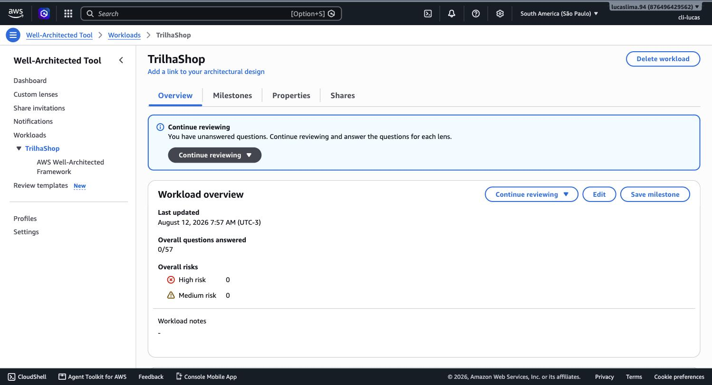

# Módulo 05 — Arquitetura de Nuvem

> **Objetivo**: dominar o AWS Well-Architected Framework por completo — os seis pilares e as perguntas que cada um força você a fazer — e sair sabendo usar a ferramenta real que a AWS oferece para avaliar uma arquitetura contra eles, não só recitar os nomes.
>
> **Pré-requisitos**: módulo 01 (primeira menção aos seis pilares), módulo 02 (multi-AZ como base de confiabilidade) e módulo 04 (rede como parte do desenho de arquitetura).
>
> **Tempo de referência (não prazo)**: uma semana em ritmo moderado.
>
> Este módulo cruza dois domínios: Task Statement 1.2 do **Domínio 1 — Cloud Concepts** (design principles) e partes do **Domínio 3 — Cloud Technology and Services**, já que arquitetura se expressa através dos serviços vistos nos módulos ao redor deste. Domínio 1: https://docs.aws.amazon.com/aws-certification/latest/cloud-practitioner-02/cloud-practitioner-02-domain1.html. Trilha sobre o CLF-C02 vigente, não o CLF-C01 (aposentado em 18/09/2023).

---

## Retomando de onde o módulo 01 parou

Lá atrás, você viu a lista dos seis pilares numa única tela do Well-Architected Tool, sem entrar no que cada um significa. Esse é exatamente o assunto deste módulo: cada pilar é, na prática, uma lente diferente para olhar para a mesma arquitetura e fazer uma pergunta diferente. Nenhuma arquitetura real otimiza os seis pilares ao mesmo tempo no máximo — cada decisão de design é, no fundo, uma negociação entre eles, e a maturidade de um arquiteto se mede pela capacidade de fazer essa negociação conscientemente, não por acidente.

## Os seis pilares, um por um

**Excelência operacional** pergunta: como você opera, monitora e melhora continuamente os sistemas que roda? Isso inclui automatizar mudanças em vez de fazê-las manualmente, responder a eventos de forma padronizada, e aprender com falhas através de post-mortems estruturados em vez de simplesmente consertar e seguir em frente.

**Segurança** pergunta: como você protege informação, sistemas e ativos, entregando valor ao negócio através de avaliação de risco e estratégias de mitigação contínuas? Boa parte do conteúdo do módulo 3 — Shared Responsibility Model, IAM, criptografia — é a implementação concreta deste pilar.

**Confiabilidade** pergunta: como o sistema se recupera de falhas de infraestrutura ou de serviço, e como ele atende à demanda dinamicamente para evitar falha por sobrecarga? A redundância multi-AZ do módulo 2 e as estratégias de disaster recovery do módulo 11 são aplicações diretas deste pilar.

**Eficiência de performance** pergunta: como você usa recursos computacionais de forma eficiente para atender aos requisitos do sistema, e como você mantém essa eficiência à medida que a demanda muda e as tecnologias evoluem? Escolher o tipo certo de instância EC2 para uma carga de trabalho específica (módulo 9) é uma decisão deste pilar.

**Otimização de custos** pergunta: como você evita gastos desnecessários? Escolher entre instâncias On-Demand, Reserved e Spot (módulo 9), ou entre classes de armazenamento S3 diferentes para dados quentes e frios (módulo 12), são decisões de otimização de custos.

**Sustentabilidade** — o pilar mais recente, adicionado em 2021 — pergunta: como você minimiza o impacto ambiental de rodar cargas de trabalho em nuvem? Isso inclui desde escolher regiões com matriz energética mais limpa até desligar recursos ociosos (o que, não por acaso, também reduz custo — os pilares frequentemente se reforçam, mas nem sempre).

> `[TEORIA]` Para a prova: os seis pilares, na ordem em que a AWS costuma listá-los, são excelência operacional, segurança, confiabilidade, eficiência de performance, otimização de custos e sustentabilidade. A prova gosta de dar um cenário curto (por exemplo, "uma empresa quer reduzir o tempo de resposta a incidentes através de automação") e pedir para identificar a qual pilar aquilo pertence — neste exemplo, excelência operacional.

## Vendo os pilares através da ferramenta real

O **AWS Well-Architected Tool** não é só uma lista estática — é um questionário estruturado que percorre cada pilar fazendo perguntas específicas sobre uma carga de trabalho real que você está desenhando ou já rodando, e no final aponta riscos identificados com recomendações concretas de como mitigá-los.

> `[PRINT]` Passo a passo para capturar: no Console, abrir "Well-Architected Tool", clicar em "Define workload", preencher um nome qualquer (por exemplo, "Laboratório da trilha") e a região São Paulo, e avançar até a etapa de perguntas. Selecionar o pilar "Reliability" (Confiabilidade) e capturar a tela com uma das perguntas visíveis, junto das opções de resposta em checkbox. Não é necessário concluir a revisão inteira.

Repare como cada pergunta do pilar não é abstrata — ela pede para você confirmar práticas concretas ("Como você faz backup dos dados?", "Como você detecta e responde a falhas de disponibilidade?"). É esse formato de pergunta-resposta que transforma os seis pilares de uma lista decorada em uma ferramenta de revisão de arquitetura de verdade, usada por equipes reais antes de colocar um sistema em produção.

## Uma segunda ferramenta: AWS Trusted Advisor

Enquanto o Well-Architected Tool depende de você responder perguntas sobre sua arquitetura, o **AWS Trusted Advisor** analisa automaticamente os recursos já existentes na sua conta e aponta recomendações em cinco categorias que espelham, de forma prática, boa parte dos pilares: otimização de custos, performance, segurança, tolerância a falhas e limites de serviço.

> `[PRINT]` Passo a passo para capturar: no Console, buscar "Trusted Advisor" e abrir o serviço. Capturar a tela do painel principal, mostrando os cartões de categoria com contadores (mesmo que a maioria esteja em branco ou com poucos itens, por a conta ser nova e ter poucos recursos criados).

> `[TEORIA]` Para a prova: as cinco categorias de checagem do Trusted Advisor são Cost Optimization, Performance, Security, Fault Tolerance e Service Limits. Vale notar que o nível de acesso completo às checagens do Trusted Advisor depende do plano de suporte da conta — o módulo 16 volta a esse ponto ao tratar dos planos de suporte da AWS.

## Princípios de design que atravessam todos os pilares

Além dos seis pilares como categorias separadas, existe um conjunto de princípios de design que aparece repetidamente dentro de mais de um pilar ao mesmo tempo, porque resolve mais de um problema de uma vez.

**Desacoplamento** significa desenhar componentes de um sistema para que dependam uns dos outros o mínimo possível — se o componente A falhar, o componente B continua funcionando (ou degrada de forma controlada), em vez de cair junto. Uma fila de mensagens entre dois serviços, por exemplo, desacopla o ritmo de um do ritmo do outro: se o serviço consumidor ficar temporariamente indisponível, as mensagens esperam na fila em vez de se perderem.

**Redundância** significa ter mais de uma cópia de um componente crítico, de forma que a falha de uma não derrube o sistema — é literalmente o que múltiplas Availability Zones (módulo 2) viabilizam na camada de infraestrutura.

**Elasticidade** — já vista no módulo 1 como benefício de negócio — é também um princípio de design: construir o sistema para crescer e encolher automaticamente, em vez de ser dimensionado para um único ponto fixo de capacidade.

**Design para falha** é talvez o princípio mais contraintuitivo para quem vem de infraestrutura tradicional: em vez de tentar tornar cada componente individual infalível (o que é caro e, em última análise, impossível), você assume que qualquer componente vai falhar eventualmente, e desenha o sistema inteiro para tolerar e se recuperar dessa falha automaticamente.

> `[TEORIA]` Para a prova: reconhecer os quatro princípios — desacoplamento, redundância, elasticidade, design para falha — e associá-los ao pilar de confiabilidade principalmente, embora eles atravessem outros pilares também (desacoplamento, por exemplo, também favorece eficiência de performance ao permitir escalar componentes independentemente).

## Padrões arquiteturais recorrentes

Alguns arranjos de arquitetura aparecem com tanta frequência que ganharam nome próprio. A arquitetura **multi-AZ** distribui os componentes de uma aplicação por múltiplas Availability Zones dentro da mesma região, garantindo que a perda de uma AZ não derrube o sistema — é o padrão padrão (com perdão da redundância) para qualquer carga de trabalho de produção séria na AWS. A arquitetura **multi-region** vai um passo além, distribuindo a aplicação inteira por regiões diferentes, normalmente reservada para requisitos extremos de disponibilidade ou para servir usuários geograficamente distantes com baixa latência em todos os lugares — o módulo 2 já sinalizou isso como `[APROFUNDAMENTO]` de nível Solutions Architect.

Arquiteturas **desacopladas com filas** usam serviços como o Amazon SQS (mencionado brevemente no domínio 3 do exame, dentro de serviços de integração de aplicação) para conectar componentes de forma assíncrona: em vez de o componente A chamar diretamente o componente B e esperar uma resposta imediata, A coloca uma mensagem numa fila, e B a processa no seu próprio ritmo. Isso absorve picos de tráfego (a fila cresce temporariamente em vez de o sistema cair) e permite que os dois componentes evoluam e escalem de forma independente.

`[APROFUNDAMENTO]` Desenhar essas arquiteturas — decidir onde exatamente colocar uma fila, como dimensionar réplicas multi-region, qual estratégia de failover usar entre elas — é o núcleo do trabalho de um Solutions Architect Associate. Para o Cloud Practitioner, o que importa é reconhecer o padrão pelo nome e pelo cenário de uso, não desenhá-lo do zero.

## Práticas

### Prática isolada

No Well-Architected Tool, defina uma segunda workload, hipotética e sem nenhuma relação com o TrilhaShop — por exemplo, "Blog pessoal em WordPress" ou "Sistema interno de ponto eletrônico". Percorra o questionário completo de **dois** pilares à sua escolha (não precisa fazer os seis), respondendo com a arquitetura mais simples e ingênua que você conseguir imaginar para essa workload (um único servidor, sem backup, sem redundância). Ao final, veja o relatório de riscos identificados que a ferramenta gera. O objetivo é sentir, na prática, como o questionário expõe pontos fracos de uma arquitetura ruim — antes de aplicar a mesma ferramenta a um projeto que você realmente está construindo.

### Contribuição ao projeto integrador

Agora sim, contra o TrilhaShop de verdade. Volte ao Well-Architected Tool e defina a workload real do projeto:

> `[PRINT]` Passo a passo para capturar: "Well-Architected Tool" → "Define workload". Nome: `TrilhaShop`. Região: São Paulo. Descrição: mencionar que, até este ponto, o projeto tem uma VPC com subnets públicas/privadas em 2 AZs e três Security Groups em cadeia (o que foi construído no módulo 4). Capturar a tela preenchida antes de salvar.

Responda ao menos o questionário do pilar **Confiabilidade** e do pilar **Segurança** contra o que já existe — a resposta honesta, neste ponto da trilha, vai apontar riscos reais (por exemplo, "nenhum recurso de computação ainda existe, então não há redundância de aplicação a avaliar" ou "MFA está ativo no root, mas ainda não há CloudTrail configurado explicitamente para auditoria"). Isso é esperado: o TrilhaShop está no início, e o valor do exercício é justamente ver a lista de riscos diminuir a cada módulo que você revisitar esta mesma revisão. Guarde a revisão salva no Console — os módulos 9, 13 e 16 vão voltar a ela.

`[CUSTO]` O Well-Architected Tool não tem custo de uso. Nada a pausar aqui.

## Erros comuns nesta fase

O erro mais comum é tratar os seis pilares como uma lista neutra em que "mais de tudo é sempre melhor" — na prática, otimizar agressivamente por custo frequentemente reduz redundância (menos réplicas rodando), e otimizar agressivamente por performance frequentemente aumenta custo. A prova gosta de testar justamente esse tipo de trade-off, então desconfie de qualquer alternativa que prometa maximizar dois pilares conflitantes ao mesmo tempo sem custo nenhum. O segundo erro é confundir "design para falha" com pessimismo operacional — é exatamente o oposto: é o que permite construir sistemas confiáveis usando componentes individualmente imperfeitos, que é a realidade de qualquer hardware em escala.

## Conexão com os módulos seguintes

| Conceito deste módulo | Aparece novamente em |
|---|---|
| Pilar de confiabilidade | Auto Scaling — módulo 6; estratégias de uptime — módulo 11 |
| Pilar de otimização de custos | Modelos de compra do EC2 — módulo 9; classes de armazenamento — módulo 12 |
| Redundância / multi-AZ | Base técnica revisitada em profundidade — módulo 11 |
| Desacoplamento com filas | Padrão serverless — módulo 14 |
| Trusted Advisor | Planos de suporte da AWS — módulo 16 |

## `[REFERÊNCIA]`

- AWS — Domínio 1 do exame CLF-C02, Task 1.2: https://docs.aws.amazon.com/aws-certification/latest/cloud-practitioner-02/cloud-practitioner-02-domain1.html
- AWS — *AWS Well-Architected Framework* (documentação completa dos seis pilares): https://docs.aws.amazon.com/wellarchitected/latest/framework/welcome.html
- AWS — *AWS Well-Architected Tool*: https://aws.amazon.com/well-architected-tool/
- AWS — *AWS Trusted Advisor*: https://aws.amazon.com/premiumsupport/technology/trusted-advisor/
- AWS Skill Builder — *AWS Cloud Practitioner Essentials*: https://explore.skillbuilder.aws/learn/course/external/view/elearning/134/aws-cloud-practitioner-essentials

## Checklist de saída

Você está pronto para o módulo 06 quando consegue, sem consultar:

- [ ] Nomear os seis pilares e formular, para cada um, a pergunta central que ele responde.
- [ ] Dado um cenário curto, identificar a qual pilar ele pertence primariamente.
- [ ] Explicar o que o Well-Architected Tool faz e como ele difere do Trusted Advisor (perguntas sobre uma arquitetura planejada vs. análise automática de recursos já existentes).
- [ ] Nomear as cinco categorias de checagem do Trusted Advisor.
- [ ] Explicar os quatro princípios de design (desacoplamento, redundância, elasticidade, design para falha) com um exemplo prático de cada.
- [ ] Reconhecer os padrões multi-AZ, multi-region e arquitetura desacoplada com filas, e o cenário típico de cada.
- [ ] Ter rodado, no Console real, ao menos uma pergunta do Well-Architected Tool e visto o painel do Trusted Advisor.
- [ ] Ter avaliado uma workload hipotética contra dois pilares na prática isolada.
- [ ] Ter criado a revisão real "TrilhaShop" no Well-Architected Tool, com os pilares Confiabilidade e Segurança respondidos contra o estado atual do projeto.
