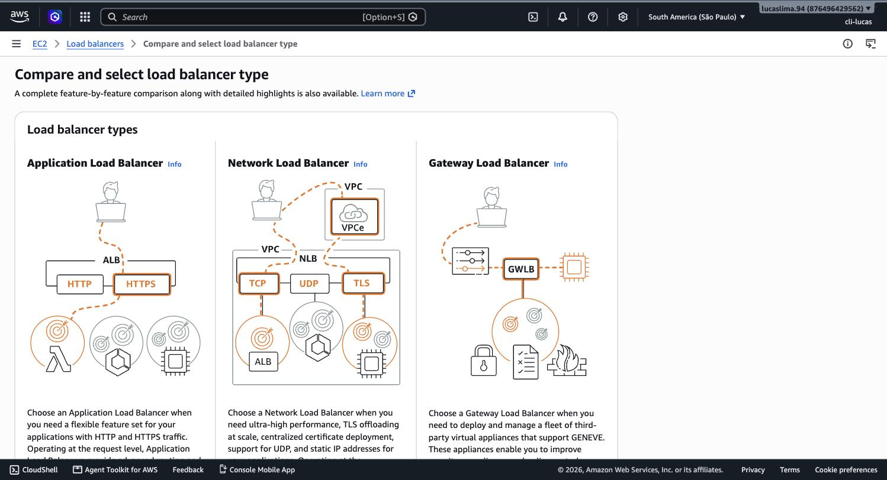
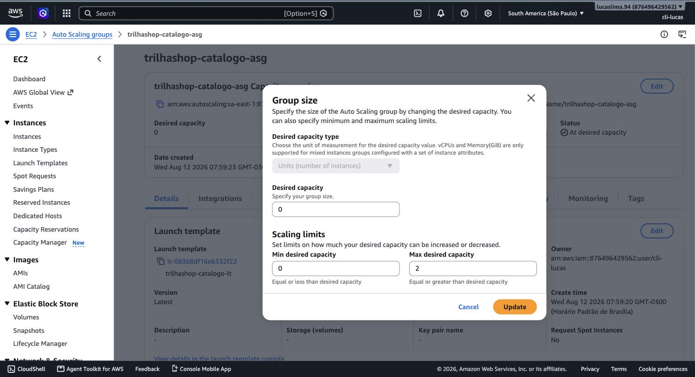
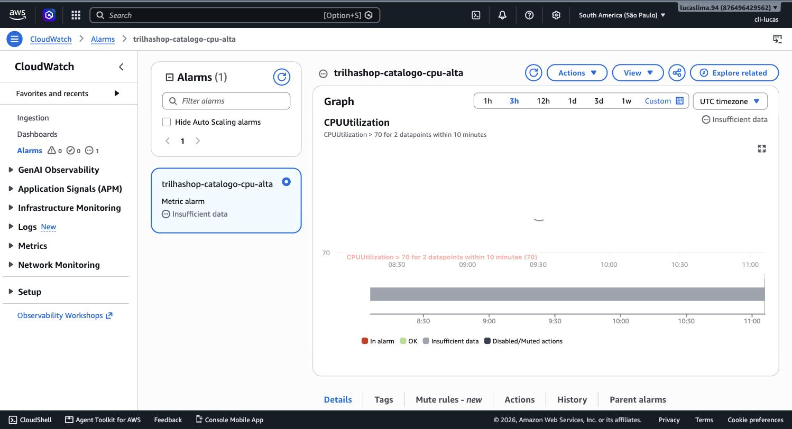
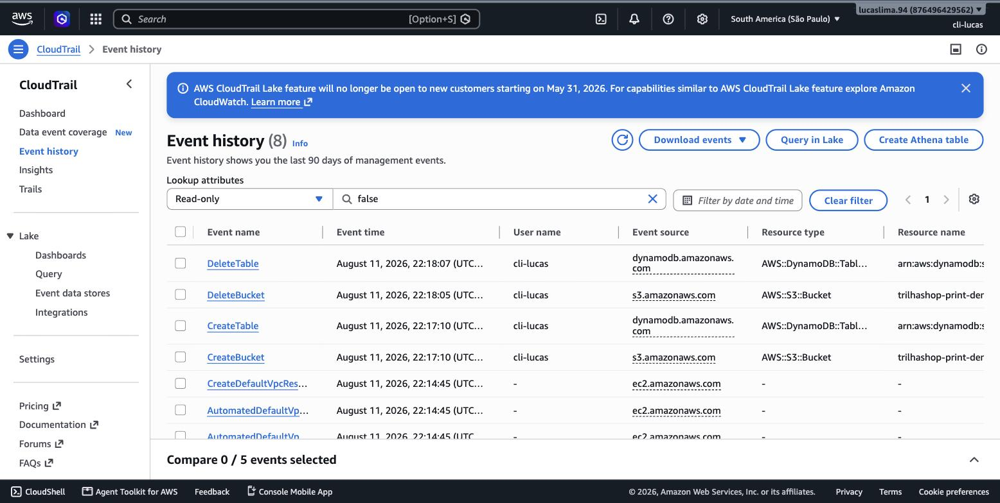
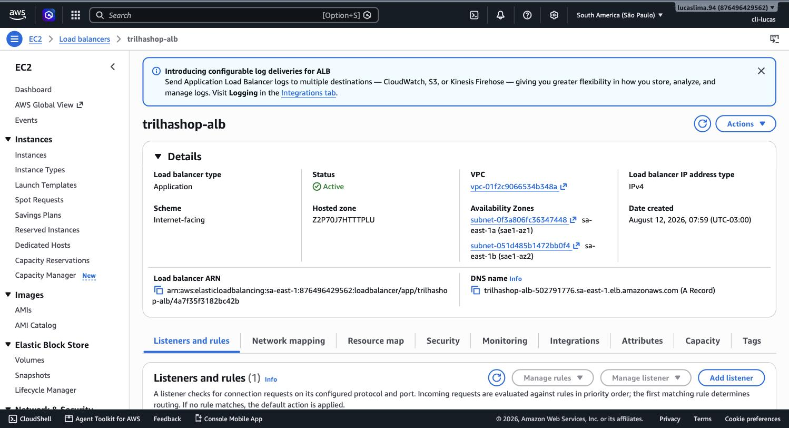
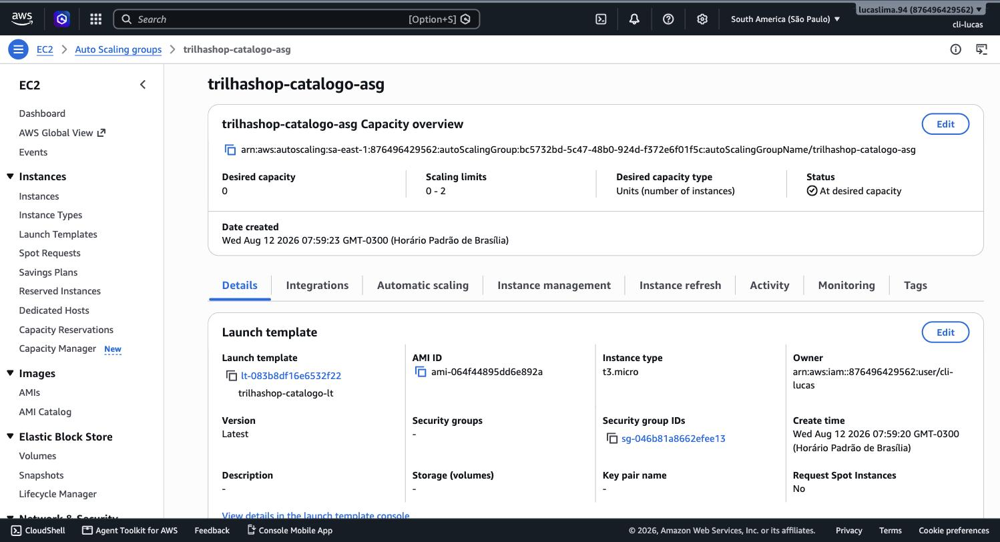

# Módulo 06 — Auto Scaling e Monitoramento

> **Objetivo**: entender o mecanismo técnico exato por trás da elasticidade que você já conhece conceitualmente desde o módulo 1 — como um Load Balancer distribui tráfego, como um Auto Scaling Group reage a sinais para crescer e encolher, e como o CloudWatch fornece os sinais que tornam tudo isso possível.
>
> **Pré-requisitos**: módulo 02 (múltiplas AZs — Load Balancer e Auto Scaling operam sobre elas), módulo 04 (VPC e subnets — onde as instâncias escaladas vivem) e módulo 05 (pilar de confiabilidade — este módulo é a implementação técnica dele).
>
> **Tempo de referência (não prazo)**: uma a duas semanas em ritmo moderado.
>
> Este módulo corresponde à Task Statement 3.3 do **Domínio 3 — Cloud Technology and Services** (34% do conteúdo pontuado), que cobra explicitamente "reconhecer que auto scaling provê elasticidade" e "identificar os propósitos de load balancers". Página oficial: https://docs.aws.amazon.com/aws-certification/latest/cloud-practitioner-02/cloud-practitioner-02-domain3.html. Trilha sobre o CLF-C02 vigente, não o CLF-C01 (aposentado em 18/09/2023).

---

## De volta ao problema da Black Friday

O módulo 1 abriu com o problema clássico: uma loja que precisa de mais capacidade no pico de dezembro do que no resto do ano. Lá, a resposta foi conceitual — "a nuvem permite crescer e encolher sob demanda". Este módulo entrega o mecanismo real por trás dessa frase: dois serviços que trabalham juntos, o **Elastic Load Balancing** e o **Auto Scaling**, complementados por um terceiro que dá a eles os olhos para saber quando agir, o **Amazon CloudWatch**.

## Elastic Load Balancing: distribuindo tráfego e absorvendo falhas

Um **Load Balancer** fica na frente de um grupo de instâncias (ou outros destinos) e distribui o tráfego recebido entre elas, em vez de deixar todo o tráfego bater numa única instância. Isso resolve dois problemas ao mesmo tempo: distribui carga, evitando que uma única instância fique sobrecarregada enquanto outras ficam ociosas; e absorve falhas — se uma instância para de responder, o Load Balancer para de enviar tráfego para ela e redireciona para as instâncias saudáveis restantes, sem que o usuário final perceba a falha.

A AWS oferece três tipos de Elastic Load Balancer, cada um pensado para um nível diferente da pilha de rede. O **Application Load Balancer (ALB)** opera na camada de aplicação (HTTP/HTTPS) e entende o conteúdo da requisição — pode rotear com base no caminho da URL ou no cabeçalho da requisição, o que o torna ideal para aplicações web modernas e arquiteturas de microsserviços. O **Network Load Balancer (NLB)** opera na camada de transporte (TCP/UDP), lida com volumes extremamente altos de conexões com latência mínima, e é a escolha certa quando performance bruta importa mais do que roteamento inteligente de conteúdo. O **Classic Load Balancer (CLB)** é o modelo mais antigo, hoje considerado legado, mantido principalmente por compatibilidade com aplicações já configuradas para ele.

> `[PRINT]` Passo a passo para capturar: abrir o EC2 direto em https://console.aws.amazon.com/ec2/home?region=sa-east-1 (ou buscar "EC2" na barra de busca do Console). No menu lateral, em "Load Balancing", clicar em "Load Balancers" e depois em "Create load balancer". Capturar a tela que apresenta os cartões de escolha do tipo de load balancer, com a descrição de cada um. Não é necessário concluir a criação.

> `[TEORIA]` Para a prova: ALB opera na camada 7 (aplicação, HTTP/HTTPS, roteamento por conteúdo), NLB opera na camada 4 (transporte, TCP/UDP, alta performance), CLB é legado. Um cenário que menciona "rotear por caminho de URL" aponta para ALB; um que menciona "latência ultrabaixa e altíssimo volume de conexões" aponta para NLB.

## Auto Scaling Groups: crescendo e encolhendo por sinal, não por comando manual

Um **Auto Scaling Group (ASG)** é a definição de "quantas instâncias devem existir agora", junto com as regras que determinam como esse número muda ao longo do tempo. Um ASG é configurado com um número mínimo, um número desejado e um número máximo de instâncias — e dentro desses limites, ele adiciona ou remove instâncias automaticamente, seguindo uma política de escalonamento.

**Target tracking scaling** é a política mais simples e mais usada: você define uma métrica-alvo (por exemplo, "manter a utilização média de CPU em 50%") e o ASG ajusta o número de instâncias automaticamente para tentar manter esse alvo, adicionando instâncias quando a métrica sobe e removendo quando ela cai. **Step scaling** dá controle mais fino, definindo degraus de resposta diferentes conforme a intensidade do sinal (por exemplo, adicionar uma instância se a CPU passar de 60%, adicionar duas se passar de 80%). **Scheduled scaling** ajusta a capacidade em horários pré-determinados, útil quando o padrão de demanda é previsível — uma aplicação corporativa que só é usada em horário comercial, por exemplo, pode reduzir capacidade automaticamente à noite.

> `[PRINT]` Passo a passo para capturar: dentro do EC2, no menu lateral em "Auto Scaling", clicar em "Auto Scaling Groups" e depois em "Create Auto Scaling group". Avançar até a etapa "Configure group size and scaling policies" e capturar a tela mostrando os três campos: "Desired capacity", "Minimum capacity" e "Maximum capacity". Não é necessário concluir a criação.

> `[TEORIA]` Para a prova: reconhecer os três tipos de política — target tracking (mais comum, baseada em métrica-alvo), step scaling (degraus configuráveis) e scheduled scaling (baseada em horário previsível). O ASG nunca ultrapassa o máximo nem fica abaixo do mínimo configurado, independentemente da política escolhida.

Vale notar como Load Balancer e Auto Scaling Group trabalham juntos na prática: o ASG cria e destrói instâncias conforme a demanda muda, e o Load Balancer, que fica associado a esse mesmo grupo, automaticamente passa a enviar (ou parar de enviar) tráfego para cada instância assim que ela é criada ou removida — sem que ninguém precise reconfigurar nada manualmente a cada mudança de capacidade.

## CloudWatch: os olhos que alimentam essas decisões

Nenhuma política de Auto Scaling funciona sem uma fonte confiável de métricas para reagir. É essa a função do **Amazon CloudWatch**: ele coleta métricas (números medidos ao longo do tempo, como utilização de CPU, contagem de requisições, latência), armazena logs (registros textuais de eventos gerados por aplicações e serviços), e permite configurar alarmes que disparam uma ação — como escalar um ASG, ou notificar alguém — quando uma métrica ultrapassa um limite definido.

> `[PRINT]` Passo a passo para capturar: abrir o CloudWatch direto em https://console.aws.amazon.com/cloudwatch/home?region=sa-east-1 (ou buscar "CloudWatch" na barra de busca do Console). No menu lateral, clicar em "All alarms" e depois em "Create alarm", ou em "Metrics" → "All metrics" para ver métricas disponíveis (podem estar vazias se não houver recursos ativos, mas a interface do assistente de criação de alarme é o que importa capturar). Avançar até a etapa em que a métrica é selecionada e o gráfico de série temporal aparece. Não é necessário concluir a criação do alarme.

O CloudWatch é também onde você configuraria o *billing alarm* que já existe na sua conta desde a preparação inicial (seção "Antes do módulo 1" do índice) — aquele alarme nada mais é do que uma métrica de custo estimado sendo observada por um alarme do CloudWatch, o mesmo mecanismo que agora está sendo aplicado a métricas de infraestrutura.

## A diferença entre CloudWatch e CloudTrail

Um ponto de confusão recorrente, inclusive em prova, é misturar CloudWatch com **AWS CloudTrail** — os dois têm nomes parecidos e ambos lidam com "o que está acontecendo na conta", mas respondem perguntas diferentes. O CloudWatch responde "o que está acontecendo com o desempenho e a saúde dos meus recursos agora" — métricas, logs de aplicação, alarmes operacionais. O CloudTrail responde "quem fez o quê, quando, e de onde" — ele registra cada chamada de API feita na conta, seja pelo Console, pela CLI ou por um SDK, criando uma trilha de auditoria completa. Se uma instância foi terminada inesperadamente, o CloudWatch mostra o impacto na métrica de instâncias ativas; o CloudTrail mostra exatamente qual usuário (ou role) chamou a API que terminou aquela instância.

> `[PRINT]` Passo a passo para capturar: abrir o CloudTrail direto em https://console.aws.amazon.com/cloudtrail/home?region=sa-east-1 (ou buscar "CloudTrail" na barra de busca do Console). Clicar em "Event history" no menu lateral. Capturar a tela mostrando a lista de eventos recentes da conta (chamadas de API já feitas durante os laboratórios anteriores desta trilha, como criação de recursos ou consultas ao IAM), com as colunas de nome do evento, usuário e horário visíveis.

> `[TEORIA]` Para a prova: CloudWatch = monitoramento de performance e saúde (métricas, logs, alarmes). CloudTrail = auditoria de quem fez o quê (histórico de chamadas de API). Essa distinção volta a aparecer, de forma complementar, na Task 2.2 do domínio de segurança ("monitoring with CloudWatch; auditing with CloudTrail and AWS Config").

`[APROFUNDAMENTO]` Um terceiro serviço relacionado, **AWS Config**, vai além do CloudTrail ao rastrear não só quem fez uma mudança, mas o histórico completo de como a configuração de um recurso mudou ao longo do tempo, permitindo avaliar conformidade contra regras definidas. Não é foco do Cloud Practitioner configurá-lo, mas vale reconhecer o nome como parte do conjunto de ferramentas de governança.

`[CUSTO]` Criar um Auto Scaling Group ou um Load Balancer de verdade gera cobrança contínua enquanto estiver ativo — um ALB, por exemplo, é cobrado por hora de disponibilidade mesmo sem tráfego algum. Os passos deste módulo foram roteirizados para parar antes da confirmação final de criação, exatamente para evitar esse custo durante a exploração. Se você quiser ir além e criar um ambiente completo de teste, lembre de excluir o Load Balancer e reduzir o Auto Scaling Group a zero instâncias (ou excluí-lo) ao final.

## Práticas

### Prática isolada

Crie um Auto Scaling Group totalmente descartável, fora da VPC do projeto, só para sentir o mecanismo de escalonamento manual. Use "EC2" → "Launch Templates" → "Create launch template", com uma AMI Amazon Linux qualquer, tipo `t2.micro`, sem user data. Em seguida, "Auto Scaling Groups" → "Create Auto Scaling group", usando esse launch template, na VPC padrão da conta, com capacidade mínima 0, desejada 0, máxima 2. Depois de criado, edite o ASG e mude a capacidade desejada para 2 — observe, na aba "Activity", o ASG lançando duas instâncias sozinho, sem você ter clicado em "Launch instance" em nenhum momento. Depois, volte a capacidade desejada para 0 e confirme que as instâncias são encerradas automaticamente. Ao final, exclua o Auto Scaling Group e o launch template — nada disso deve sobreviver ao módulo.

`[CUSTO]` As duas instâncias `t2.micro` criadas temporariamente pelo exercício ficam dentro do Free Tier se você não deixá-las rodando por muito tempo — o objetivo é só ver a mudança de capacidade acontecer (poucos minutos), depois zerar de novo.

### Contribuição ao projeto integrador

Agora a peça real: o Load Balancer e o Auto Scaling Group que vão sustentar o catálogo do TrilhaShop, dentro da `trilhashop-vpc` criada no módulo 4. Este módulo monta a estrutura; o módulo 9 volta aqui para colocar a aplicação de verdade dentro dela.

> `[PRINT]` Passo a passo para capturar: "EC2" → "Load Balancers" → "Create load balancer" → "Application Load Balancer". Nome: `trilhashop-alb`. VPC: `trilhashop-vpc`. Mapear as duas subnets **públicas** (`trilhashop-subnet-public1...`, `-public2...`). Security group: `trilhashop-web-sg` (criado no módulo 4). Criar um novo target group `trilhashop-catalogo-tg` (tipo instância, porta 80, mesma VPC) durante o mesmo fluxo. Capturar a tela com essa configuração preenchida antes de criar.

Com o ALB criado, monte o launch template e o ASG que vão preencher esse target group:

> `[PRINT]` Passo a passo para capturar: criar o launch template `trilhashop-catalogo-lt` (AMI Amazon Linux 2023, tipo `t2.micro` ou `t3.micro`, Security Group `trilhashop-app-sg` — **sem user data ainda**, isso vem no módulo 9). Depois, "Auto Scaling Groups" → "Create Auto Scaling group", usando esse launch template, na `trilhashop-vpc`, subnets **privadas** (`-private1...`, `-private2...`). Na etapa de load balancing, anexar ao target group `trilhashop-catalogo-tg` já criado. Configurar capacidade mínima 0, desejada 0, máxima 2 — deliberadamente **zero por enquanto**, porque o launch template ainda não tem nenhuma aplicação real para servir. Capturar a tela de revisão antes de criar.

Deixe a capacidade desejada em 0 até o módulo 9 — não há necessidade de pagar por instâncias rodando um sistema operacional vazio. O ALB, porém, já fica no ar (e já começa a cobrar por hora), servindo como a peça de rede que o módulo 9 vai popular de conteúdo real.

`[CUSTO]` A partir daqui, o TrilhaShop tem um segundo recurso cobrando por hora: o Application Load Balancer, independentemente de haver instância saudável atrás dele ou não. Ver a tabela de pausa em `00_indice.md` — se for pausar por muito tempo, o ALB pode ser excluído e recriado depois (o target group e o ASG, com capacidade 0, não custam nada enquanto isso).

## Erros comuns nesta fase

O erro mais frequente é achar que o Auto Scaling Group reage instantaneamente — na prática, ele espera a métrica se manter fora do alvo por um período configurável antes de agir, para evitar "flapping" (adicionar e remover instâncias repetidamente por causa de um pico momentâneo). O segundo erro é esquecer que reduzir o número mínimo do ASG para 0 durante um laboratório não é o mesmo que excluir o grupo — o ASG em si não gera custo, mas vale ter o hábito de limpar completamente o que não vai mais ser usado.

## Conexão com os módulos seguintes

| Conceito deste módulo | Aparece novamente em |
|---|---|
| Load Balancer (ALB) | Padrão web com EC2 — módulo 9; failover de rede — módulo 11 |
| Auto Scaling Group | Instâncias EC2 escaladas — módulo 9; projeto final — módulo 16 |
| CloudWatch | Monitoramento retomado em containers — módulo 10; billing alarms — já em uso desde o módulo 1 |
| CloudTrail | Auditoria de segurança, complementar ao módulo 3 |

## `[REFERÊNCIA]`

- AWS — Domínio 3 do exame CLF-C02, Task 3.3: https://docs.aws.amazon.com/aws-certification/latest/cloud-practitioner-02/cloud-practitioner-02-domain3.html
- AWS — *What Is Elastic Load Balancing?*: https://docs.aws.amazon.com/elasticloadbalancing/latest/userguide/what-is-load-balancing.html
- AWS — *Amazon EC2 Auto Scaling User Guide*: https://docs.aws.amazon.com/autoscaling/ec2/userguide/what-is-amazon-ec2-auto-scaling.html
- AWS — *Amazon CloudWatch User Guide*: https://docs.aws.amazon.com/AmazonCloudWatch/latest/monitoring/WhatIsCloudWatch.html
- AWS — *AWS CloudTrail User Guide*: https://docs.aws.amazon.com/awscloudtrail/latest/userguide/cloudtrail-user-guide.html

## Checklist de saída

Você está pronto para o módulo 07 quando consegue, sem consultar:

- [ ] Explicar o propósito de um Load Balancer em duas frentes: distribuição de carga e absorção de falhas.
- [ ] Diferenciar ALB, NLB e CLB por camada de rede e cenário de uso.
- [ ] Explicar o que é um Auto Scaling Group e os três tipos de política de escalonamento (target tracking, step, scheduled).
- [ ] Explicar como Load Balancer e Auto Scaling Group trabalham juntos.
- [ ] Diferenciar CloudWatch de CloudTrail com uma frase para cada.
- [ ] Ter visto, no Console real, o assistente de criação de um Load Balancer, de um Auto Scaling Group, uma métrica com alarme no CloudWatch, e o event history do CloudTrail.
- [ ] Ter criado e destruído um ASG descartável, observando o escalonamento manual de 0 para 2 e de volta a 0.
- [ ] Ter criado, de verdade, o `trilhashop-alb` e o `trilhashop-catalogo-asg` (capacidade 0 por enquanto) na `trilhashop-vpc`.
