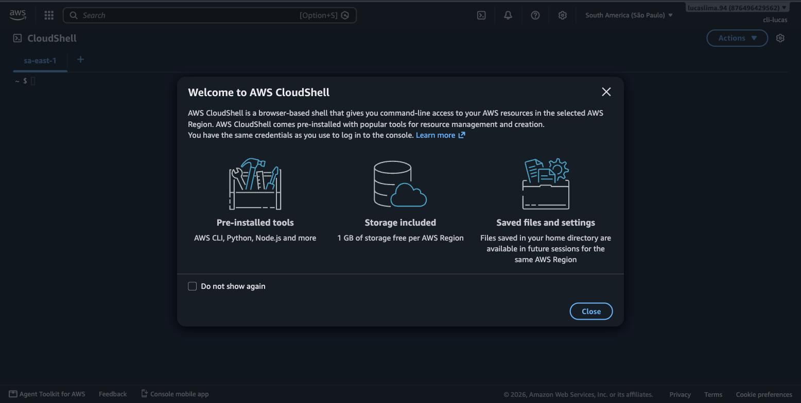
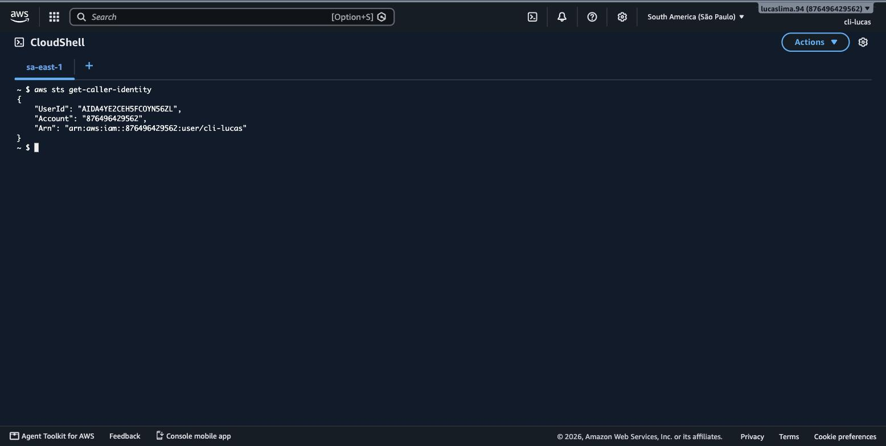
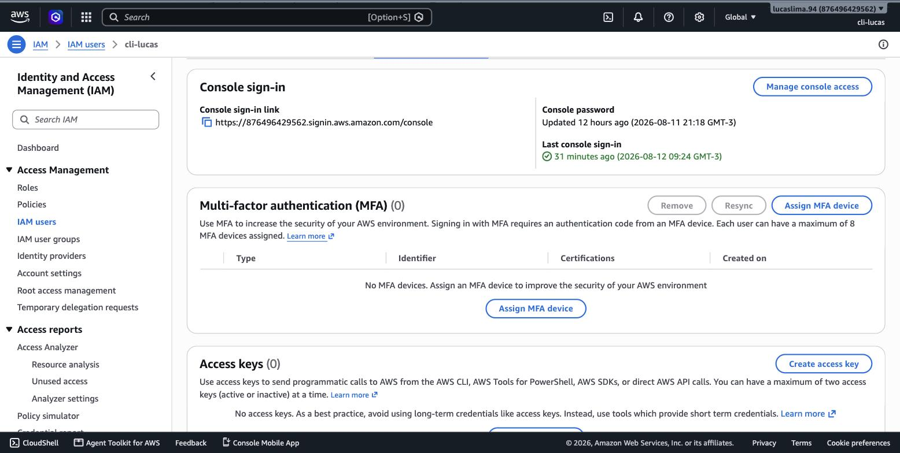

# Módulo 07 — AWS CLI e CloudShell

> **Objetivo**: sair da dependência exclusiva de cliques no Console e aprender a operar a AWS por linha de comando — entendendo por que isso importa, não só decorando sintaxe — usando primeiro o CloudShell (sem instalar nada) e depois, opcionalmente, o AWS CLI instalado localmente.
>
> **Pré-requisitos**: módulo 03 (IAM — Access Keys são credenciais IAM, e este módulo assume que você já entende usuários, políticas e o princípio do menor privilégio).
>
> **Tempo de referência (não prazo)**: uma semana em ritmo moderado.
>
> Este módulo corresponde à Task Statement 3.1 do **Domínio 3 — Cloud Technology and Services** (34% do conteúdo pontuado), que cobra decidir entre acesso programático (API, SDK, CLI), Console e infraestrutura como código. Página oficial: https://docs.aws.amazon.com/aws-certification/latest/cloud-practitioner-02/cloud-practitioner-02-domain3.html. Trilha sobre o CLF-C02 vigente, não o CLF-C01 (aposentado em 18/09/2023).

---

## Por que operar por linha de comando é uma habilidade separada

Até agora, esta trilha usou o Console para tudo — e por bom motivo: o Console é visual, exploratório, ótimo para aprender o que cada serviço oferece. Mas ele tem um limite estrutural: cada ação no Console é manual, um clique de cada vez, sem memória. Se você precisa criar a mesma configuração de rede em três ambientes diferentes (desenvolvimento, teste, produção), refazer isso manualmente no Console três vezes é lento e sujeito a erro humano — um clique esquecido, um campo preenchido diferente por engano. A **AWS CLI (Command Line Interface)** resolve exatamente esse problema: cada ação vira um comando de texto, que pode ser repetido de forma idêntica quantas vezes for preciso, guardado num arquivo, versionado, revisado por outra pessoa antes de rodar. É a diferença entre "eu lembro como fiz da última vez" e "eu tenho escrito, exatamente, como isso é feito".

> `[TEORIA]` Para a prova: a Task 3.1 do domínio 3 pede para você saber decidir entre Console, acesso programático (API/SDK/CLI) e infraestrutura como código (o assunto do módulo 8) para uma dada situação. Regra prática: Console para exploração e tarefas únicas; CLI/API para tarefas repetíveis e automação; IaC para infraestrutura que precisa ser versionada e reproduzida de forma confiável.

## O caminho mais rápido: AWS CloudShell

Antes de instalar qualquer coisa localmente, vale conhecer o **AWS CloudShell**: um terminal de linha de comando que roda inteiramente dentro do navegador, acessível direto do Console, já com o AWS CLI pré-instalado e pré-autenticado com as mesmas permissões do usuário que está logado. Não existe passo de configuração de credenciais — o CloudShell já sabe quem você é, porque você acabou de entrar nele a partir de uma sessão logada no Console.


> `[PRINT]` Passo a passo para capturar: logado no Console, clicar no ícone de terminal no topo da barra de navegação (geralmente ao lado do sino de notificações) ou buscar "CloudShell" na barra de busca. Aguardar o ambiente inicializar (pode levar alguns segundos na primeira vez). Capturar a tela com o terminal aberto e o prompt de comando visível, pronto para receber um comando.

Vale rodar o primeiro comando ali mesmo, para confirmar que a identidade autenticada é exatamente a que você espera:

```
aws sts get-caller-identity
```


> `[PRINT]` Passo a passo para capturar: dentro do CloudShell já aberto, digitar `aws sts get-caller-identity` e pressionar Enter. Capturar a tela mostrando o comando digitado e a saída JSON de resposta, com os campos `UserId`, `Account` e `Arn` visíveis (o `Arn` deve mostrar o nome do usuário IAM administrativo usado nesta trilha, não o root).

Esse comando é um bom hábito de verificação: `sts get-caller-identity` pergunta à AWS "quem eu sou, segundo as credenciais que estou usando agora", e a resposta confirma a conta e o usuário exatos — útil sempre que você não tem certeza de qual identidade está ativa numa sessão de terminal, especialmente depois do módulo 3 ter te ensinado a nunca presumir isso sem checar.

## A estrutura de um comando AWS CLI

Todo comando da AWS CLI segue o mesmo esqueleto: `aws <serviço> <ação> [parâmetros]`. O primeiro elemento depois de `aws` identifica o serviço (`ec2`, `s3`, `iam`, e assim por diante); o segundo identifica a ação dentro daquele serviço (`describe-instances`, `list-buckets`, `create-user`); e o resto são parâmetros específicos daquela ação. Os dois comandos que você já rodou no módulo 2 seguem exatamente esse padrão:

```
aws ec2 describe-regions --output table
aws ec2 describe-availability-zones --region sa-east-1 --output table
```

O parâmetro `--output` controla o formato da resposta — `table` para leitura humana, `json` (o padrão) para processamento programático, `text` para uso em scripts que precisam extrair um valor simples. Essa previsibilidade de formato é outra vantagem central da CLI sobre o Console: uma saída em JSON pode alimentar diretamente outro script ou ferramenta, algo impossível de fazer com uma tela clicada manualmente.

## Instalando e configurando localmente (opcional)

O CloudShell resolve a maior parte das necessidades de quem está aprendendo, mas tem uma limitação: ele existe só dentro do navegador, atrelado a uma sessão do Console. Para automação de verdade — scripts que rodam periodicamente, integração com ferramentas no seu próprio computador — instalar a AWS CLI localmente eventualmente se torna necessário. A instalação varia por sistema operacional (o site oficial, linkado nas referências, mantém instruções atualizadas para Windows, macOS e Linux); depois de instalada, a configuração inicial é feita com:

```
aws configure
```

Esse comando pede quatro informações: a **Access Key ID** e a **Secret Access Key** (o par de credenciais que identifica seu usuário IAM programaticamente, diferente da senha que você usa para logar no Console), a região padrão, e o formato de saída padrão. É possível manter múltiplos conjuntos de credenciais simultaneamente através de **profiles** nomeados (`aws configure --profile nome-do-profile`), útil quando você precisa alternar entre contas ou entre usuários com permissões diferentes.

## Access Keys: a credencial mais fácil de vazar por engano

Uma Access Key é criada dentro do IAM, associada a um usuário específico, e funciona como usuário e senha para acesso programático — mas sem a proteção adicional de MFA que normalmente protege o login no Console. Isso a torna, ao mesmo tempo, indispensável para automação e particularmente perigosa se exposta.


> `[PRINT]` Passo a passo para capturar: no Console, abrir "IAM" → "Users", selecionar o usuário administrativo usado nesta trilha, e clicar na aba "Security credentials". Rolar até a seção "Access keys" e capturar a tela mostrando a lista de chaves existentes (se houver) e o botão "Create access key". Não é necessário criar uma chave nova — se já existir uma da configuração inicial da conta, ela pode aparecer na lista (com o valor da Secret oculto, como o Console sempre mostra por padrão).

> `[ATENÇÃO]` O erro mais caro e mais comum envolvendo Access Keys é publicá-las sem querer num repositório de código público — bots automatizados varrem o GitHub constantemente à procura desse padrão específico, e uma chave exposta pode ser usada em minutos para gerar recursos custosos (mineração de criptomoeda é um abuso comum) na sua conta. Nunca coloque uma Access Key diretamente em código-fonte; use variáveis de ambiente, arquivos de configuração fora do controle de versão, ou, melhor ainda, roles do IAM em vez de Access Keys sempre que o contexto permitir (por exemplo, uma instância EC2 rodando um script não precisa de uma Access Key fixa — ela pode assumir uma role diretamente, um padrão que o módulo 9 detalha).

> `[TEORIA]` Para a prova: Access Keys concedem acesso programático e não são protegidas por MFA da mesma forma que o login do Console. Rotacionar (trocar periodicamente) e nunca commitar Access Keys em código são práticas de segurança cobradas em conjunto com os tópicos de IAM do domínio 2.

`[CUSTO]` Nenhuma ação deste módulo gera cobrança — CloudShell é gratuito para uso dentro de limites generosos de tempo e armazenamento por sessão, e os comandos `describe-*`/`get-caller-identity` são chamadas de leitura sem custo. O ponto de atenção fica, como sempre, para comandos que criam recursos (`aws ec2 run-instances`, por exemplo) — esses sim geram cobrança exatamente como se tivessem sido criados pelo Console.

## Erros comuns nesta fase

O erro mais comum de quem está começando com CLI é confundir a Secret Access Key com a senha do Console — são credenciais completamente diferentes, geradas e usadas em contextos distintos, e a Secret Access Key só é mostrada uma única vez no momento da criação (se perdida, é preciso gerar uma nova, não recuperar a antiga). O segundo erro é rodar comandos destrutivos (`delete-*`, `terminate-*`) sem antes rodar o `describe-*`/`list-*` correspondente para confirmar exatamente o que vai ser afetado — a CLI não pede confirmação visual como o Console frequentemente pede.

## Conexão com os módulos seguintes

| Conceito deste módulo | Aparece novamente em |
|---|---|
| Estrutura `aws <serviço> <ação>` | Todo laboratório com CLI complementar, a partir daqui |
| Access Keys vs. roles | Roles de instância EC2 — módulo 9; execução de Lambda — módulo 14 |
| CLI como via de acesso programático | Comparação com IaC — módulo 8 (CloudFormation) |
| `aws configure` / profiles | Automação de laboratórios mais avançados, ao longo da trilha |

## `[REFERÊNCIA]`

- AWS — Domínio 3 do exame CLF-C02, Task 3.1: https://docs.aws.amazon.com/aws-certification/latest/cloud-practitioner-02/cloud-practitioner-02-domain3.html
- AWS — *What Is the AWS Command Line Interface?*: https://docs.aws.amazon.com/cli/latest/userguide/cli-chap-welcome.html
- AWS — *AWS CloudShell User Guide*: https://docs.aws.amazon.com/cloudshell/latest/userguide/welcome.html
- AWS — *Managing Access Keys for IAM Users*: https://docs.aws.amazon.com/IAM/latest/UserGuide/id_credentials_access-keys.html

## Checklist de saída

Você está pronto para o módulo 08 quando consegue, sem consultar:

- [ ] Explicar por que operar por linha de comando resolve um problema que o Console não resolve (repetibilidade, automação).
- [ ] Explicar a estrutura geral de um comando AWS CLI (`aws <serviço> <ação> <parâmetros>`).
- [ ] Explicar o que o CloudShell oferece que a instalação local não oferece de imediato (nenhuma configuração de credencial necessária).
- [ ] Diferenciar Access Key de senha de Console, e explicar por que Access Keys expostas são um risco de segurança sério.
- [ ] Ter rodado, no CloudShell real, ao menos `aws sts get-caller-identity` e um comando `describe-*`.
