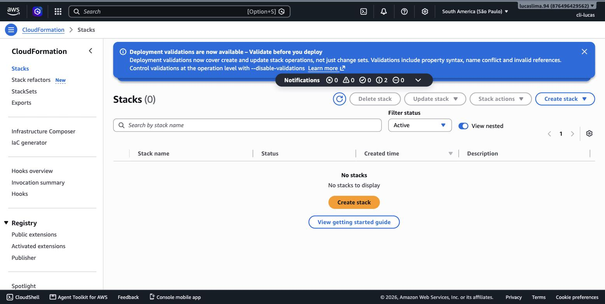
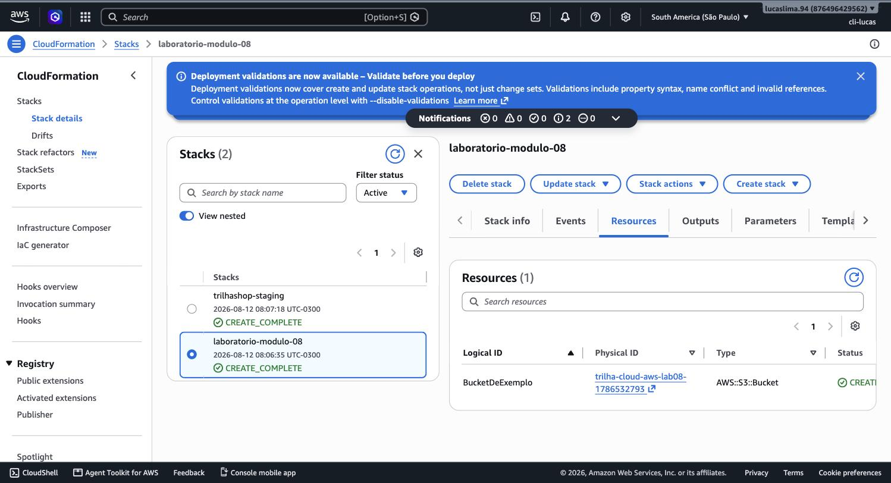
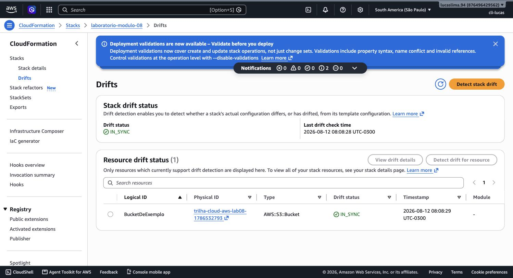
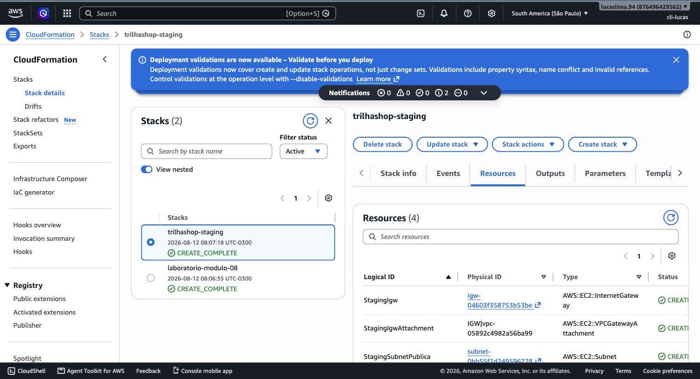

# Módulo 08 — CloudFormation

> **Objetivo**: entender por que descrever infraestrutura como texto resolve um problema que nem o Console nem a CLI, sozinhos, resolvem completamente — e sair sabendo ler e lançar um template CloudFormation real, do início ao fim, incluindo a limpeza correta ao final.
>
> **Pré-requisitos**: módulo 07 (CLI — CloudFormation é um serviço que também pode ser operado por linha de comando, embora este módulo use o Console) e a noção geral de que ações repetíveis merecem automação, já semeada ali.
>
> **Tempo de referência (não prazo)**: uma semana em ritmo moderado.
>
> Este módulo corresponde à Task Statement 3.1 do **Domínio 3 — Cloud Technology and Services** (34% do conteúdo pontuado), na parte sobre infraestrutura como código (IaC) como forma de provisionar e operar na AWS. Página oficial: https://docs.aws.amazon.com/aws-certification/latest/cloud-practitioner-02/cloud-practitioner-02-domain3.html. Trilha sobre o CLF-C02 vigente, não o CLF-C01 (aposentado em 18/09/2023).

---

## O problema que nem Console nem CLI sozinhos resolvem

O módulo 7 já mostrou por que a CLI é melhor que o Console para tarefas repetíveis: um comando pode ser reexecutado de forma idêntica. Mas um comando isolado ainda tem um limite — ele não sabe, por si só, o **estado atual** da infraestrutura. Se você rodou um comando para criar uma instância ontem, e hoje precisa saber exatamente o que existe, em que configuração, e se algo foi alterado manualmente desde então, nem o Console nem um histórico de comandos CLI respondem isso de forma confiável — você teria que reconstruir esse conhecimento na cabeça, olhando recurso por recurso.

**Infrastructure as Code (IaC)** resolve esse problema de um jeito diferente: em vez de descrever *ações* ("crie uma instância", "crie um bucket"), você descreve o **estado desejado** ("eu quero que exista exatamente esta instância, com esta configuração, e este bucket") num arquivo de texto declarativo. Uma ferramenta de IaC lê esse arquivo, compara com o que já existe de fato na nuvem, e calcula automaticamente o que precisa ser criado, alterado ou removido para que a realidade bata com o que está descrito. O **AWS CloudFormation** é a ferramenta de IaC nativa da AWS para esse propósito.

> `[TEORIA]` Para a prova: IaC significa descrever infraestrutura de forma declarativa (o estado desejado), não imperativa (a sequência de ações). CloudFormation é a ferramenta nativa da AWS; ela lê um template e o compara ao estado atual da infraestrutura para decidir o que fazer.

## Anatomia de um template

Um template CloudFormation é escrito em YAML ou JSON (YAML é o formato mais legível e o mais usado na prática) e organizado em seções previsíveis. A seção **Resources** é a única obrigatória — é onde você declara cada recurso da AWS que deve existir, seu tipo (por exemplo, `AWS::S3::Bucket`) e suas propriedades. A seção **Parameters** permite que o mesmo template receba valores diferentes a cada execução (por exemplo, um nome de ambiente, "dev" ou "prod"), tornando-o reutilizável em vez de fixo para um único cenário. A seção **Outputs** expõe valores calculados durante a criação (como o nome final gerado para um bucket, ou o endpoint de um banco de dados) para que possam ser consultados depois ou usados por outro template. A seção **Mappings** funciona como uma tabela de consulta fixa dentro do próprio template (por exemplo, mapear cada região a um ID de AMI diferente).

Veja um exemplo mínimo, completo e funcional, que declara apenas um bucket S3 com versionamento ativado:

```yaml
AWSTemplateFormatVersion: "2010-09-09"
Description: Bucket de exemplo para o modulo 08 da Trilha-Cloud-AWS

Parameters:
  NomeDoBucket:
    Type: String
    Description: Nome único global para o bucket S3

Resources:
  BucketDeExemplo:
    Type: AWS::S3::Bucket
    Properties:
      BucketName: !Ref NomeDoBucket
      VersioningConfiguration:
        Status: Enabled

Outputs:
  NomeFinalDoBucket:
    Value: !Ref BucketDeExemplo
```

Repare na função `!Ref`: é como um template CloudFormation referencia, dentro dele mesmo, um valor definido em outro lugar (aqui, o parâmetro `NomeDoBucket` sendo usado como nome do bucket, e o próprio bucket sendo referenciado no Output). Esse tipo de referência interna é o que permite que um template descreva relações entre recursos — por exemplo, uma instância EC2 referenciando o ID de um Security Group declarado no mesmo template — sem que você precise copiar e colar IDs manualmente entre etapas.

## O ciclo de vida de uma stack

Quando você envia um template para o CloudFormation, ele cria uma **stack**: uma unidade que agrupa todos os recursos declarados naquele template e os trata como um conjunto único. Vamos lançar o template acima de verdade — é um laboratório seguro, porque um bucket S3 vazio não gera custo relevante dentro do Free Tier, e vamos limpar tudo ao final.


> `[PRINT]` Passo a passo para capturar: abrir o CloudFormation direto em https://console.aws.amazon.com/cloudformation/home?region=sa-east-1 (ou buscar "CloudFormation" na barra de busca do Console). Clicar em "Create stack" → "With new resources (standard)". Selecionar a opção de "Template is ready" e, na fonte do template, escolher "Enter template in Designer" ou o editor de texto direto na tela (dependendo da versão do Console, pode ser "Upload a template file" — nesse caso, colar o YAML acima num arquivo local antes de enviar). Capturar a tela com o template YAML visível no editor embutido, antes de avançar.

Depois de enviar o template e preencher o parâmetro `NomeDoBucket` (use um nome único, como `trilha-cloud-aws-lab08-` seguido de números aleatórios, já que nomes de bucket S3 são únicos globalmente), o CloudFormation entra em estado `CREATE_IN_PROGRESS`, cria os recursos na ordem correta de dependência, e ao final marca a stack como `CREATE_COMPLETE`.


> `[PRINT]` Passo a passo para capturar: depois de concluir a criação da stack (aguardar o status mudar para "CREATE_COMPLETE" na lista de stacks), clicar na stack criada e abrir a aba "Resources". Capturar a tela mostrando o recurso `BucketDeExemplo` do tipo `AWS::S3::Bucket` com status "CREATE_COMPLETE", junto com o link para o recurso físico real.

## Change sets: revisando antes de aplicar

Se você editar o template depois — por exemplo, adicionar uma tag ao bucket — e enviar essa mudança para a mesma stack, o CloudFormation não aplica a alteração imediatamente. Em vez disso, ele pode gerar um **change set**: um preview textual de exatamente o que vai mudar (quais recursos serão modificados, substituídos ou removidos) antes de qualquer coisa acontecer de fato. Isso é particularmente valioso porque algumas alterações de propriedade forçam o CloudFormation a **substituir** o recurso inteiro (destruir e recriar) em vez de apenas atualizá-lo — e um change set avisa disso antecipadamente, evitando a surpresa de perder dados por uma mudança aparentemente inofensiva.

> `[TEORIA]` Para a prova: change sets mostram o impacto de uma atualização de template antes de ela ser aplicada — incluindo se um recurso será modificado no lugar ou substituído (recriado). Essa é a forma "segura" de aplicar mudanças em produção via CloudFormation.

## Drift detection: quando alguém mexe fora do template

Nada impede que alguém, mais tarde, entre no Console e altere manualmente um recurso que foi criado por uma stack CloudFormation — mude a configuração de versionamento do bucket diretamente, por exemplo, sem passar pelo template. Quando isso acontece, o estado real diverge do que o template descreve, uma situação chamada **drift**. O CloudFormation oferece uma função de **drift detection** que compara o estado atual de cada recurso da stack com o que o template original declara, e aponta exatamente onde houve divergência.


> `[PRINT]` Passo a passo para capturar: dentro da stack criada, clicar em "Stack actions" → "Detect drift". Aguardar a verificação concluir (leva alguns segundos) e capturar a tela de resultado, mostrando o status de drift por recurso (provavelmente "IN_SYNC", já que nada foi alterado manualmente ainda).

> `[ATENÇÃO]` Um erro comum de quem está começando com CloudFormation é "consertar" um recurso de uma stack diretamente no Console durante uma emergência, e esquecer de refletir essa mudança no template depois. Isso funciona no curto prazo, mas na próxima vez que a stack for atualizada pelo template original, o CloudFormation pode reverter a correção manual sem aviso — porque, do ponto de vista dele, o template continua sendo a única fonte de verdade.

## CloudFormation frente a Terraform

Vale uma palavra sobre o Terraform, já que ele aparece explicitamente no curso da Capgemini que inspirou parte desta trilha. O Terraform, da HashiCorp, resolve o mesmo problema geral (IaC declarativo) mas é **multi-cloud** por design — o mesmo Terraform pode gerenciar recursos na AWS, na Azure, no Google Cloud e em dezenas de outros provedores, usando uma linguagem própria (HCL) em vez do YAML/JSON do CloudFormation. O CloudFormation, em compensação, é nativo da AWS: recebe suporte a novos serviços da AWS quase imediatamente no lançamento, e não depende de nenhuma ferramenta ou credencial de terceiros para funcionar. A escolha entre os dois, na prática do mercado, costuma depender de a organização operar num único provedor de nuvem (onde CloudFormation tende a ser suficiente) ou em múltiplos provedores simultaneamente (onde Terraform evita manter duas ferramentas de IaC diferentes).

`[APROFUNDAMENTO]` Não é conteúdo do Cloud Practitioner comparar sintaxe ou decidir entre os dois em profundidade — isso é uma decisão de arquitetura de nível mais avançado. Para a prova, basta reconhecer CloudFormation como a ferramenta nativa de IaC da AWS.

## Práticas

### Prática isolada

Antes de limpar a stack do bucket criada mais acima, dê um passo a mais nela: edite o template, adicionando uma tag ao bucket —

```yaml
Resources:
  BucketDeExemplo:
    Type: AWS::S3::Bucket
    Properties:
      BucketName: !Ref NomeDoBucket
      VersioningConfiguration:
        Status: Enabled
      Tags:
        - Key: Ambiente
          Value: laboratorio-modulo-08
```

Envie essa alteração para a mesma stack já criada usando um **change set** (na tela da stack, "Stack actions" → "Create change set for current stack"), e leia o preview antes de executar — confirme que ele descreve uma **modificação** do bucket existente, não uma substituição. Execute o change set e confirme, na aba "Resources", que a tag foi aplicada.

Feito isso, excluir a stack remove, por padrão, todos os recursos que ela criou — é a contrapartida exata da criação, e é por isso que CloudFormation é também uma ferramenta de limpeza confiável: você não precisa lembrar manualmente de cada recurso individual criado, só precisa excluir a stack.

`[CUSTO]` Um bucket S3 vazio, dentro do Free Tier, não gera custo relevante — mas é boa prática de qualquer forma excluir a stack ao final desta prática isolada. No Console do CloudFormation, selecione a stack criada e clique em "Delete". Se o bucket já tiver algum objeto dentro dele, a exclusão pode falhar até que o bucket seja esvaziado manualmente primeiro — esse é, inclusive, um comportamento de segurança proposital do CloudFormation para S3, evitando perda de dados por exclusão acidental.

### Contribuição ao projeto integrador

O TrilhaShop já tem uma VPC criada manualmente no módulo 4 — a peça de IaC que este módulo contribui não é recriar a mesma VPC (isso geraria conflito), é **codificar essa mesma topologia num template** e usá-lo para subir um **ambiente de staging** paralelo, com os mesmos princípios de rede em um bloco CIDR diferente:

```yaml
AWSTemplateFormatVersion: "2010-09-09"
Description: Ambiente de staging do TrilhaShop, espelhando a VPC de producao do modulo 04

Resources:
  StagingVpc:
    Type: AWS::EC2::VPC
    Properties:
      CidrBlock: 10.1.0.0/16
      EnableDnsSupport: true
      EnableDnsHostnames: true
      Tags:
        - Key: Name
          Value: trilhashop-staging-vpc

  StagingSubnetPublica:
    Type: AWS::EC2::Subnet
    Properties:
      VpcId: !Ref StagingVpc
      CidrBlock: 10.1.0.0/24
      AvailabilityZone: sa-east-1a
      MapPublicIpOnLaunch: true
      Tags:
        - Key: Name
          Value: trilhashop-staging-subnet-public

  StagingIgw:
    Type: AWS::EC2::InternetGateway
    Properties:
      Tags:
        - Key: Name
          Value: trilhashop-staging-igw

  StagingIgwAttachment:
    Type: AWS::EC2::VPCGatewayAttachment
    Properties:
      VpcId: !Ref StagingVpc
      InternetGatewayId: !Ref StagingIgw

Outputs:
  VpcId:
    Value: !Ref StagingVpc
  SubnetId:
    Value: !Ref StagingSubnetPublica
```

Este template é deliberadamente mais simples que a VPC de produção do módulo 4 (uma AZ só, uma subnet pública, sem NAT Gateway) — staging, nesta trilha, existe para testar mudanças de template com segurança, não para replicar produção 1:1 com o mesmo custo.


> `[PRINT]` Passo a passo para capturar: criar a stack `trilhashop-staging` com o template acima, do mesmo jeito que a stack de exemplo foi criada mais acima neste módulo. Capturar a aba "Resources" com os quatro recursos em `CREATE_COMPLETE`.

Esse padrão — codificar a infraestrutura que existia só manualmente, e usá-la para gerar um segundo ambiente — é exatamente o argumento de negócio por trás de Infrastructure as Code que a abertura deste módulo levantou, agora aplicado ao próprio TrilhaShop.

`[CUSTO]` A `trilhashop-staging-vpc` (sem NAT Gateway) não gera custo por hora — só existe o Internet Gateway, que é gratuito. Pode ficar criada indefinidamente sem preocupação, ou ser excluída (`Delete` na stack) quando não precisar mais dela — recriar depois é um clique.

## Erros comuns nesta fase

Além dos já mencionados (editar recursos manualmente e gerar drift, esquecer de esvaziar um bucket antes de excluir a stack), vale destacar um terceiro: tratar um template CloudFormation como um script de uma vez só, sem reaproveitá-lo. O valor real do IaC aparece quando o mesmo template (ou uma variação parametrizada dele) é usado para criar ambientes de desenvolvimento, teste e produção de forma consistente — se você reescreve o template do zero a cada vez, está perdendo a razão de ser da ferramenta.

## Conexão com os módulos seguintes

| Conceito deste módulo | Aparece novamente em |
|---|---|
| Templates declarativos | Provisionamento de EC2, VPC e outros recursos, revisitado implicitamente do módulo 9 em diante |
| Change sets | Boas práticas de mudança em produção, retomadas no módulo 16 |
| Drift detection | Conexão com governança e AWS Config, mencionado no módulo 6 |
| CloudFormation vs. Terraform | Ementa original da Capgemini, que inclui um curso de Terraform separado |

## `[REFERÊNCIA]`

- AWS — Domínio 3 do exame CLF-C02, Task 3.1: https://docs.aws.amazon.com/aws-certification/latest/cloud-practitioner-02/cloud-practitioner-02-domain3.html
- AWS — *AWS CloudFormation User Guide*: https://docs.aws.amazon.com/AWSCloudFormation/latest/UserGuide/Welcome.html
- AWS — *Working with stack sets and change sets*: https://docs.aws.amazon.com/AWSCloudFormation/latest/UserGuide/using-cfn-updating-stacks-changesets.html
- AWS — *Detecting unmanaged configuration changes to stacks and resources (drift)*: https://docs.aws.amazon.com/AWSCloudFormation/latest/UserGuide/detect-drift-stack.html

## Checklist de saída

Você está pronto para o módulo 09 quando consegue, sem consultar:

- [ ] Explicar a diferença entre descrever ações (imperativo) e descrever o estado desejado (declarativo), e por que IaC usa o segundo modelo.
- [ ] Identificar as seções principais de um template (Resources, Parameters, Outputs, Mappings) e qual delas é obrigatória.
- [ ] Explicar o que é uma stack e o que acontece quando ela é excluída.
- [ ] Explicar o que um change set mostra e por que ele é útil antes de aplicar uma atualização.
- [ ] Explicar o que é drift e como ele acontece.
- [ ] Ter criado e excluído, no Console real, uma stack CloudFormation completa.
- [ ] Ter aplicado uma mudança via change set numa stack já existente, e confirmado que o preview mostrava "modificação", não "substituição".
- [ ] Ter criado a stack real `trilhashop-staging` com a VPC de staging do TrilhaShop.
