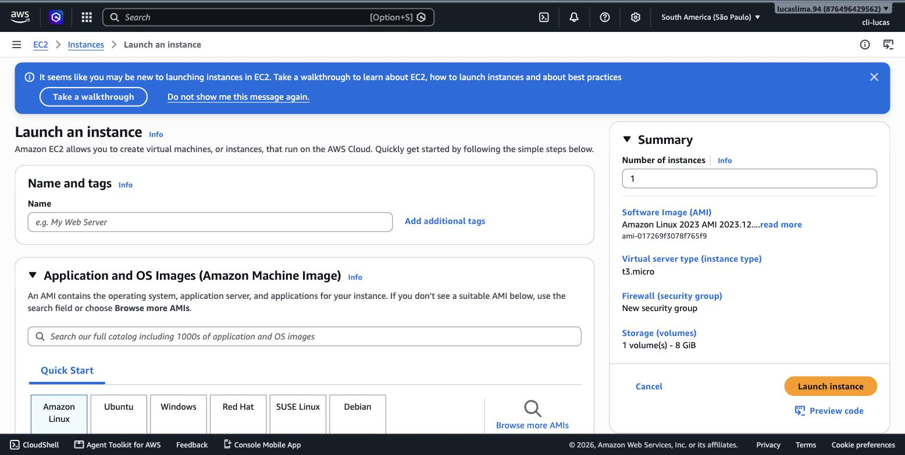
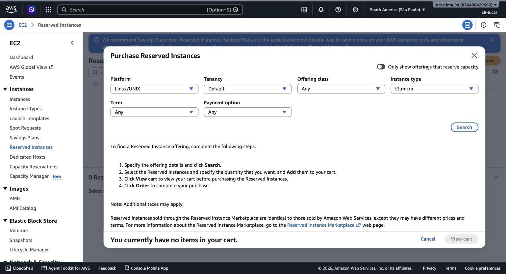
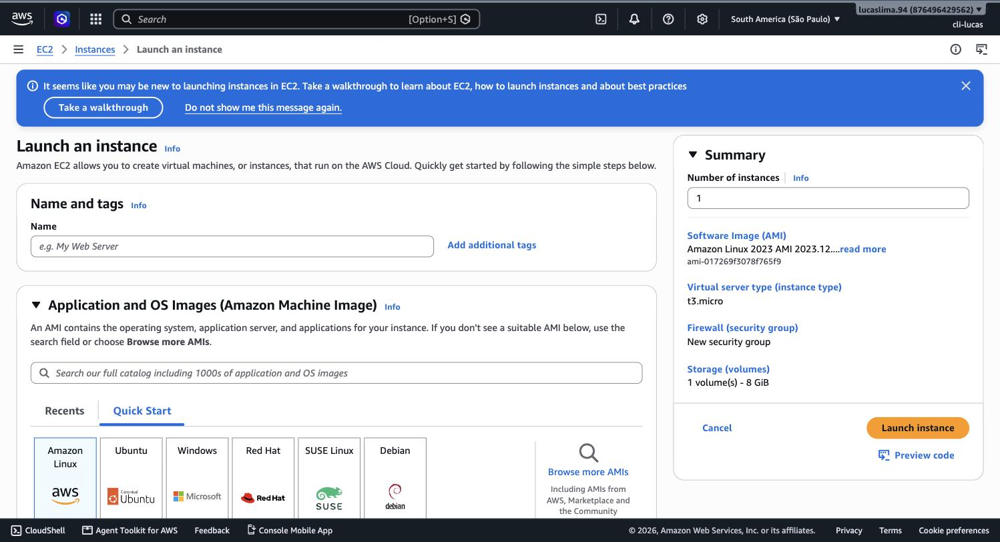
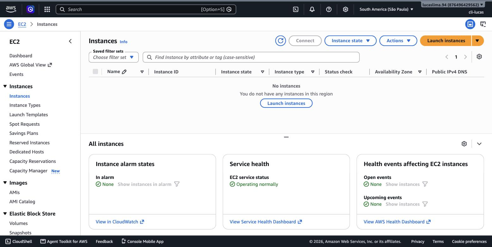
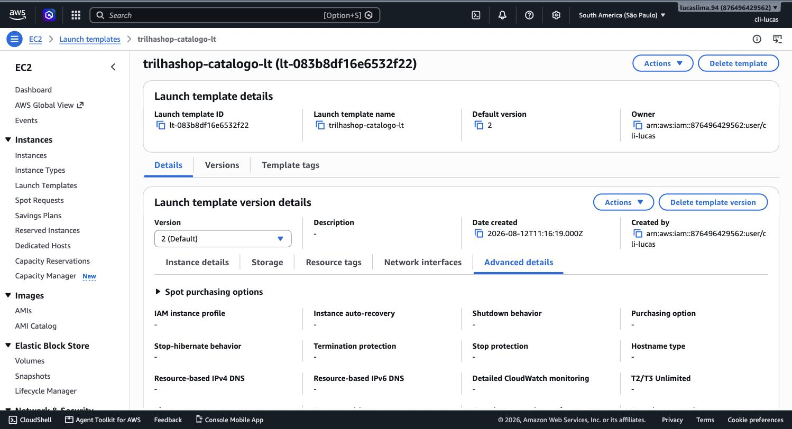
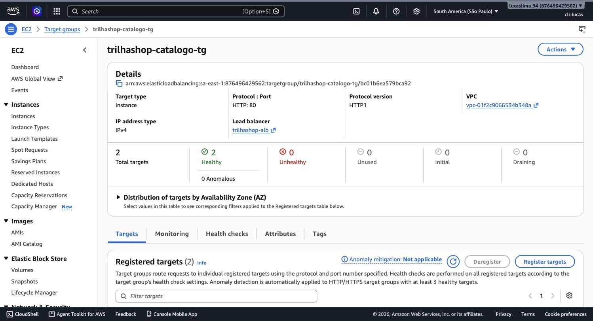

# Módulo 09 — Amazon Elastic Compute Cloud

> **Objetivo**: entender o serviço que é, para a maioria das pessoas, a porta de entrada para a AWS — e desta vez ir até o fim: lançar uma instância real, acessá-la, ver ela funcionando, e encerrá-la corretamente. Este é o primeiro módulo da trilha com um laboratório de criação completa, do lançamento à terminação.
>
> **Pré-requisitos**: módulo 03 (Security Groups e roles IAM), módulo 04 (subnets — onde a instância vive) e módulo 06 (Load Balancer e Auto Scaling — o que normalmente acompanha um grupo de instâncias em produção).
>
> **Tempo de referência (não prazo)**: uma a duas semanas em ritmo moderado.
>
> Este módulo corresponde à Task Statement 3.3 do **Domínio 3 — Cloud Technology and Services** (34%) e à Task Statement 4.1 do **Domínio 4 — Billing, Pricing, and Support** (12%), que cobre comparação de modelos de compra de compute. Domínio 3: https://docs.aws.amazon.com/aws-certification/latest/cloud-practitioner-02/cloud-practitioner-02-domain3.html — Domínio 4: https://docs.aws.amazon.com/aws-certification/latest/cloud-practitioner-02/cloud-practitioner-02-domain4.html. Trilha sobre o CLF-C02 vigente, não o CLF-C01 (aposentado em 18/09/2023).

---

## O servidor virtual que começa tudo

O **Amazon EC2 (Elastic Compute Cloud)** é o exemplo canônico de IaaS na AWS, já mencionado desde o módulo 1: você recebe um servidor virtual — uma **instância** — e é responsável por tudo a partir do sistema operacional para cima. Uma instância nasce a partir de uma **AMI (Amazon Machine Image)**: um molde que já contém um sistema operacional (e, opcionalmente, software pré-instalado) pronto para ser copiado para uma nova instância. A AWS mantém AMIs oficiais para os sistemas operacionais mais comuns (Amazon Linux, Ubuntu, Windows Server, entre outros), e também é possível criar AMIs próprias a partir de uma instância já configurada, para reutilizar exatamente aquela configuração depois.

## Famílias de tipo de instância: escolhendo o hardware certo

Cada instância EC2 tem um **tipo** (como `t3.micro` ou `m5.large`), e esse tipo codifica a combinação de CPU, memória, rede e, às vezes, armazenamento local que a instância vai ter. Os tipos são organizados em famílias, cada uma otimizada para um perfil de carga de trabalho diferente. Instâncias **de uso geral** (família `t` e `m`) equilibram CPU e memória, adequadas para a maioria das aplicações web e servidores de propósito geral. Instâncias **otimizadas para computação** (família `c`) priorizam poder de processamento, adequadas para processamento em lote intenso ou servidores de jogos. Instâncias **otimizadas para memória** (família `r`, entre outras) priorizam RAM em relação à CPU, adequadas para bancos de dados em memória ou processamento de grandes datasets. Instâncias **otimizadas para armazenamento** (família `i`, `d`) priorizam I/O de disco rápido e volume de armazenamento local, adequadas para bancos de dados transacionais de alta performance.


> `[PRINT]` Passo a passo para capturar: com a região São Paulo selecionada, abrir o EC2 direto em https://console.aws.amazon.com/ec2/home?region=sa-east-1 → "Launch instance". Rolar até a seção "Instance type" e clicar para expandir a lista completa (não apenas o campo de busca). Capturar a tela mostrando a tabela de tipos com colunas de família, vCPUs, memória, e a indicação "Free tier eligible" ao lado do tipo elegível (geralmente `t2.micro` ou `t3.micro`, dependendo da região).

> `[TEORIA]` Para a prova: reconhecer o propósito de cada família por categoria (uso geral, otimizada para computação, otimizada para memória, otimizada para armazenamento) — não decorar códigos específicos de tipo, que mudam com o tempo conforme a AWS lança novas gerações.

## Os modelos de compra: o mesmo hardware, preços muito diferentes

A forma como você paga por uma instância EC2 é, em si, uma decisão de arquitetura — e é aqui que o pilar de otimização de custos do módulo 5 se torna prático. **On-Demand** cobra por segundo (com mínimo de 60 segundos) de uso, sem compromisso de prazo — o modelo mais caro por hora, mas o único sem risco de pagar por algo que você não usou. **Reserved Instances** exigem compromisso de 1 ou 3 anos de uso, em troca de desconto substancial (frequentemente acima de 60% comparado a On-Demand) — adequado para cargas de trabalho previsíveis e constantes, como um banco de dados de produção que roda 24 horas por dia o ano inteiro. **Savings Plans** oferecem um desconto parecido ao das Reserved Instances, mas com mais flexibilidade: em vez de reservar um tipo de instância específico, você se compromete com um valor de gasto por hora, que pode ser aplicado a diferentes famílias e tamanhos de instância (e até a Lambda e Fargate, dependendo do plano). **Spot Instances** usam capacidade ociosa da AWS com desconto agressivo (até 90% comparado a On-Demand), mas com uma contrapartida importante: a AWS pode retomar essa capacidade de volta com pouco aviso, se precisar dela para atender demanda On-Demand — por isso, Spot só é adequado para cargas de trabalho tolerantes a interrupção, como processamento em lote ou renderização, nunca para um banco de dados de produção.


> `[PRINT]` Passo a passo para capturar: dentro do EC2, no menu lateral em "Purchasing and reservation types", clicar em "Reserved Instances" ou navegar até "Savings Plans" no Console (pode aparecer como serviço separado na busca). Capturar a tela mostrando a interface de comparação/compra, mesmo sem concluir uma compra real.

> `[CLI]` Consultar ofertas de Reserved Instances disponíveis, sem comprar nada:
> ```bash
> aws ec2 describe-reserved-instances-offerings \
>   --instance-type t3.micro --product-description "Linux/UNIX" \
>   --query 'ReservedInstancesOfferings[0].[Duration,FixedPrice,UsagePrice]'
> ```
> Resultado esperado: `Duration` em segundos (31536000 = 1 ano, ou 94608000 = 3 anos), `FixedPrice` (o valor pago antecipado, se houver) e `UsagePrice` (custo por hora restante) — os mesmos números que a comparação do Console mostra. Documentação: https://docs.aws.amazon.com/cli/latest/reference/ec2/describe-reserved-instances-offerings.html

Existem ainda dois modelos de nicho: **Dedicated Hosts** e **Dedicated Instances**, ambos entregando hardware físico dedicado exclusivamente à sua conta (sem compartilhar o servidor físico com outros clientes da AWS) — usados quando exigências de licenciamento de software ou de conformidade regulatória exigem isolamento físico completo, não apenas isolamento lógico. E **Capacity Reservations** garantem capacidade disponível numa AZ específica, independentemente do modelo de compra usado para pagar por ela.

> `[TEORIA]` Para a prova: essa tabela de modelos de compra é uma das mais cobradas do domínio de billing. Memorize o eixo central — On-Demand (flexível, mais caro), Reserved/Savings Plans (compromisso de tempo, desconto grande, para carga previsível), Spot (mais barato, pode ser interrompido, para carga tolerante a falha), Dedicated Hosts/Instances (isolamento físico, para licenciamento/compliance).

## EBS: o disco que acompanha a instância

Uma instância EC2, por padrão, guarda seus dados num volume do **Amazon EBS (Elastic Block Store)** — um disco de rede que existe de forma independente do ciclo de vida da instância (ele pode ser desanexado de uma instância e anexado a outra, e sobrevive à parada ou até à substituição da instância, dependendo da configuração). Isso é diferente do **instance store**, um armazenamento fisicamente ligado ao hardware físico por trás da instância, mais rápido, mas que se perde completamente se a instância for parada ou terminada — por isso, instance store só é adequado para dados temporários ou replicados de outra forma. O módulo 12 volta a este ponto com mais profundidade, comparando EBS a outras formas de armazenamento da AWS.

## User data: configurando a instância no momento em que ela nasce

Uma das formas mais úteis de automatizar o EC2 é o campo **user data**: um script (geralmente shell script, no caso de instâncias Linux) que a instância executa automaticamente na primeira inicialização, sem intervenção manual. É assim que instâncias EC2 se tornam parte de um Auto Scaling Group de forma prática — cada nova instância criada automaticamente pelo ASG (módulo 6) roda o mesmo script de user data e chega pronta, com o software necessário já instalado, sem que ninguém precise conectar manualmente em cada uma para configurá-la.

## Práticas

### Prática isolada

Este é o primeiro laboratório da trilha que efetivamente cria um recurso de computação e o mantém rodando por alguns minutos — dentro do Free Tier, sem custo, desde que você siga o passo de terminação ao final. É deliberadamente isolado da VPC do TrilhaShop (usa a VPC padrão da conta) — o objetivo aqui é só o mecanismo de lançar, servir e terminar uma instância, sem misturar com o projeto ainda.


> `[PRINT]` Passo a passo para capturar: no assistente de lançamento já iniciado, escolher a AMI "Amazon Linux 2023" (marcada como Free tier eligible), o tipo de instância `t2.micro` ou `t3.micro` (o que estiver marcado como Free tier eligible na região), criar ou selecionar um par de chaves (key pair) para acesso, manter as configurações de rede padrão (VPC e subnet padrão do módulo 4), e em "Advanced details" → "User data", colar o seguinte script:
> ```
> #!/bin/bash
> yum update -y
> yum install -y httpd
> systemctl start httpd
> systemctl enable httpd
> echo "<h1>Instancia lancada pela Trilha-Cloud-AWS, modulo 09</h1>" > /var/www/html/index.html
> ```
> Capturar a tela de revisão final do assistente (painel lateral "Summary"), antes de clicar em "Launch instance".

> `[CLI]`
> ```bash
> AMI_ID=$(aws ec2 describe-images --owners amazon \
>   --filters "Name=name,Values=al2023-ami-*-x86_64" "Name=state,Values=available" \
>   --query 'sort_by(Images, &CreationDate)[-1].ImageId' --output text)
>
> cat > userdata.sh <<'EOF'
> #!/bin/bash
> yum update -y
> yum install -y httpd
> systemctl start httpd
> systemctl enable httpd
> echo "<h1>Instancia lancada pela Trilha-Cloud-AWS, modulo 09</h1>" > /var/www/html/index.html
> EOF
>
> INSTANCE_ID=$(aws ec2 run-instances \
>   --image-id $AMI_ID --instance-type t3.micro \
>   --user-data file://userdata.sh \
>   --query 'Instances[0].InstanceId' --output text)
>
> aws ec2 wait instance-running --instance-ids $INSTANCE_ID
> aws ec2 describe-instances --instance-ids $INSTANCE_ID --query 'Reservations[0].Instances[0].PublicIpAddress'
> ```
> Resultado esperado: o `describe-instances` final imprime um IP público — cole em `http://<esse-ip>` no navegador, exatamente como no fluxo pelo Console. Sem `--key-name` e sem `--security-group-ids` explícitos, a instância usa a VPC/Security Group padrão da conta e não permite SSH — para este teste (só a página web), não é necessário. Documentação: https://docs.aws.amazon.com/cli/latest/reference/ec2/run-instances.html

Depois de lançar, aguarde a instância passar para o estado `running` e o status check ficar `2/2 checks passed` — isso costuma levar de um a três minutos. O script de user data instala e inicia um servidor web simples (Apache/`httpd`) automaticamente, sem que você precise conectar na instância para fazer isso manualmente.


> `[PRINT]` Passo a passo para capturar: na tela "Instances" do EC2, com a instância criada selecionada, aguardar o estado mudar para "Running" e o status check para "2/2 checks passed". Capturar a tela da lista de instâncias mostrando essas duas colunas preenchidas, junto com o IPv4 público atribuído à instância.

Para confirmar que o servidor web está realmente respondendo, copie o **IPv4 público** da instância (visível na mesma tela) e cole num navegador, acessando `http://<ip-publico>`. Isso só funciona porque, por padrão, o Security Group associado a instâncias lançadas por esse assistente libera a porta 80 quando você seleciona um template de segurança que permite tráfego HTTP — se a página não carregar, vale revisar as regras de entrada do Security Group da instância (módulo 4) e confirmar que a porta 80 está liberada para `0.0.0.0/0`.

`[ATENÇÃO]` Liberar a porta 80 (ou qualquer porta) para `0.0.0.0/0` significa liberar para toda a internet, não só para você. Para este laboratório específico, isso é intencional (queremos ver a página carregando de qualquer lugar), mas é exatamente o tipo de configuração que deve ser revisitada com cuidado antes de ir para produção — a prova gosta de testar cenários em que uma porta foi deixada aberta além do necessário, violando o princípio do menor privilégio do módulo 3.

**Encerrando esta prática**: `[CUSTO]` Uma instância `t2.micro` ou `t3.micro` está coberta pelo Free Tier até um limite de 750 horas por mês (o suficiente para deixar uma instância rodando o mês inteiro, mas não duas simultaneamente pelo mesmo período) — ainda assim, o hábito correto é nunca deixar uma instância de laboratório rodando além do necessário. Para encerrar: selecione a instância na lista, clique em "Instance state" → "Terminate instance". Terminar (diferente de apenas "parar"/*stop*) destrói a instância e, por padrão, o volume EBS raiz associado a ela — não há cobrança contínua depois disso.

> `[CLI]`
> ```bash
> aws ec2 terminate-instances --instance-ids $INSTANCE_ID
> aws ec2 wait instance-terminated --instance-ids $INSTANCE_ID
> ```
> Resultado esperado: o `wait` retorna sem erro; `aws ec2 describe-instances --instance-ids $INSTANCE_ID --query 'Reservations[0].Instances[0].State.Name'` mostra `"terminated"`. Documentação: https://docs.aws.amazon.com/cli/latest/reference/ec2/terminate-instances.html

### Contribuição ao projeto integrador

Agora sim, dentro do TrilhaShop: volte ao launch template `trilhashop-catalogo-lt`, criado vazio no módulo 6, e edite-o para adicionar o Security Group `trilhashop-app-sg` (se ainda não estiver) e o seguinte user data, servindo uma versão simples do catálogo:

```bash
#!/bin/bash
yum update -y
yum install -y httpd
systemctl start httpd
systemctl enable httpd
cat <<'HTML' > /var/www/html/index.html
<h1>TrilhaShop - Catalogo</h1>
<p>Servido por uma instancia gerenciada pelo Auto Scaling Group trilhashop-catalogo-asg.</p>
HTML
```


> `[PRINT]` Passo a passo para capturar: "EC2" → "Launch Templates" → `trilhashop-catalogo-lt` → "Actions" → "Modify template (create new version)". Colar o user data acima em "Advanced details". Capturar a tela antes de salvar a nova versão. Salvar, e marcar a nova versão como "Default version" do launch template.

> `[CLI]`
> ```bash
> aws ec2 create-launch-template-version \
>   --launch-template-name trilhashop-catalogo-lt \
>   --source-version 1 \
>   --launch-template-data "{\"UserData\":\"$(base64 -i userdata-catalogo.sh)\"}"
>
> aws ec2 modify-launch-template --launch-template-name trilhashop-catalogo-lt --default-version '$Latest'
> ```
> (salve o user data do catálogo, mostrado acima, em `userdata-catalogo.sh` antes de rodar). Resultado esperado: `aws ec2 describe-launch-template-versions --launch-template-name trilhashop-catalogo-lt --query 'LaunchTemplateVersions[?DefaultVersion].VersionNumber'` mostra a nova versão como padrão. Documentação: https://docs.aws.amazon.com/cli/latest/reference/ec2/create-launch-template-version.html

Com o template atualizado, volte ao Auto Scaling Group `trilhashop-catalogo-asg` (módulo 6) e mude a capacidade desejada de 0 para 2 — desta vez, com um propósito real: essas instâncias vão ficar registradas no target group do `trilhashop-alb` e responder de verdade.

> `[CLI]`
> ```bash
> aws autoscaling update-auto-scaling-group --auto-scaling-group-name trilhashop-catalogo-asg --desired-capacity 2
> aws elbv2 describe-target-health --target-group-arn $TG_ARN --query 'TargetHealthDescriptions[].TargetHealth.State'
> ```
> Resultado esperado: depois de alguns minutos (tempo de boot + health check), a segunda consulta mostra `["healthy", "healthy"]`. Documentação: https://docs.aws.amazon.com/cli/latest/reference/autoscaling/update-auto-scaling-group.html


> `[PRINT]` Passo a passo para capturar: "EC2" → "Target Groups" → `trilhashop-catalogo-tg` → aba "Targets". Aguardar as duas instâncias lançadas pelo ASG aparecerem com status "healthy" (pode levar alguns minutos, incluindo o tempo do health check). Capturar a tela com as duas instâncias e o status.

Copie o DNS name do `trilhashop-alb` (na tela do Load Balancer) e acesse `http://<dns-do-alb>` no navegador — a página do catálogo deve carregar, servida por uma das duas instâncias por trás do Load Balancer, exatamente a arquitetura desenhada nos módulos 4 e 6, agora com conteúdo real. Depois de confirmar que funciona, volte ao Well-Architected Tool (módulo 5) e atualize a revisão "TrilhaShop": o risco "nenhum recurso de computação existe" não se aplica mais.

`[CUSTO]` As duas instâncias do ASG agora contam para o Free Tier de 750 horas/mês — dentro do limite se for só este par. Ao pausar entre sessões de estudo, reduza a capacidade desejada do ASG para 0 (ver a tabela em `00_indice.md`) — o launch template e o target group não custam nada vazios.

## Erros comuns nesta fase

O erro mais comum é confundir "Stop" com "Terminate" — parar uma instância não a remove, apenas desliga a computação, e o volume EBS anexado continua sendo cobrado. O segundo erro é escolher um tipo de instância fora do Free Tier por engano (por exemplo, `t3.medium` em vez de `t3.micro`) — vale sempre conferir a etiqueta "Free tier eligible" antes de confirmar o lançamento.

## Conexão com os módulos seguintes

| Conceito deste módulo | Aparece novamente em |
|---|---|
| AMIs e tipos de instância | Comparado a containers — módulo 10 |
| Modelos de compra (On-Demand, Reserved, Spot) | Revisão de billing e pricing — módulo 16 |
| EBS | Comparação completa com S3 e EFS — módulo 12 |
| User data / bootstrap automático | Auto Scaling Groups já visto no módulo 6, agora com mecanismo completo |
| Security Group liberando porta 80 | Revisitado em failover e uptime — módulo 11 |

## `[REFERÊNCIA]`

- AWS — Domínio 3 do exame CLF-C02, Task 3.3: https://docs.aws.amazon.com/aws-certification/latest/cloud-practitioner-02/cloud-practitioner-02-domain3.html
- AWS — Domínio 4 do exame CLF-C02, Task 4.1: https://docs.aws.amazon.com/aws-certification/latest/cloud-practitioner-02/cloud-practitioner-02-domain4.html
- AWS — *Amazon EC2 User Guide*: https://docs.aws.amazon.com/AWSEC2/latest/UserGuide/concepts.html
- AWS — *Amazon EC2 Instance Types*: https://aws.amazon.com/ec2/instance-types/
- AWS — *Amazon EC2 Pricing*: https://aws.amazon.com/ec2/pricing/

## Checklist de saída

Você está pronto para o módulo 10 quando consegue, sem consultar:

- [ ] Explicar o que é uma AMI e a relação entre AMI e instância.
- [ ] Reconhecer as quatro categorias de família de instância (uso geral, computação, memória, armazenamento) e o cenário típico de cada.
- [ ] Comparar On-Demand, Reserved Instances, Savings Plans e Spot Instances em termos de custo, compromisso e tolerância a interrupção.
- [ ] Explicar a diferença entre EBS e instance store.
- [ ] Explicar o que é user data e por que ele é essencial para Auto Scaling funcionar sem intervenção manual.
- [ ] Explicar a diferença entre "Stop" e "Terminate" e o impacto de cada um no billing.
- [ ] Ter lançado, acessado via navegador, e terminado uma instância EC2 real (prática isolada).
- [ ] Ter atualizado o `trilhashop-catalogo-lt` com o user data real, escalado o ASG para 2 instâncias, e acessado o catálogo pelo DNS do `trilhashop-alb`.
