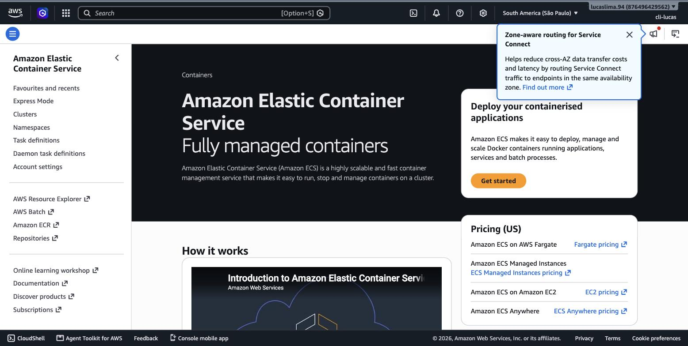
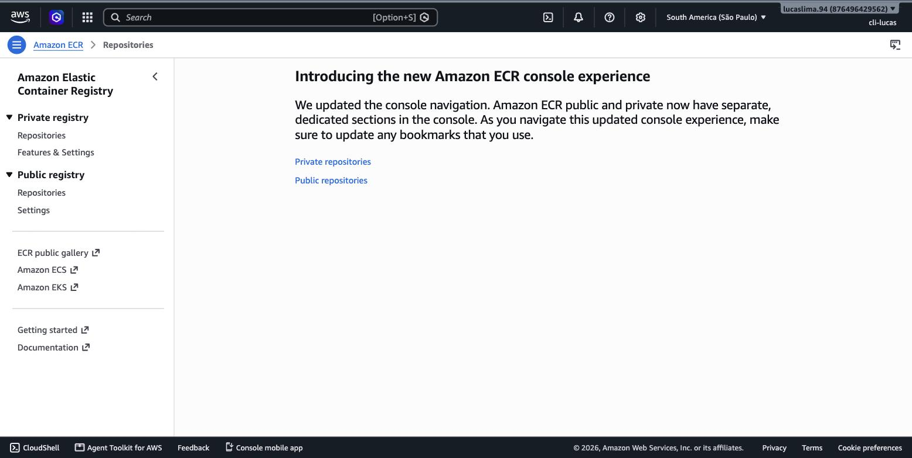
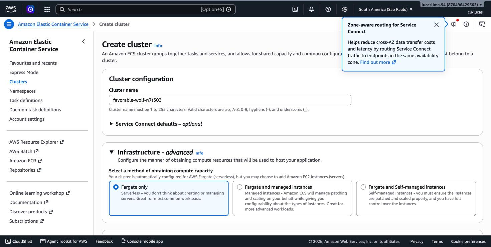
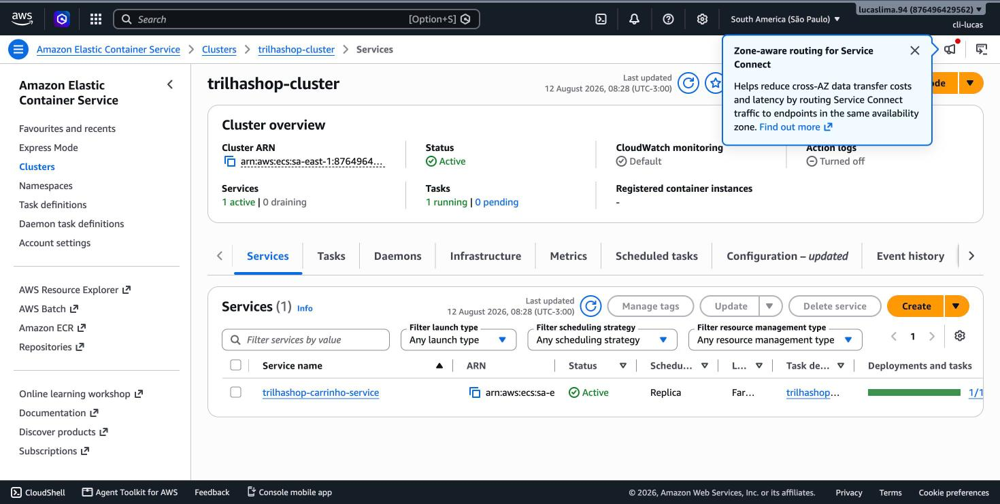

# Módulo 10 — Introdução ao AWS Container Services e Networking

> **Objetivo**: entender o que muda quando a unidade de implantação deixa de ser uma instância inteira e passa a ser um container, e como a AWS oferece diferentes níveis de gerenciamento para rodar containers em produção.
>
> **Pré-requisitos**: módulo 09 (EC2 — containers são frequentemente comparados e às vezes combinados com instâncias EC2) e módulo 04 (VPC — containers também vivem dentro de subnets e são protegidos por Security Groups).
>
> **Tempo de referência (não prazo)**: uma semana em ritmo moderado.
>
> Este módulo corresponde à Task Statement 3.3 do **Domínio 3 — Cloud Technology and Services** (34%), que cobra explicitamente reconhecer o uso apropriado de opções de container (Amazon ECS, Amazon EKS) e de compute serverless (AWS Fargate). Página oficial: https://docs.aws.amazon.com/aws-certification/latest/cloud-practitioner-02/cloud-practitioner-02-domain3.html. Trilha sobre o CLF-C02 vigente, não o CLF-C01 (aposentado em 18/09/2023).

---

## O que muda quando a unidade vira container, não instância

Uma instância EC2 inteira, com seu próprio sistema operacional completo, é uma unidade relativamente pesada de se criar e replicar — mesmo com AMIs e user data automatizando o processo, cada instância carrega o peso de um sistema operacional inteiro rodando. Um **container** resolve isso de um jeito diferente: em vez de virtualizar um computador inteiro, ele empacota uma aplicação junto com exatamente as dependências que ela precisa (bibliotecas, runtime, configuração), e compartilha o kernel do sistema operacional do host em vez de rodar o seu próprio. O resultado é uma unidade muito mais leve e rápida de iniciar — segundos, em vez de minutos — e, mais importante, **portátil**: o mesmo container roda de forma idêntica no laptop de um desenvolvedor, num servidor de teste, e em produção, porque ele carrega consigo tudo que precisa para rodar, sem depender do que já está (ou não está) instalado no host.

O **Docker** é a tecnologia mais usada para empacotar e rodar containers, e vale conhecer três termos dela porque a AWS usa exatamente o mesmo vocabulário: uma **imagem** é o molde read-only de um container (parecido com o conceito de AMI do módulo 9, mas para containers); um **container** é uma instância em execução dessa imagem; e um **Dockerfile** é o arquivo de texto que descreve como construir uma imagem, passo a passo — outra forma de infraestrutura como código, na linha do que o módulo 8 já discutiu para CloudFormation.

> `[TEORIA]` Para a prova: a diferença central entre container e VM é que o container compartilha o kernel do sistema operacional do host, enquanto uma VM (como uma instância EC2 tradicional) virtualiza um sistema operacional completo e independente. Isso torna containers mais leves e rápidos de iniciar, ao custo de um isolamento um pouco menos completo do que uma VM oferece.

## ECS: rodando containers de forma gerenciada na AWS

O **Amazon ECS (Elastic Container Service)** é o serviço da AWS para orquestrar containers — decidir onde cada container roda, reiniciá-lo se ele falhar, e conectá-lo em rede com os outros. No ECS, você define uma **task definition** (a receita de quais containers rodar, com quais imagens, quanta CPU e memória cada um recebe) e um **service** (que mantém um número desejado de cópias dessa task rodando continuamente, de forma parecida com o que um Auto Scaling Group faz para instâncias EC2 no módulo 6).

A decisão mais importante ao configurar o ECS é o **launch type**: EC2 ou Fargate. No **launch type EC2**, você provisiona e gerencia as instâncias EC2 que vão hospedar os containers — mais controle sobre o hardware subjacente, mas também mais responsabilidade operacional, incluindo aplicar patch de sistema operacional nessas instâncias. No **AWS Fargate**, você não gerencia servidor nenhum — declara quanta CPU e memória cada container precisa, e a AWS provisiona e gerencia a infraestrutura por trás automaticamente, cobrando pelo que os containers efetivamente consomem. É, na prática, a diferença entre IaaS e algo próximo de serverless aplicado a containers — Fargate remove a camada de gestão de servidor que o EC2 launch type ainda exige.

> `[PRINT]` Passo a passo para capturar: abrir o ECS direto em https://console.aws.amazon.com/ecs/v2/home?region=sa-east-1 (ou buscar "ECS" na barra de busca do Console). Clicar em "Create cluster" (ou "Clusters" → "Create Cluster"). Capturar a tela do assistente mostrando as opções de infraestrutura, com "AWS Fargate (serverless)" e "Amazon EC2 instances" como escolhas. Não é necessário concluir a criação do cluster.

> `[TEORIA]` Para a prova: EC2 launch type = você gerencia as instâncias por trás; Fargate = a AWS gerencia toda a infraestrutura, você só declara CPU/memória do container e paga pelo consumo. Um cenário que menciona "sem gerenciar servidor" ou "serverless para containers" aponta para Fargate.

## ECR: onde as imagens de container ficam guardadas

Antes de um container poder rodar, sua imagem precisa estar armazenada em algum lugar acessível. O **Amazon ECR (Elastic Container Registry)** é o registro de imagens de container da AWS — equivalente, dentro do ecossistema AWS, ao Docker Hub público, mas privado por padrão e integrado nativamente com IAM (controle de quem pode enviar ou baixar imagens) e com o ECS (que busca imagens diretamente do ECR ao iniciar uma task).

> `[PRINT]` Passo a passo para capturar: abrir o ECR direto em https://console.aws.amazon.com/ecr/repositories?region=sa-east-1 (ou buscar "ECR" na barra de busca do Console). Capturar a tela de "Repositories", mostrando a lista (provavelmente vazia numa conta nova) e o botão "Create repository".

## EKS: quando a orquestração precisa ser Kubernetes

O **Amazon EKS (Elastic Kubernetes Service)** é a alternativa ao ECS para quem precisa (ou já usa) especificamente o **Kubernetes** — uma plataforma de orquestração de containers de código aberto, mantida pela Cloud Native Computing Foundation, e não exclusiva da AWS (roda também em outros provedores de nuvem e on-premises). A escolha entre ECS e EKS costuma depender de contexto organizacional: equipes que já têm conhecimento de Kubernetes, ou que precisam manter portabilidade entre nuvens diferentes, tendem a preferir EKS; equipes que estão começando do zero na AWS e não têm essa exigência de portabilidade frequentemente acham o ECS mais simples de operar, por ser mais integrado nativamente ao restante do ecossistema AWS.

> `[TEORIA]` Para a prova: reconhecer que EKS é a oferta gerenciada de Kubernetes da AWS, e Kubernetes em si é um padrão aberto, não proprietário da AWS — diferente do ECS, que é proprietário e exclusivo da AWS. Não é esperado configurar um cluster Kubernetes para o Cloud Practitioner.

`[APROFUNDAMENTO]` Assim como o ECS, o EKS também pode rodar sobre EC2 ou sobre Fargate como camada de infraestrutura — a decisão entre gerenciar os nós você mesmo ou deixar isso totalmente abstraído se repete aqui. Configurar essa combinação em detalhe é conteúdo de certificações mais avançadas, incluindo a certificação especializada da própria AWS em Kubernetes.

## Como containers se conectam em rede

Dentro do ECS, cada task recebe sua própria configuração de rede. No modo mais comum, chamado **`awsvpc`**, cada task recebe sua própria interface de rede elástica (ENI) com seu próprio IP privado dentro da VPC — o que significa que um container no ECS é endereçável na rede de forma muito parecida com uma instância EC2, podendo ter Security Groups aplicados diretamente a ele, em vez de compartilhar a configuração de rede de um host subjacente. Isso conecta diretamente ao que o módulo 4 já ensinou: os mesmos conceitos de subnet, Security Group e route table continuam se aplicando, só que agora ao nível de cada task individual, não de uma instância inteira.

Para containers que precisam se localizar uns aos outros dinamicamente (por exemplo, um serviço de "carrinho de compras" que precisa chamar um serviço de "catálogo de produtos", ambos rodando com múltiplas réplicas que sobem e descem conforme o Auto Scaling do ECS ajusta a capacidade), a AWS oferece **service discovery**, que mantém registros de DNS internos atualizados automaticamente conforme containers são criados e destruídos — sem isso, cada container precisaria descobrir o endereço dos outros manualmente, algo inviável numa configuração que muda dinamicamente.

`[CUSTO]` Diferente do laboratório do EC2 no módulo anterior, este módulo não chega a rodar um container de verdade — criar um cluster ECS vazio não tem custo por si só, mas rodar uma task (seja em EC2 ou em Fargate) gera cobrança pelo tempo em que ela fica ativa, e Fargate, em particular, não tem cobertura de Free Tier tão generosa quanto o EC2. Os prints deste módulo foram roteirizados para parar nas telas de configuração, sem lançar uma task real — se você quiser ir além por conta própria, lembre de derrubar qualquer service e cluster criado ao final para não deixar cobrança rodando.

## Práticas

### Prática isolada

Suba uma única task Fargate descartável, fora do TrilhaShop, só para ver o ciclo completo de container gerenciado funcionando. Crie um cluster ECS vazio (launch type Fargate), depois uma task definition simples usando a imagem pública `public.ecr.aws/nginx/nginx:latest`, 0.25 vCPU / 0.5 GB de memória, numa subnet pública qualquer com IP público atribuído automaticamente e um Security Group liberando a porta 80. Rode a task manualmente ("Run new Task", não um Service) e, depois que o status virar `RUNNING`, copie o IP público da task e acesse no navegador — a página padrão do nginx deve aparecer. Confirme que funcionou e então pare a task ("Stop") e exclua o cluster.

`[CUSTO]` Fargate cobra por vCPU e memória alocados enquanto a task roda, por segundo. Uma única task pequena rodando por poucos minutos custa frações de centavo, mas não tem a mesma cobertura generosa de Free Tier que o EC2 — pare a task assim que confirmar que ela respondeu.

### Contribuição ao projeto integrador

O carrinho de compras do TrilhaShop vira um segundo serviço, real e independente do catálogo em EC2, rodando na mesma VPC:

> `[PRINT]` Passo a passo para capturar: "ECS" → "Create cluster". Nome: `trilhashop-cluster`. Infraestrutura: AWS Fargate (serverless). Capturar a tela antes de criar.

Crie uma task definition `trilhashop-carrinho-td` usando a mesma imagem de exemplo `public.ecr.aws/nginx/nginx:latest` (um projeto real usaria uma imagem própria publicada no ECR, mas para os fins desta trilha o nginx já demonstra o mecanismo completo), 0.25 vCPU / 0.5 GB. Em seguida, crie um **Service** (não uma task avulsa desta vez, porque um service mantém réplicas rodando continuamente, o equivalente em containers do Auto Scaling Group do módulo 6) chamado `trilhashop-carrinho-service`, com 1 réplica desejada, nas subnets **privadas** da `trilhashop-vpc` (módulo 4), Security Group `trilhashop-app-sg`.

> `[PRINT]` Passo a passo para capturar: depois de criar o service, capturar a tela do cluster mostrando `trilhashop-carrinho-service` com "Running tasks" = 1 e "Desired tasks" = 1.

Como o service está em subnet privada (sem IP público, seguindo o mesmo padrão de defesa em profundidade do catálogo em EC2), ele não é acessível diretamente do navegador — em uma arquitetura de produção completa, um segundo target group no `trilhashop-alb` (ou um Load Balancer dedicado) exporia esse serviço externamente, o mesmo padrão do módulo 6 aplicado a um destino de container em vez de uma instância. Para os fins desta trilha, confirmar "1/1 tasks running" já demonstra o serviço operando corretamente dentro da rede do projeto.

`[CUSTO]` O service do carrinho fica rodando continuamente enquanto `desired count = 1`, cobrando por vCPU/memória alocados. Ao pausar entre sessões, reduza o `desired count` do service para 0 (ver tabela em `00_indice.md`) — o cluster e a task definition em si não custam nada.

## Erros comuns nesta fase

O erro mais comum é achar que Fargate "não tem servidor" no sentido literal — existe servidor por trás, só que ele é inteiramente gerenciado e abstraído pela AWS, e você paga pelo consumo de CPU/memória declarado, não por uma instância específica. O segundo erro é confundir ECR (onde as imagens ficam guardadas) com ECS (onde os containers efetivamente rodam) — são serviços complementares, não alternativos um ao outro.

## Conexão com os módulos seguintes

| Conceito deste módulo | Aparece novamente em |
|---|---|
| Fargate como opção serverless | Comparado com Lambda — módulo 14 |
| Rede de containers (`awsvpc`, Security Groups) | Retomando VPC e Security Groups do módulo 4 |
| ECS Service (mantendo réplicas) | Paralelo direto ao Auto Scaling Group do módulo 6 |
| Task definitions | Padrões de deployment revisitados no projeto final — módulo 16 |

## `[REFERÊNCIA]`

- AWS — Domínio 3 do exame CLF-C02, Task 3.3: https://docs.aws.amazon.com/aws-certification/latest/cloud-practitioner-02/cloud-practitioner-02-domain3.html
- AWS — *What Is Amazon Elastic Container Service?*: https://docs.aws.amazon.com/AmazonECS/latest/developerguide/Welcome.html
- AWS — *What Is AWS Fargate?*: https://docs.aws.amazon.com/AmazonECS/latest/userguide/what-is-fargate.html
- AWS — *What Is Amazon ECR?*: https://docs.aws.amazon.com/AmazonECR/latest/userguide/what-is-ecr.html
- AWS — *What Is Amazon EKS?*: https://docs.aws.amazon.com/eks/latest/userguide/what-is-eks.html

## Checklist de saída

Você está pronto para o módulo 11 quando consegue, sem consultar:

- [ ] Explicar a diferença estrutural entre container e VM (compartilhamento de kernel vs. virtualização completa).
- [ ] Explicar o que é uma task definition e um service no ECS.
- [ ] Diferenciar launch type EC2 de Fargate em termos de quem gerencia a infraestrutura.
- [ ] Explicar o papel do ECR frente ao ECS.
- [ ] Reconhecer o EKS como a oferta gerenciada de Kubernetes da AWS, e Kubernetes como padrão aberto, não proprietário.
- [ ] Explicar como os mesmos conceitos de VPC/Security Group do módulo 4 se aplicam a containers no modo de rede `awsvpc`.
- [ ] Ter navegado, no Console real, pelas telas de criação de cluster ECS e de repositório ECR.
- [ ] Ter rodado e parado uma task Fargate descartável, confirmando resposta HTTP dela.
- [ ] Ter criado, de verdade, o `trilhashop-cluster` e o `trilhashop-carrinho-service` rodando 1/1 na `trilhashop-vpc`.
