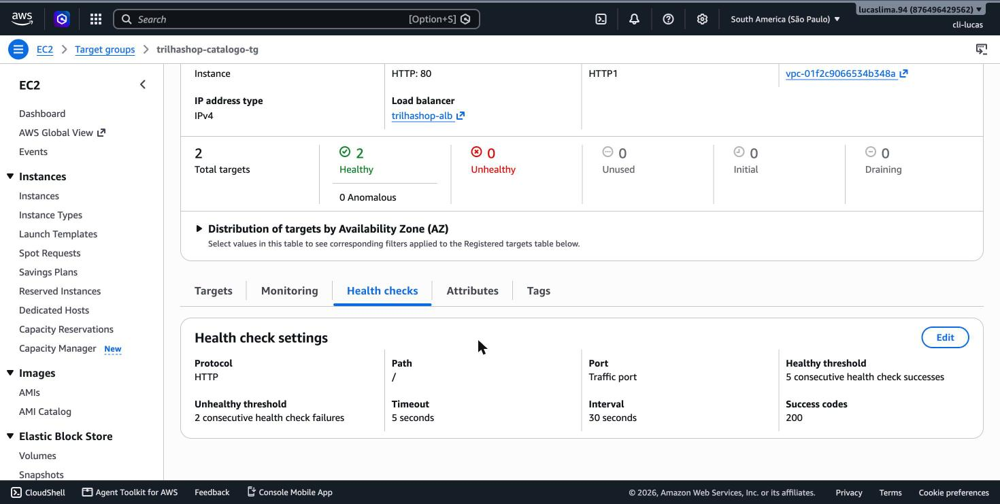
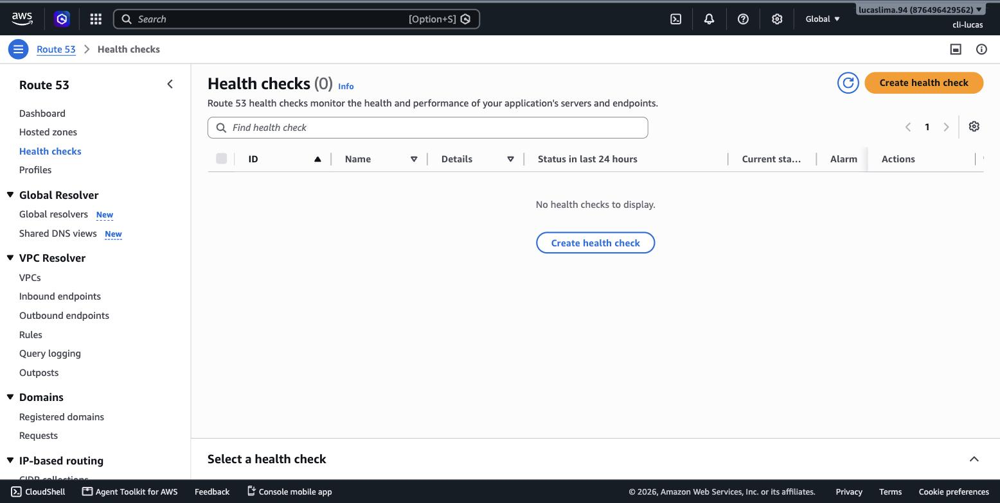
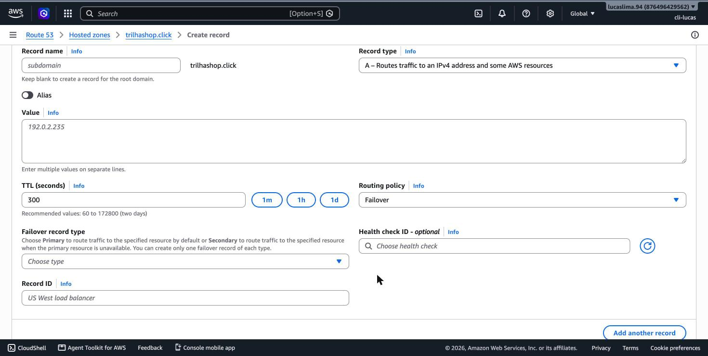
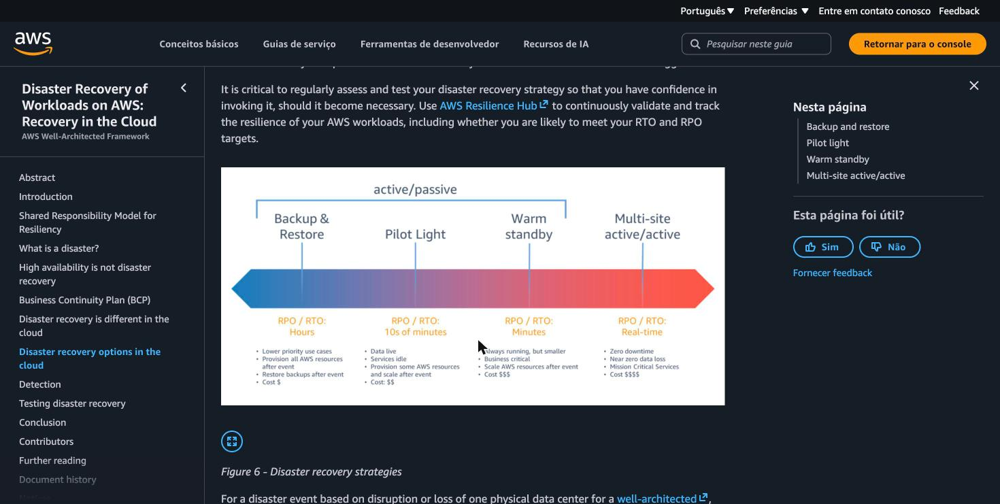

# Módulo 11 — Projetando para Uptime – Network

> **Objetivo**: consolidar tudo que a trilha já construiu em torno de disponibilidade — múltiplas AZs, Load Balancer, DNS — numa visão única de como se desenha uma arquitetura de rede que sobrevive a falhas, e conhecer o vocabulário formal de disaster recovery que a prova cobra.
>
> **Pré-requisitos**: módulo 02 (múltiplas AZs), módulo 04 (Route 53) e módulo 06 (Load Balancer e health checks) — este módulo não introduz muito conceito novo de zero, ele amarra o que já foi visto sob a lente específica de continuidade de negócio.
>
> **Tempo de referência (não prazo)**: uma semana em ritmo moderado.
>
> Este módulo corresponde à Task Statement 3.2 do **Domínio 3 — Cloud Technology and Services** (34%), que cobra explicitamente "quando usar múltiplas regiões (por exemplo, disaster recovery, continuidade de negócio, baixa latência para usuários finais, soberania de dados)". Página oficial: https://docs.aws.amazon.com/aws-certification/latest/cloud-practitioner-02/cloud-practitioner-02-domain3.html. Trilha sobre o CLF-C02 vigente, não o CLF-C01 (aposentado em 18/09/2023).

---

## Amarrando o que já foi visto sob um objetivo único

Boa parte do vocabulário deste módulo já apareceu em módulos anteriores, cada vez sob um pretexto diferente: múltiplas AZs apareceram no módulo 2 como base de alta disponibilidade; Load Balancer apareceu no módulo 6 distribuindo tráfego e absorvendo falha de instância; Route 53 apareceu no módulo 4 traduzindo nomes em endereços. Este módulo existe para reunir essas peças sob uma única pergunta, que é a que qualquer arquitetura de produção séria precisa responder: **o que acontece quando algo falha, e quanto tempo (e dado) a organização está disposta a perder até se recuperar?**

## Health checks: como o sistema sabe que algo falhou

Nenhum mecanismo de failover funciona sem primeiro detectar que houve falha. Um **health check** é uma verificação periódica e automática de que um recurso está respondendo corretamente — o Load Balancer do módulo 6, por exemplo, faz health checks contínuos em cada instância do seu target group, e para de enviar tráfego para qualquer uma que pare de responder dentro do esperado, sem esperar intervenção humana.

> `[PRINT]` Passo a passo para capturar: no Console, dentro de "EC2" → "Target Groups" (no menu lateral, em "Load Balancing"), abrir um target group existente (ou iniciar a criação de um novo, sem concluir) e clicar na aba/seção "Health checks". Capturar a tela mostrando os campos de "Health check path", "Healthy threshold", "Unhealthy threshold" e "Timeout".

O Route 53 também pode fazer health checks, mas num nível diferente: em vez de checar instâncias individuais atrás de um Load Balancer, ele pode checar endpoints inteiros — por exemplo, se um site inteiro numa região está respondendo — e usar o resultado para decidir para onde apontar o DNS.

> `[PRINT]` Passo a passo para capturar: no Console, dentro de "Route 53", clicar em "Health checks" no menu lateral e depois em "Create health check". Capturar a tela do assistente, mostrando os campos de configuração do endpoint a ser monitorado (domínio ou IP) e o intervalo entre verificações. Não é necessário concluir a criação.

## Failover de DNS: redirecionando automaticamente

Combinando um health check do Route 53 com uma **política de roteamento de failover**, é possível configurar o DNS para apontar normalmente para um endpoint primário, e trocar automaticamente para um endpoint secundário assim que o health check do primário começa a falhar — sem que ninguém precise alterar manualmente um registro DNS no meio de um incidente, o que seria lento demais para ser útil numa emergência real.

> `[PRINT]` Passo a passo para capturar: dentro de uma hosted zone do Route 53 (criada de forma exploratória no módulo 4, ou uma nova), clicar em "Create record" e, na etapa de configuração, selecionar "Failover" como "Routing policy". Capturar a tela mostrando os campos de "Failover record type" (Primary/Secondary) associados ao health check.

> `[TEORIA]` Para a prova: reconhecer que o Route 53 suporta múltiplas políticas de roteamento além de failover — incluindo roteamento por latência (direciona o usuário ao endpoint com menor latência), geolocalização (direciona por localização do usuário) e ponderado (distribui tráfego por percentual entre endpoints, útil para testes graduais de uma nova versão). O Cloud Practitioner exige reconhecer que essas opções existem e o propósito de cada uma, não configurá-las em profundidade.

## As quatro estratégias clássicas de disaster recovery

Quando a pergunta não é mais "uma instância falhou" mas "uma região inteira ficou indisponível", entra em jogo o vocabulário formal de **disaster recovery (DR)**. A AWS reconhece quatro estratégias, organizadas numa escala progressiva de custo e velocidade de recuperação — e a escolha entre elas é, fundamentalmente, uma negociação entre dois números: o **RTO (Recovery Time Objective)**, quanto tempo a organização tolera ficar fora do ar até se recuperar, e o **RPO (Recovery Point Objective)**, quantos dados (medidos em tempo) a organização tolera perder no processo.

**Backup and restore** é a estratégia mais barata e mais lenta: você mantém backups regulares dos dados (o módulo 12 detalha o AWS Backup), e em caso de desastre, precisa provisionar toda a infraestrutura do zero e restaurar os dados a partir do backup mais recente. RTO e RPO altos (horas a dias) — aceitável quando o custo de manter qualquer coisa "quente" em standby não se justifica frente ao impacto de uma indisponibilidade prolongada.

**Pilot light** mantém uma versão mínima e essencial do sistema sempre rodando na região de recuperação — tipicamente só o banco de dados sendo replicado continuamente, com o restante da infraestrutura (servidores de aplicação, por exemplo) definida como template (lembra o módulo 8?) mas não rodando. Em caso de desastre, o "resto" é provisionado rapidamente a partir desses templates, com os dados já lá esperando. RTO e RPO menores que backup and restore, com custo intermediário.

**Warm standby** vai além: mantém uma versão completa, porém reduzida em escala (menos instâncias, tipos menores), do sistema inteiro rodando continuamente na região de recuperação. Em caso de desastre, essa versão reduzida é escalada rapidamente (usando o Auto Scaling do módulo 6) para assumir a carga total. RTO e RPO ainda menores, com custo mais alto que pilot light, porque parte da infraestrutura já está sempre ativa.

**Multi-site (active-active)** é a estratégia mais cara e mais rápida: o sistema roda em capacidade total, simultaneamente, em mais de uma região, com tráfego sendo servido de ambas ao mesmo tempo — a "recuperação" de uma falha na prática já aconteceu antes mesmo do desastre ser detectado, porque a outra região já estava atendendo tráfego real o tempo todo. RTO próximo de zero, RPO próximo de zero, ao custo de manter infraestrutura completa duplicada e ativa permanentemente.

> `[PRINT]` Passo a passo para capturar: acessar a página da AWS sobre estratégias de disaster recovery (link nas referências abaixo) e capturar a seção que apresenta as quatro estratégias em ordem, geralmente com um diagrama ou tabela comparativa de custo vs. tempo de recuperação. Como alternativa, se a página não tiver um diagrama capturável de forma limpa, esta captura pode ser substituída por um diagrama próprio criado a partir do texto acima — sinalizar essa alternativa ao capturar.

> `[TEORIA]` Para a prova: memorize a ordem — backup and restore (mais barato, RTO/RPO mais altos) → pilot light → warm standby → multi-site/active-active (mais caro, RTO/RPO próximos de zero). Um cenário de prova que menciona "orçamento limitado, indisponibilidade de algumas horas é aceitável" aponta para backup and restore; um que menciona "zero tolerância a indisponibilidade, orçamento não é restrição" aponta para multi-site.

## Por que usar múltiplas regiões, além de disaster recovery

A Task Statement 3.2 do domínio 3 lista quatro motivos para usar múltiplas regiões, e disaster recovery é só um deles. **Continuidade de negócio** é o motivo mais amplo, do qual DR é uma parte específica. **Baixa latência para usuários finais** já apareceu no módulo 2: servir usuários em continentes diferentes a partir de regiões próximas a cada um, independentemente de haver ou não preocupação com desastre. **Soberania de dados** também já apareceu no módulo 2: exigências legais que obrigam dados de determinado país a permanecer fisicamente lá, o que pode forçar uma arquitetura multi-region mesmo sem nenhuma motivação de disponibilidade envolvida.

`[APROFUNDAMENTO]` Desenhar e implementar de fato qualquer uma dessas quatro estratégias de DR — decidir exatamente quais componentes replicar, com qual frequência, e automatizar o processo de failover completo entre regiões — é trabalho de nível Solutions Architect Associate e além. Para o Cloud Practitioner, o que importa é reconhecer as quatro estratégias pelo nome, pela ordem de custo/RTO/RPO, e escolher a mais adequada dado um cenário descrito.

## Erros comuns nesta fase

O erro mais comum é achar que "mais caro é sempre melhor" nas estratégias de DR — a escolha correta depende do impacto real de negócio de uma indisponibilidade, não de maximizar redundância indiscriminadamente; multi-site para um sistema interno de baixo impacto seria desperdício de orçamento, não boa prática. O segundo erro é confundir RTO com RPO: RTO é sobre **tempo até voltar a funcionar**; RPO é sobre **quanto dado é aceitável perder**, medido também em unidade de tempo (por exemplo, "RPO de 1 hora" significa que, na pior hipótese, dados dos últimos 60 minutos antes do desastre podem ser perdidos).

## Conexão com os módulos seguintes

| Conceito deste módulo | Aparece novamente em |
|---|---|
| Health checks | Retomados implicitamente em qualquer arquitetura do projeto final — módulo 16 |
| Backup and restore | AWS Backup em detalhe — módulo 12 |
| Réplicas de banco de dados (pilot light/warm standby) | Read replicas do RDS — módulo 13 |
| RTO / RPO | Vocabulário usado na revisão final de arquitetura — módulo 16 |

## `[REFERÊNCIA]`

- AWS — Domínio 3 do exame CLF-C02, Task 3.2: https://docs.aws.amazon.com/aws-certification/latest/cloud-practitioner-02/cloud-practitioner-02-domain3.html
- AWS — *Disaster Recovery Options in the Cloud* (whitepaper): https://docs.aws.amazon.com/whitepapers/latest/disaster-recovery-workloads-on-aws/disaster-recovery-workloads-on-aws.html
- AWS — *Amazon Route 53 — Choosing a Routing Policy*: https://docs.aws.amazon.com/Route53/latest/DeveloperGuide/routing-policy.html
- AWS — *Health checks for load balancer target groups*: https://docs.aws.amazon.com/elasticloadbalancing/latest/application/target-group-health-checks.html

## Checklist de saída

Você está pronto para o módulo 12 quando consegue, sem consultar:

- [ ] Explicar o que é um health check e citar um exemplo no nível de instância (Load Balancer) e um no nível de endpoint completo (Route 53).
- [ ] Explicar como o roteamento de failover do Route 53 usa um health check para decidir para onde direcionar tráfego.
- [ ] Nomear as quatro estratégias de disaster recovery, em ordem de custo crescente, e o RTO/RPO aproximado de cada uma.
- [ ] Diferenciar RTO de RPO com uma frase para cada.
- [ ] Listar os quatro motivos para usar múltiplas regiões (disaster recovery, continuidade de negócio, baixa latência, soberania de dados).
- [ ] Ter visto, no Console real, a configuração de health check de um target group e de um health check do Route 53.
