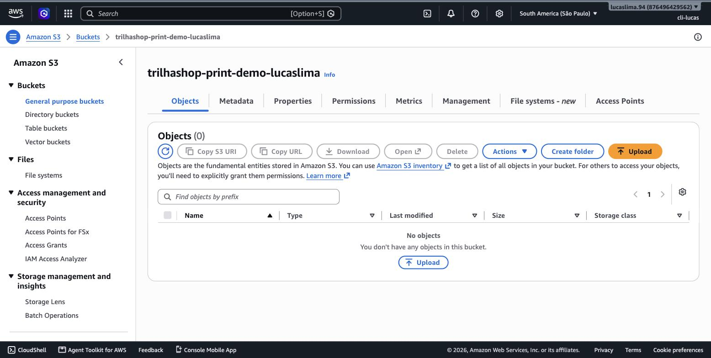
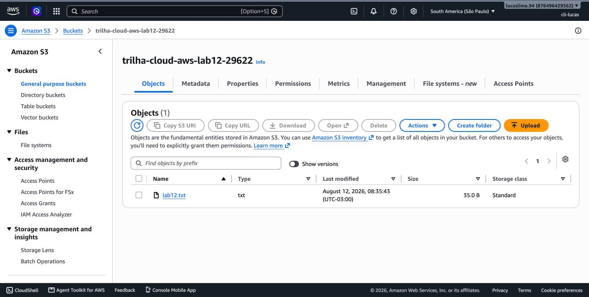
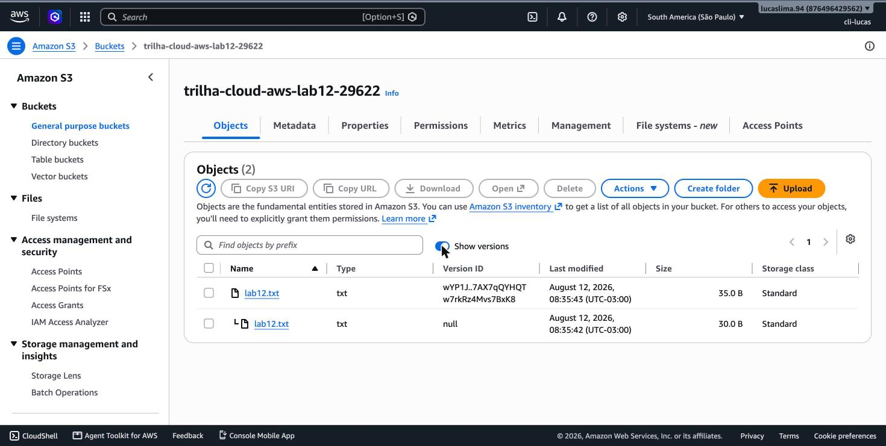
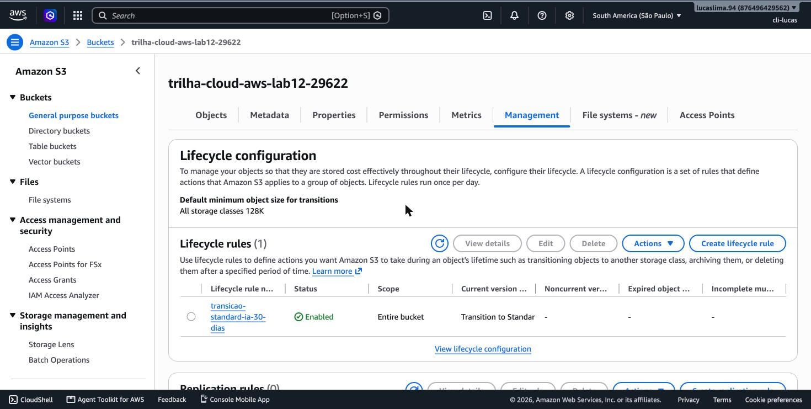
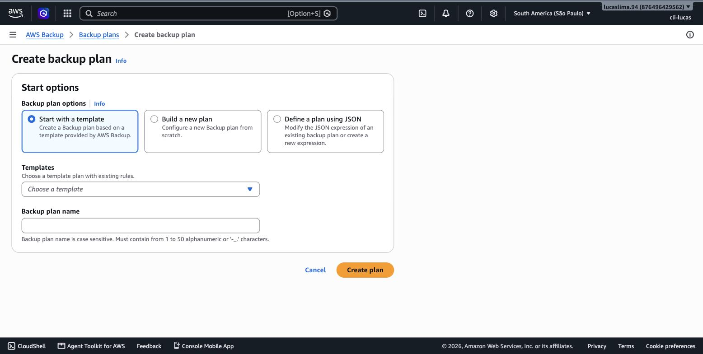
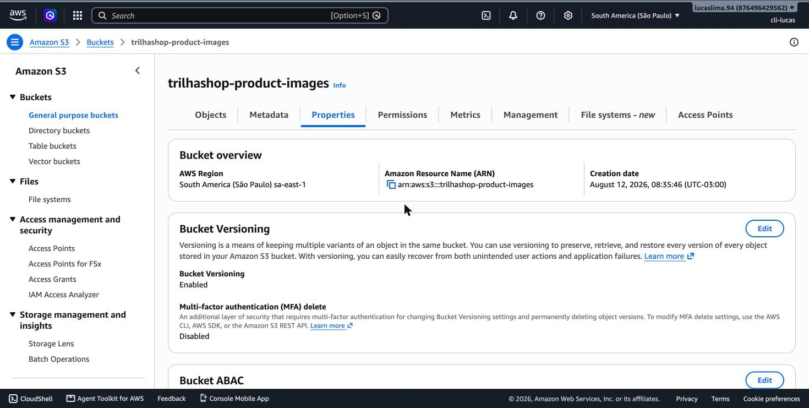

# Módulo 12 — Opções de Armazenamento

> **Objetivo**: entender as três formas fundamentalmente diferentes de armazenar dados na AWS — objeto, bloco e arquivo — e quando cada uma é a certa. E, na prática, criar um bucket S3 real, subir um arquivo, ativar versionamento e configurar uma regra de ciclo de vida.
>
> **Pré-requisitos**: módulo 09 (EBS já foi introduzido como o disco de uma instância EC2 — este módulo aprofunda e compara com as outras opções).
>
> **Tempo de referência (não prazo)**: uma semana em ritmo moderado.
>
> Este módulo corresponde à Task Statement 3.6 do **Domínio 3 — Cloud Technology and Services** (34%), que cobra armazenamento de objeto, classes do S3, armazenamento em bloco, serviços de arquivo, lifecycle policies e AWS Backup. Página oficial: https://docs.aws.amazon.com/aws-certification/latest/cloud-practitioner-02/cloud-practitioner-02-domain3.html. Trilha sobre o CLF-C02 vigente, não o CLF-C01 (aposentado em 18/09/2023).

---

## Três formas de guardar dado, três problemas diferentes

"Armazenamento" soa como um conceito único, mas a AWS oferece três categorias fundamentalmente diferentes, cada uma resolvendo um padrão de acesso diferente. **Armazenamento em bloco** (o EBS do módulo 9) divide dados em blocos de tamanho fixo, endereçáveis individualmente — é o modelo que um sistema operacional espera de um disco rígido tradicional, por isso um volume EBS se comporta exatamente como o disco de um computador comum, e só pode estar anexado a uma instância por vez (com raras exceções). **Armazenamento de objeto** trata cada arquivo como uma unidade completa e indivisível (um "objeto"), guardado junto com metadados, acessível via API HTTP em vez de como um sistema de arquivos tradicional — é o modelo do Amazon S3, ideal para arquivos que são escritos uma vez e lidos muitas vezes, sem edição parcial interna. **Armazenamento de arquivo** organiza dados numa hierarquia tradicional de pastas e arquivos, acessível **simultaneamente por múltiplos clientes ao mesmo tempo** — o que nem bloco nem objeto oferecem da mesma forma — e é o modelo do Amazon EFS.

> `[TEORIA]` Para a prova: bloco (EBS) = anexado a uma única instância, como um HD; objeto (S3) = arquivos completos acessados via API, ilimitado em escala; arquivo (EFS) = hierarquia de pastas, acessível por múltiplos clientes simultaneamente. Reconhecer qual usar dado um cenário é o núcleo desta Task Statement.

## S3: o armazenamento de objeto da AWS

O **Amazon S3 (Simple Storage Service)** organiza dados em **buckets** — contêineres de nível superior, com nome único globalmente (nenhuma outra conta AWS no mundo pode ter um bucket com o mesmo nome que o seu, dentro da mesma partição da AWS) — dentro dos quais você guarda objetos identificados por uma chave (key), que costuma se parecer com um caminho de arquivo (`fotos/2026/imagem.jpg`), embora o S3 não tenha pastas de verdade por trás — é uma ilusão organizada pela própria chave.

> `[PRINT]` Passo a passo para capturar: no Console, buscar "S3" e abrir o serviço. Clicar em "Create bucket". Preencher um nome único (por exemplo, `trilha-cloud-aws-lab12-` seguido de números aleatórios) com a região São Paulo selecionada. Capturar a tela mostrando o campo de nome preenchido e a seção de configuração de acesso público (que deve permanecer bloqueada por padrão — "Block all public access" marcado). Concluir a criação do bucket.

Depois de criado o bucket, envie um arquivo pequeno qualquer (uma imagem ou um `.txt` simples) para dentro dele.

> `[PRINT]` Passo a passo para capturar: dentro do bucket recém-criado, clicar em "Upload", adicionar um arquivo qualquer do computador, e concluir o upload. Capturar a tela da listagem do bucket mostrando o objeto enviado, com as colunas de tamanho e data de última modificação visíveis.

## Classes de armazenamento: a mesma durabilidade, custos muito diferentes

Nem todo dado no S3 precisa do mesmo nível de disponibilidade imediata, e é aí que entram as **classes de armazenamento**: todas oferecem a mesma durabilidade extremamente alta (a AWS promete 99,999999999% de durabilidade — "11 noves" — para a classe Standard e a maioria das outras), mas diferem em custo de armazenamento, custo de recuperação e velocidade de acesso. **S3 Standard** é a classe padrão, para dados acessados frequentemente, com acesso instantâneo. **S3 Standard-Infrequent Access (Standard-IA)** custa menos por gigabyte armazenado, mas cobra uma taxa por recuperação de dados — adequada para dados acessados raramente, mas que ainda precisam de acesso instantâneo quando necessário (backups recentes, por exemplo). **S3 Glacier** (nas suas variações Instant Retrieval, Flexible Retrieval e Deep Archive) é a classe para arquivamento de longuíssimo prazo, com custo de armazenamento drasticamente menor, mas com tempo de recuperação que varia de minutos a até dezenas de horas, dependendo da variação escolhida — pensada para dados que raramente, ou nunca, precisam ser lidos de volta, mas que por exigência legal ou de negócio não podem ser apagados.

> `[TEORIA]` Para a prova: a lógica geral é um trade-off — quanto mais barato o armazenamento por gigabyte, mais lento (ou mais caro) é recuperar o dado de volta. Standard = acesso frequente, instantâneo, mais caro por GB. Standard-IA = acesso raro, ainda instantâneo, mais barato por GB, cobra por recuperação. Glacier (em suas variações) = arquivamento de longo prazo, muito mais barato, recuperação de minutos a horas.

## Versionamento: protegendo contra sobrescrita e exclusão acidental

Por padrão, se você subir um novo arquivo com a mesma chave de um já existente, o S3 sobrescreve o objeto anterior sem aviso — e ele se perde. O **versionamento**, quando ativado num bucket, muda esse comportamento: em vez de sobrescrever, o S3 mantém cada versão anterior do objeto, permitindo restaurar uma versão antiga a qualquer momento, e transforma uma exclusão numa "marca de exclusão" reversível em vez de uma remoção definitiva imediata.

> `[PRINT]` Passo a passo para capturar: dentro do bucket criado, clicar na aba "Properties", localizar a seção "Bucket Versioning" e clicar em "Edit" para ativar ("Enable"). Depois de ativado, subir uma nova versão do mesmo arquivo enviado anteriormente (mesmo nome, conteúdo levemente diferente). Voltar à listagem de objetos, clicar em "Show versions" (ou equivalente) e capturar a tela mostrando as duas versões do mesmo objeto, cada uma com seu próprio Version ID.

## Lifecycle policies: automatizando a transição entre classes

Configurar manualmente quando cada objeto deve mudar de classe de armazenamento (ou ser excluído) não escala para milhões de arquivos. Uma **lifecycle policy** automatiza isso: você define regras como "mover objetos para Standard-IA depois de 30 dias sem acesso" ou "excluir objetos depois de 365 dias", e o S3 aplica essas transições automaticamente, sem intervenção manual contínua.

> `[PRINT]` Passo a passo para capturar: dentro do bucket, clicar na aba "Management" e depois em "Create lifecycle rule". Dar um nome à regra, aplicar a todos os objetos do bucket, e na seção de ações, marcar "Move current versions of objects between storage classes" configurando uma transição (por exemplo, para Standard-IA após 30 dias). Capturar a tela mostrando essa configuração antes de salvar. Pode concluir a criação da regra — ela não gera custo por si só, só afeta objetos no futuro.

> `[TEORIA]` Para a prova: lifecycle policies automatizam transição de classe e exclusão de objetos por tempo decorrido. É a ferramenta padrão para otimização de custo de armazenamento de longo prazo sem esforço manual contínuo — conecta diretamente ao pilar de otimização de custos do módulo 5.

## EFS: quando múltiplos clientes precisam do mesmo sistema de arquivos ao mesmo tempo

O **Amazon EFS (Elastic File System)** preenche o caso de uso que nem EBS nem S3 resolvem bem: um sistema de arquivos tradicional (com hierarquia de pastas, permissões POSIX) que pode ser **montado simultaneamente por múltiplas instâncias EC2 ao mesmo tempo**, todas lendo e escrevendo no mesmo conjunto de arquivos compartilhado — útil para conteúdo compartilhado entre um grupo de servidores web num Auto Scaling Group, por exemplo, onde cada instância precisa enxergar exatamente os mesmos arquivos. Um volume EBS, em contraste, normalmente só pode estar anexado a uma instância por vez. Para cenários que exigem sistema de arquivos compartilhado mas com protocolos específicos do Windows, ou para cargas de trabalho de alta performance específicas (como computação científica), existe também o **Amazon FSx**, disponível em variações otimizadas para diferentes engines de arquivo.

`[APROFUNDAMENTO]` Não é criado um sistema de arquivos EFS de verdade neste laboratório — EFS tem cobertura de Free Tier limitada e menos generosa que S3, e sua configuração envolve escolher pontos de montagem por AZ dentro de uma VPC (módulo 4), o que foge do escopo introdutório deste módulo. Para o Cloud Practitioner, basta reconhecer o cenário de uso (acesso compartilhado simultâneo) e a diferença frente a EBS e S3.

## Storage Gateway e AWS Backup: pontes com o mundo on-premises e proteção centralizada

O **AWS Storage Gateway** conecta ambientes on-premises ao armazenamento da AWS, funcionando como uma ponte — por exemplo, permitindo que uma aplicação legada, que só sabe falar com um sistema de arquivos local tradicional, na verdade esteja escrevendo dados que são armazenados (ou replicados) no S3 por trás, sem que a aplicação precise ser reescrita para isso. É uma peça central de arquiteturas híbridas, complementando o que o módulo 4 já mostrou sobre VPN e Direct Connect.

O **AWS Backup** centraliza e automatiza a política de backup de múltiplos serviços da AWS (EBS, RDS, DynamoDB, EFS, entre outros) num único lugar, em vez de configurar backup separadamente serviço por serviço — conectando diretamente com a estratégia de "backup and restore" vista no módulo 11 como a mais básica das quatro abordagens de disaster recovery.

> `[PRINT]` Passo a passo para capturar: no Console, buscar "Backup" e abrir "AWS Backup". Clicar em "Create Backup plan". Capturar a tela do assistente mostrando as opções de frequência de backup e período de retenção. Não é necessário concluir a criação de um plano real.

## Práticas

### Prática isolada

O bucket `trilha-cloud-aws-lab12-...` criado ao longo deste módulo, com versionamento e a lifecycle rule configurados, já é a prática isolada completa. `[CUSTO]` O S3 tem 5 GB de armazenamento gratuito por mês no Free Tier — um bucket com um ou dois arquivos pequenos e algumas versões fica muito abaixo desse limite, então este laboratório não deveria gerar cobrança relevante mesmo deixado ativo. Ainda assim, para manter o hábito de limpeza: se quiser remover o bucket ao final, primeiro é preciso excluir todos os objetos (incluindo todas as versões, já que o versionamento foi ativado) antes que o bucket em si possa ser excluído — o S3 não permite excluir um bucket não vazio, o mesmo comportamento de segurança já visto no módulo 8 com CloudFormation.

### Contribuição ao projeto integrador

O TrilhaShop ganha seu bucket real de imagens de produto — o mesmo que a política de menor privilégio do módulo 3 já foi escrita para proteger.

> `[PRINT]` Passo a passo para capturar: "S3" → "Create bucket". Nome: `trilhashop-product-images` (se já estiver em uso globalmente por outra conta, usar um sufixo como `trilhashop-product-images-<suas-iniciais>`). Região: São Paulo. Na seção "Bucket Versioning", selecionar "Enable" já nesta tela (diferente do bucket de prática, que ativou depois). Manter "Block all public access" marcado — mesmo sendo imagens de produto, o acesso público vai ser mediado pelo CloudFront (módulo 4/16), não pelo bucket diretamente. Concluir a criação.

Configure uma lifecycle rule transicionando imagens para **Standard-IA** depois de 90 dias (fotos de produtos antigos, fora de catálogo ativo, são acessadas com pouca frequência, mas ainda podem ser consultadas em pedidos históricos). Por fim, volte à política `trilhashop-leitura-imagens-produto` escrita no módulo 3 e confirme que o nome do bucket nela bate exatamente com o bucket real recém-criado — se você usou um sufixo diferente por causa de unicidade global, edite a política para refletir o nome real.

`[CUSTO]` Um bucket de imagens de produto, nesta escala de projeto de estudo, fica bem dentro do Free Tier de 5 GB. Nada a pausar — bucket S3 não cobra por hora, só pelo volume armazenado.

## Erros comuns nesta fase

O erro mais comum é ativar versionamento sem entender que ele muda o comportamento de custo: cada versão de um objeto ocupa espaço próprio, então um bucket com versionamento ativado e muitas reescritas do mesmo arquivo pode crescer em armazenamento de forma não óbvia se nenhuma lifecycle policy estiver limpando versões antigas. O segundo erro é escolher Glacier para dados que, na prática, precisam de acesso ocasional rápido — o custo de recuperação de emergência de uma classe de arquivamento profundo pode superar rapidamente a economia obtida no armazenamento, se mal dimensionado.

## Conexão com os módulos seguintes

| Conceito deste módulo | Aparece novamente em |
|---|---|
| S3 como armazenamento de objeto | Origem de distribuições CloudFront (módulo 4), hospedagem de sites estáticos, artefatos de projeto — módulo 16 |
| Lifecycle policies | Otimização de custo, revisitada na revisão final — módulo 16 |
| AWS Backup | Estratégias de disaster recovery — módulo 11 |
| EFS (acesso compartilhado) | Cenários de container que precisam de storage compartilhado — módulo 10 |

## `[REFERÊNCIA]`

- AWS — Domínio 3 do exame CLF-C02, Task 3.6: https://docs.aws.amazon.com/aws-certification/latest/cloud-practitioner-02/cloud-practitioner-02-domain3.html
- AWS — *Amazon S3 User Guide*: https://docs.aws.amazon.com/AmazonS3/latest/userguide/Welcome.html
- AWS — *Amazon S3 Storage Classes*: https://aws.amazon.com/s3/storage-classes/
- AWS — *Amazon EFS User Guide*: https://docs.aws.amazon.com/efs/latest/ug/whatisefs.html
- AWS — *AWS Backup Developer Guide*: https://docs.aws.amazon.com/aws-backup/latest/devguide/whatisbackup.html

## Checklist de saída

Você está pronto para o módulo 13 quando consegue, sem consultar:

- [ ] Diferenciar armazenamento em bloco, objeto e arquivo, e dar um exemplo de serviço AWS para cada.
- [ ] Explicar o trade-off entre as classes S3 Standard, Standard-IA e Glacier.
- [ ] Explicar o que o versionamento faz e por que ele muda o comportamento padrão de sobrescrita do S3.
- [ ] Explicar o que uma lifecycle policy automatiza.
- [ ] Explicar quando usar EFS em vez de EBS (acesso compartilhado simultâneo por múltiplos clientes).
- [ ] Explicar o papel do Storage Gateway (ponte híbrida) e do AWS Backup (centralização de backups).
- [ ] Ter criado, no Console real, um bucket S3, enviado um objeto, ativado versionamento e configurado uma lifecycle rule.
- [ ] Ter criado o bucket real `trilhashop-product-images` e conferido que a policy do módulo 3 aponta para o nome certo.
