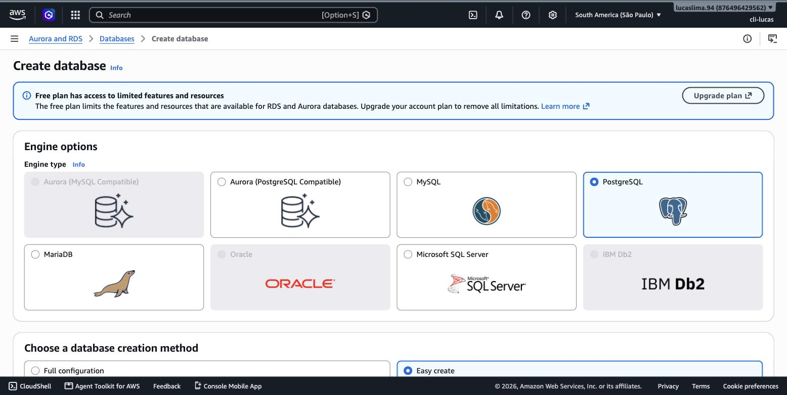
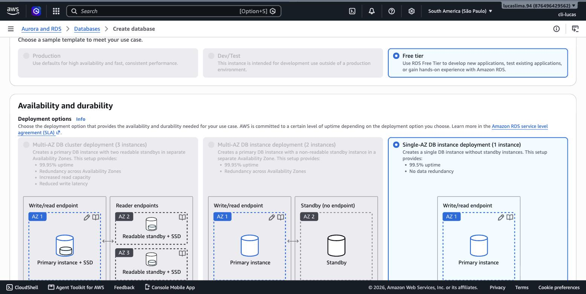
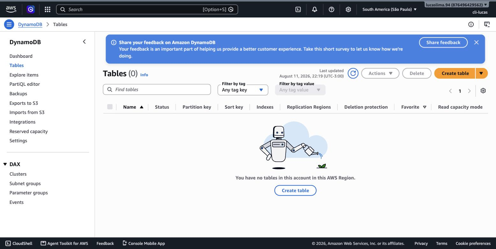
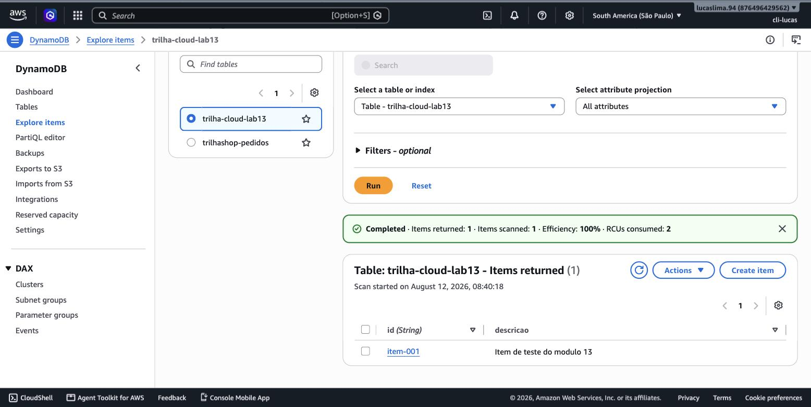
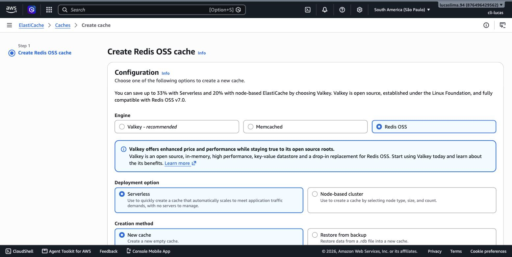
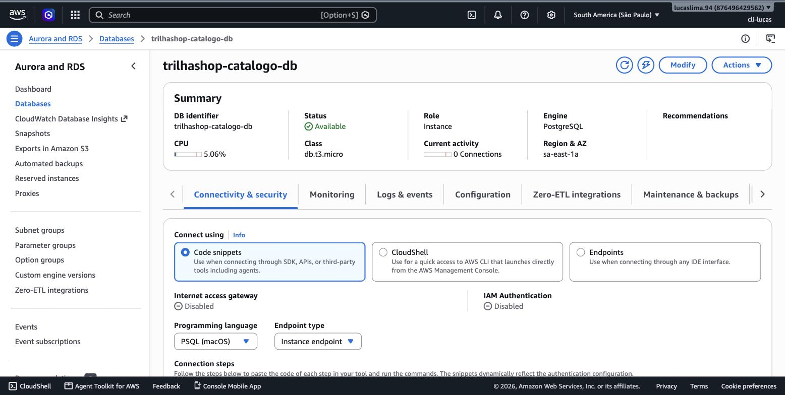
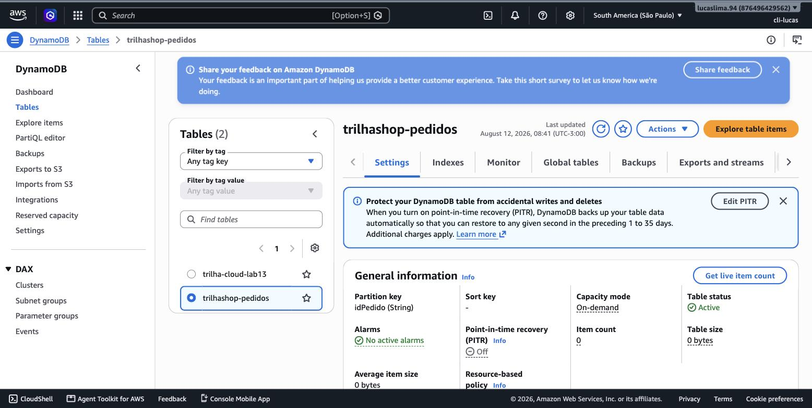

# Módulo 13 — Opções de Banco de Dados

> **Objetivo**: entender o critério real que decide entre banco relacional e não-relacional (não é gosto pessoal, é o formato dos dados e o padrão de acesso), reconhecer as opções gerenciadas da AWS para cada categoria, e criar uma tabela DynamoDB real, do início ao fim.
>
> **Pré-requisitos**: módulo 04 (VPC — bancos gerenciados também vivem dentro de subnets) e módulo 03 (Shared Responsibility Model — a diferença entre "hospedar seu próprio banco numa instância EC2" e "usar um banco gerenciado" é, no fundo, uma decisão de onde a linha de responsabilidade fica).
>
> **Tempo de referência (não prazo)**: uma a duas semanas em ritmo moderado.
>
> Este módulo corresponde à Task Statement 3.4 do **Domínio 3 — Cloud Technology and Services** (34%), que cobra decidir entre bancos hospedados em EC2 ou gerenciados pela AWS, e identificar bancos relacionais, NoSQL, em memória e ferramentas de migração. Página oficial: https://docs.aws.amazon.com/aws-certification/latest/cloud-practitioner-02/cloud-practitioner-02-domain3.html. Trilha sobre o CLF-C02 vigente, não o CLF-C01 (aposentado em 18/09/2023).

---

## Hospedar você mesmo, ou deixar a AWS gerenciar?

Antes mesmo de escolher qual tipo de banco de dados usar, existe uma decisão anterior: rodar o banco você mesmo numa instância EC2 (instalando o PostgreSQL ou o MySQL manualmente, por exemplo), ou usar um serviço de banco de dados **gerenciado** pela AWS. A primeira opção dá controle total, mas transfere para você — de volta ao Shared Responsibility Model do módulo 3 — a responsabilidade por patching, backup, replicação e recuperação de falhas. A segunda opção, através de serviços como o Amazon RDS, transfere boa parte dessa carga operacional para a AWS, em troca de um pouco menos de controle de baixo nível (por exemplo, você normalmente não tem acesso root ao sistema operacional por trás de uma instância RDS). Na esmagadora maioria dos casos práticos, um banco gerenciado é a escolha certa — a AWS aplica patches de segurança, cuida de backup automático e lida com boa parte da complexidade operacional que rodar um banco de produção exige.

> `[TEORIA]` Para a prova: "quando usar EC2 hospedando o próprio banco vs. um banco gerenciado da AWS" é literalmente uma skill nomeada na Task Statement 3.4. A resposta padrão esperada: banco gerenciado sempre que possível, EC2 hospedado apenas quando há uma exigência muito específica de controle total (uma engine de banco não suportada por nenhum serviço gerenciado, por exemplo).

## Relacional vs. não-relacional: o critério é o formato do dado

Um banco de dados **relacional** organiza dados em tabelas com colunas fixas e predefinidas, e relações entre tabelas são expressas por chaves — é o modelo clássico de décadas de engenharia de software, consultado via SQL, e é a escolha certa quando os dados têm uma estrutura bem definida e consistente, e quando relações complexas entre entidades diferentes (um pedido que referencia um cliente que referencia um endereço) precisam ser consultadas de forma flexível. Um banco **não-relacional (NoSQL)** abandona a exigência de esquema fixo — cada registro pode ter uma estrutura diferente — e otimiza para escala horizontal massiva e latência baixíssima em padrões de acesso simples e previsíveis (buscar um item por uma chave conhecida, por exemplo), ao custo de flexibilidade de consulta complexa.

> `[TEORIA]` Para a prova: o critério de decisão não é "qual é mais moderno" — é o formato e o padrão de acesso ao dado. Estrutura fixa, relações complexas, consultas variadas e imprevisíveis → relacional. Estrutura flexível, acesso principalmente por chave conhecida, necessidade de escala horizontal extrema → NoSQL.

## Amazon RDS: bancos relacionais gerenciados

O **Amazon RDS (Relational Database Service)** gerencia bancos relacionais das engines mais usadas do mercado — PostgreSQL, MySQL, MariaDB, Oracle e SQL Server — cuidando de provisionamento, patch de segurança, backup automático e failover, sem que você precise administrar o sistema operacional por trás.

> `[PRINT]` Passo a passo para capturar: no Console, com a região São Paulo selecionada, buscar "RDS" e abrir o serviço. Clicar em "Create database". Selecionar o método "Standard create" e escolher uma engine (por exemplo, PostgreSQL). Capturar a tela mostrando os cartões de seleção de engine e, mais abaixo, o template "Free tier" selecionado.

Duas capacidades do RDS merecem destaque especial porque conectam diretamente com módulos anteriores. **Multi-AZ** replica o banco de forma síncrona para uma AZ diferente da mesma região — se a instância primária falhar, o RDS promove automaticamente a réplica para primária, com interrupção mínima. É a aplicação direta, num banco de dados, da mesma lógica de redundância multi-AZ vista pela primeira vez no módulo 2. **Read replicas**, por outro lado, replicam de forma assíncrona e servem para escalar **leitura**, não disponibilidade — você pode ter múltiplas read replicas recebendo consultas de leitura, aliviando a carga da instância primária, que continua sendo a única a receber escritas.

> `[PRINT]` Passo a passo para capturar: dentro do mesmo assistente de criação do RDS, rolar até a seção "Availability and durability", onde aparece a opção "Multi-AZ deployment" (geralmente com um aviso de custo adicional ao lado). Capturar a tela mostrando essa opção, **sem marcá-la** — o objetivo é só visualizar a configuração, não criar um banco de fato neste laboratório (ver aviso de custo abaixo).

> `[ATENÇÃO]` Multi-AZ e read replica resolvem problemas diferentes e a prova gosta de testar essa troca: Multi-AZ existe para **disponibilidade** (failover automático em caso de falha), não para performance de leitura — na configuração padrão, a réplica Multi-AZ nem sequer aceita consultas de leitura diretamente. Read replica existe para **escalar leitura**, não é um mecanismo de failover automático por padrão (embora seja possível promover uma read replica manualmente em caso de emergência).

## Amazon Aurora: uma evolução do modelo RDS

O **Amazon Aurora** é a engine de banco relacional própria da AWS, compatível com MySQL e PostgreSQL na superfície (o mesmo driver e a mesma sintaxe SQL funcionam), mas com uma arquitetura de armazenamento redesenhada internamente para entregar mais throughput e replicação mais rápida do que as engines RDS tradicionais equivalentes. Aurora é operado através do mesmo Console e conceitos do RDS (também suporta Multi-AZ e read replicas, com propagação de réplica tipicamente mais rápida), mas é oferecido como um produto próprio dentro da família RDS, com opções adicionais como o **Aurora Serverless**, que ajusta capacidade automaticamente conforme a demanda — o mesmo princípio de elasticidade do módulo 1, aplicado especificamente a um banco relacional.

> `[TEORIA]` Para a prova: reconhecer Aurora como a engine relacional proprietária da AWS, compatível com MySQL/PostgreSQL, com melhor performance e replicação mais rápida que RDS tradicional — sem precisar saber os detalhes internos de como essa arquitetura funciona.

## DynamoDB: o NoSQL gerenciado da AWS

O **Amazon DynamoDB** é o serviço de banco de dados NoSQL totalmente gerenciado da AWS, do tipo chave-valor/documento: cada item é identificado por uma chave primária, e o esquema de cada item pode variar livremente. DynamoDB opera em dois **modos de capacidade**: **on-demand**, que cobra por requisição de leitura/escrita realizada, sem necessidade de planejar capacidade antecipadamente (ideal para cargas de trabalho novas ou imprevisíveis); e **provisioned**, onde você reserva uma capacidade fixa de leitura/escrita por segundo, mais barato por unidade quando o padrão de tráfego é previsível, mas exige dimensionamento manual (ou Auto Scaling configurado sobre ele).

Vamos criar uma tabela real — DynamoDB no modo on-demand tem uma camada sempre gratuita generosa, tornando este um laboratório seguro de ponta a ponta.

> `[PRINT]` Passo a passo para capturar: no Console, buscar "DynamoDB" e abrir o serviço. Clicar em "Create table". Preencher o nome da tabela (por exemplo, `trilha-cloud-lab13`) e a chave de partição (por exemplo, `id`, tipo String). Manter as configurações padrão (modo de capacidade "On-demand"). Capturar a tela preenchida antes de concluir a criação. Concluir a criação da tabela.

Com a tabela criada, adicione um item manualmente pela interface, e depois consulte-o de volta.

> `[PRINT]` Passo a passo para capturar: dentro da tabela recém-criada, clicar em "Explore table items" e depois em "Create item". Preencher o valor da chave de partição (`id`) com um valor qualquer (por exemplo, `item-001`) e adicionar um atributo extra (por exemplo, `descricao` = "Item de teste do modulo 13"). Salvar o item. Capturar a tela da listagem de itens da tabela mostrando esse item criado, com suas colunas de atributos visíveis.

> `[TEORIA]` Para a prova: DynamoDB é chave-valor/documento, sem esquema fixo por item, projetado para escala horizontal e latência de milissegundos de dois dígitos consistente, independente do tamanho da tabela. Modo on-demand cobra por requisição; modo provisioned reserva capacidade fixa, mais barato para tráfego previsível.

## ElastiCache: banco em memória para acelerar o que já existe

O **Amazon ElastiCache** gerencia bancos de dados **em memória** (engines Redis e Memcached), usados como camada de cache na frente de um banco principal (relacional ou NoSQL) — dados acessados com muita frequência ficam guardados em memória RAM, ordens de magnitude mais rápida de ler do que um disco, reduzindo tanto a latência percebida pelo usuário quanto a carga direta no banco principal.

> `[PRINT]` Passo a passo para capturar: no Console, buscar "ElastiCache" e abrir o serviço. Clicar em "Create cache" (ou "Redis clusters" → "Create"). Capturar a tela do assistente mostrando a escolha entre engine Redis e Memcached, e a seleção de tipo de nó. Não é necessário concluir a criação — ElastiCache não tem cobertura de Free Tier tão simples quanto DynamoDB.

## Migrando para a AWS: DMS e SCT

Para organizações movendo um banco de dados existente (seja de outro provedor de nuvem, seja de um datacenter próprio) para a AWS, dois serviços resolvem partes diferentes do problema. O **AWS Database Migration Service (DMS)** migra os dados em si, com a capacidade de manter a origem e o destino sincronizados durante a transição (útil para minimizar tempo de indisponibilidade durante a virada). O **AWS Schema Conversion Tool (SCT)** resolve um problema anterior: quando origem e destino usam engines diferentes (por exemplo, migrando de Oracle para Aurora PostgreSQL), o SCT converte automaticamente o máximo possível do esquema e do código de banco de dados (procedures, funções) de uma sintaxe para outra, reduzindo o trabalho manual de reescrita.

> `[TEORIA]` Para a prova: DMS migra dados (com suporte a sincronização contínua durante a migração); SCT converte esquema/código entre engines diferentes. Frequentemente usados em conjunto quando a migração envolve troca de engine.

## Um guia de decisão prático

Juntando tudo: um sistema transacional tradicional, com relações complexas entre entidades e necessidade de consultas SQL variadas — RDS ou Aurora. Uma aplicação com necessidade de escala horizontal extrema, padrão de acesso simples (buscar por chave) e volume potencialmente massivo — DynamoDB. Uma camada de aceleração na frente de um banco já existente, para reduzir latência de leituras repetidas — ElastiCache. Uma migração de um banco existente para a AWS — DMS (dados) e, se a engine muda, SCT (esquema) primeiro.

## Práticas

### Prática isolada

A tabela DynamoDB `trilha-cloud-lab13` criada ao longo deste módulo, com o item adicionado e consultado, já é a prática isolada completa. `[CUSTO]` No modo on-demand com pouquíssimos itens, ela fica dentro da camada sempre gratuita do DynamoDB — mas vale o hábito de limpeza: se não for reutilizá-la, exclua a tabela ao final ("Delete table", dentro do Console do DynamoDB).

### Contribuição ao projeto integrador

O TrilhaShop ganha os dois bancos reais desta vez — um relacional para o catálogo, um NoSQL para os pedidos, exatamente o "guia de decisão" acima aplicado a um projeto de verdade.

> `[PRINT]` Passo a passo para capturar: "RDS" → "Create database" → "Standard create" → engine PostgreSQL → template "Free tier". Identificador da instância: `trilhashop-catalogo-db`. Em "Connectivity", VPC: `trilhashop-vpc`; "DB Subnet Group": criar um novo grupo usando as duas subnets **privadas** do módulo 4; VPC Security Group: selecionar o `trilhashop-db-sg` (criado no módulo 4) em vez de criar um novo; "Public access": **No**. Capturar a tela com essa configuração de rede preenchida antes de criar. Concluir a criação (a instância leva alguns minutos para ficar disponível).

O `trilhashop-db-sg` só aceita conexões vindas do `trilhashop-app-sg` (regra criada no módulo 4) — ou seja, mesmo com a instância criada, nada fora da camada de aplicação do TrilhaShop consegue se conectar a ela, nem você, diretamente da sua máquina. Essa é a cadeia de menor privilégio do módulo 3 e do módulo 4 funcionando de ponta a ponta num recurso real.

Em seguida, crie a tabela real de pedidos no DynamoDB:

> `[PRINT]` Passo a passo para capturar: "DynamoDB" → "Create table". Nome: `trilhashop-pedidos`. Partition key: `idPedido` (String). Capacity mode: On-demand. Capturar a tela preenchida antes de criar. Concluir a criação — o módulo 14 volta aqui para gravar pedidos de verdade via Lambda.

`[CUSTO]` Este é o recurso mais caro do TrilhaShop até agora: o RDS, mesmo `db.t3.micro` dentro do Free Tier (750 horas/mês), cobra por hora enquanto a instância estiver `available`. Ao pausar entre sessões de estudo mais longas, use "Actions" → "Stop temporarily" — mas lembre da ressalva da tabela em `00_indice.md`: a AWS reinicia uma instância RDS parada automaticamente depois de 7 dias, então pausas muito longas exigem parar de novo periodicamente. A tabela DynamoDB de pedidos, em modo on-demand e vazia, não custa nada parada.

## Erros comuns nesta fase

O erro mais comum é confundir Multi-AZ com read replica, tratando os dois como formas intercambiáveis de "ter mais de uma cópia do banco" — como visto acima, eles resolvem problemas diferentes (disponibilidade vs. escala de leitura) e a prova testa essa distinção diretamente. O segundo erro é escolher DynamoDB por padrão só por parecer mais "moderno" ou "escalável", sem considerar que ele não é adequado para consultas relacionais complexas com múltiplos joins — a escolha correta depende do formato do dado e do padrão de acesso, não de tendência.

## Conexão com os módulos seguintes

| Conceito deste módulo | Aparece novamente em |
|---|---|
| RDS Multi-AZ | Extensão direta da alta disponibilidade multi-AZ — módulos 2 e 11 |
| Read replicas | Padrão "pilot light"/"warm standby" de DR — módulo 11 |
| DynamoDB | Padrão arquitetural API Gateway + Lambda + DynamoDB — módulo 14 |
| ElastiCache | Otimização de performance, ligada ao pilar de eficiência — módulo 5 |

## `[REFERÊNCIA]`

- AWS — Domínio 3 do exame CLF-C02, Task 3.4: https://docs.aws.amazon.com/aws-certification/latest/cloud-practitioner-02/cloud-practitioner-02-domain3.html
- AWS — *Amazon RDS User Guide*: https://docs.aws.amazon.com/AmazonRDS/latest/UserGuide/Welcome.html
- AWS — *Amazon DynamoDB Developer Guide*: https://docs.aws.amazon.com/amazondynamodb/latest/developerguide/Introduction.html
- AWS — *Amazon Aurora User Guide*: https://docs.aws.amazon.com/AmazonRDS/latest/AuroraUserGuide/CHAP_AuroraOverview.html
- AWS — *Amazon ElastiCache*: https://aws.amazon.com/elasticache/

## Checklist de saída

Você está pronto para o módulo 14 quando consegue, sem consultar:

- [ ] Explicar quando faz sentido hospedar o próprio banco em EC2 em vez de usar um serviço gerenciado.
- [ ] Explicar o critério de decisão entre relacional e não-relacional (formato do dado e padrão de acesso, não modernidade).
- [ ] Diferenciar Multi-AZ de read replica no RDS, com o problema que cada um resolve.
- [ ] Reconhecer Aurora como a engine relacional proprietária da AWS, compatível com MySQL/PostgreSQL.
- [ ] Explicar os dois modos de capacidade do DynamoDB (on-demand vs. provisioned).
- [ ] Explicar o papel do ElastiCache como camada de cache em memória.
- [ ] Diferenciar DMS (migração de dados) de SCT (conversão de esquema).
- [ ] Ter criado, no Console real, uma tabela DynamoDB, adicionado e consultado um item nela.
- [ ] Ter criado, de verdade, o `trilhashop-catalogo-db` (RDS, sem acesso público, atrás do `trilhashop-db-sg`) e a tabela `trilhashop-pedidos` no DynamoDB.
