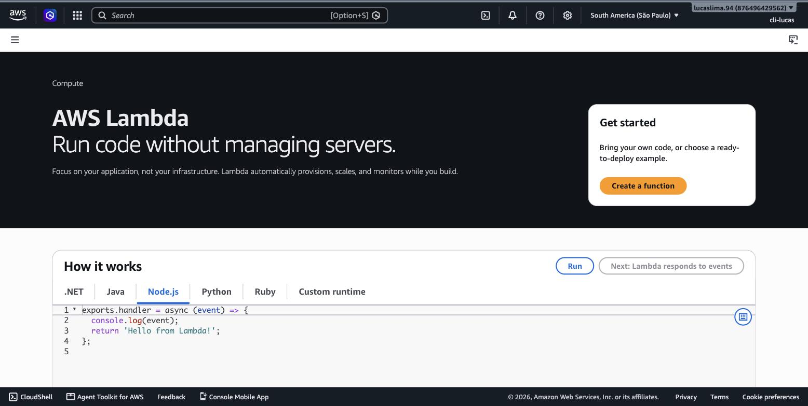
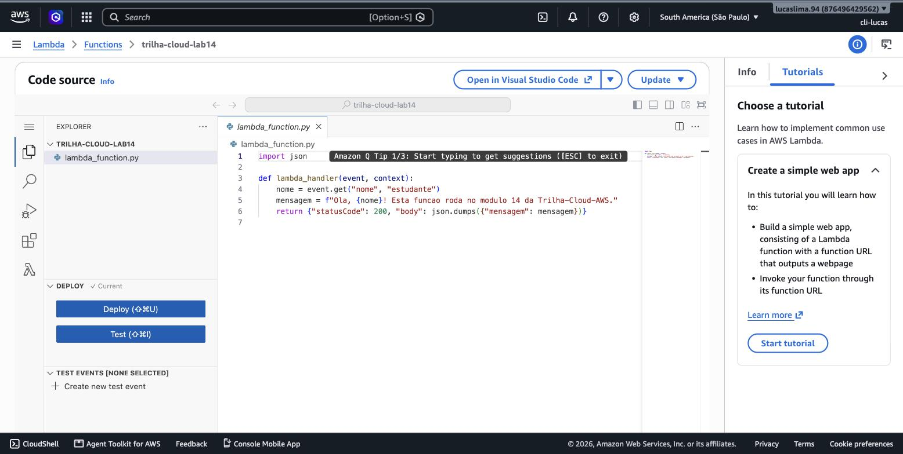
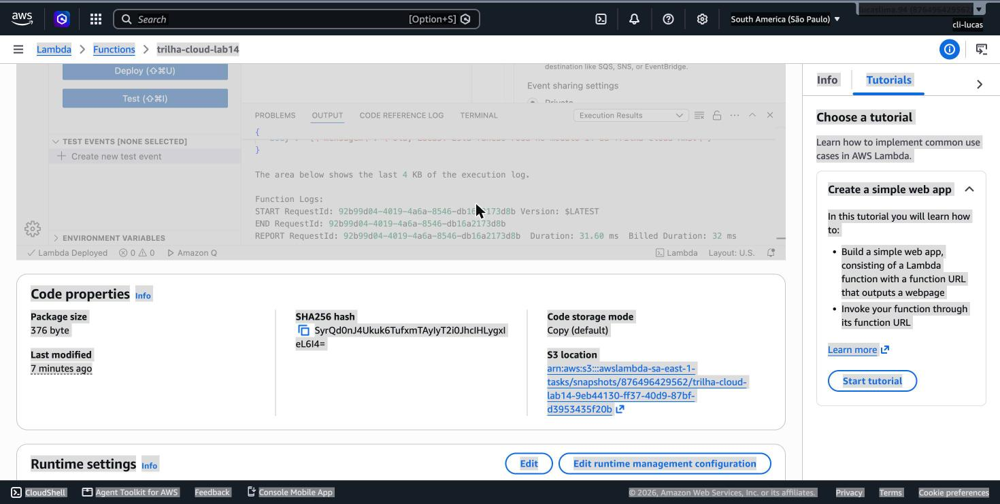
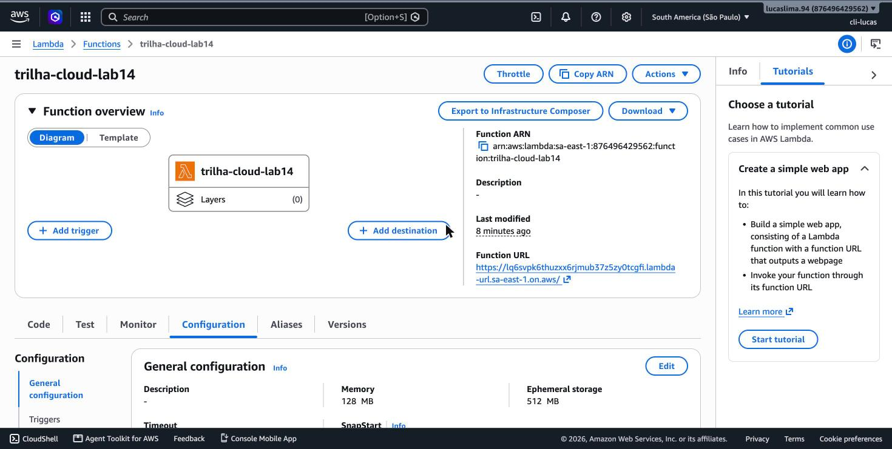
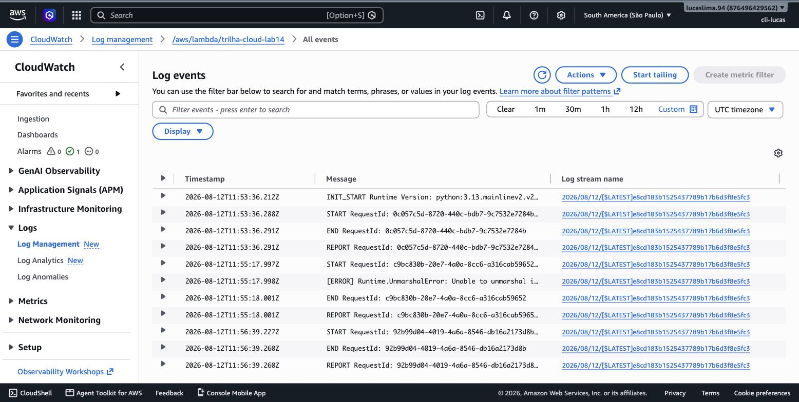
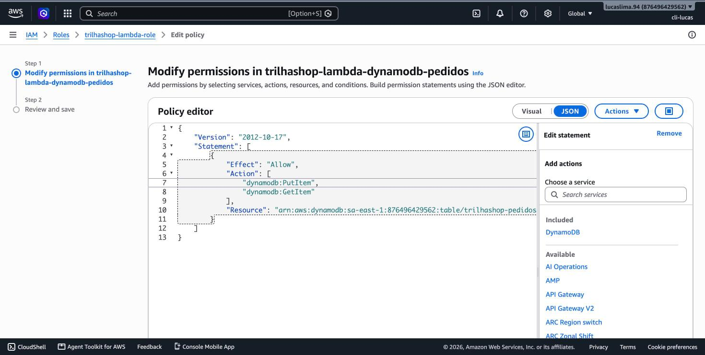
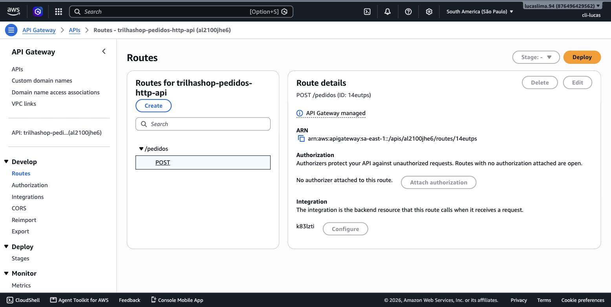

# Módulo 14 — Computação Baseada em Funções (Lambda)

> **Objetivo**: entender o que "serverless" realmente significa (não é ausência de servidor, é ausência de gestão de servidor) e, na prática, criar, testar e expor ao mundo uma função Lambda real, olhando para os números de execução que definem como ela é cobrada.
>
> **Pré-requisitos**: módulo 09 (EC2 — Lambda é o contraponto direto), módulo 10 (Fargate — outra forma de "menos gestão de servidor", para comparar) e módulo 04 (API Gateway, introduzido ali e usado de verdade aqui).
>
> **Tempo de referência (não prazo)**: uma a duas semanas em ritmo moderado.
>
> Este módulo corresponde à Task Statement 3.3 do **Domínio 3 — Cloud Technology and Services** (34%), que cobra reconhecer o uso apropriado de opções de compute serverless, incluindo AWS Lambda. Página oficial: https://docs.aws.amazon.com/aws-certification/latest/cloud-practitioner-02/cloud-practitioner-02-domain3.html. Trilha sobre o CLF-C02 vigente, não o CLF-C01 (aposentado em 18/09/2023).

---

## Serverless não significa "sem servidor"

O nome é enganoso de propósito, então vale desfazer o mal-entendido logo de início: **serverless** não significa que não existe servidor por trás — existe, e é gerenciado pela AWS. O que "serverless" remove é a sua responsabilidade de **provisionar, dimensionar e manter** esse servidor. Voltando à régua de IaaS/PaaS/SaaS do módulo 1: uma instância EC2 (módulo 9) é IaaS puro — você decide o tipo, a quantidade, quando ligar e desligar. O Fargate (módulo 10) já remove a gestão de instância, mas você ainda declara containers rodando continuamente. O **AWS Lambda** vai um passo além: você não declara nem containers rodando — você declara **uma função**, um pedaço de código que executa em resposta a um evento, e existe (do ponto de vista de cobrança e de infraestrutura visível) apenas durante os milissegundos ou segundos em que está de fato executando.

> `[TEORIA]` Para a prova: serverless remove a gestão de servidor, não a existência dele. Lambda é o serviço de compute baseado em função (event-driven) da AWS — código que roda em resposta a um evento, sem infraestrutura para provisionar ou manter.

## Criando uma função real

Vamos criar uma função Lambda simples, testá-la, e observar exatamente como a AWS mede sua execução — a base de como ela é cobrada.


> `[PRINT]` Passo a passo para capturar: com a região São Paulo selecionada, abrir o Lambda direto em https://console.aws.amazon.com/lambda/home?region=sa-east-1 (ou buscar "Lambda" na barra de busca do Console). Clicar em "Create function", manter "Author from scratch" selecionado, preencher o nome (por exemplo, `trilha-cloud-lab14`), selecionar o runtime "Python 3.13" (ou a versão mais recente disponível) e manter a arquitetura padrão. Capturar a tela preenchida antes de clicar em "Create function". Concluir a criação.

> `[CLI]` A mesma função criada via terminal exige empacotar o código em um `.zip` e uma role de execução com a policy gerenciada `AWSLambdaBasicExecutionRole` (permissão mínima para escrever logs no CloudWatch):
> ```bash
> cat > /tmp/lambda_function.py <<'EOF'
> import json
>
> def lambda_handler(event, context):
>     nome = event.get("nome", "estudante")
>     mensagem = f"Ola, {nome}! Esta funcao roda no modulo 14 da Trilha-Cloud-AWS."
>     return {"statusCode": 200, "body": json.dumps({"mensagem": mensagem})}
> EOF
> cd /tmp && zip lambda.zip lambda_function.py && cd -
>
> cat > /tmp/lambda-trust-policy.json <<'EOF'
> {
>   "Version": "2012-10-17",
>   "Statement": [{
>     "Effect": "Allow",
>     "Principal": { "Service": "lambda.amazonaws.com" },
>     "Action": "sts:AssumeRole"
>   }]
> }
> EOF
> aws iam create-role --role-name trilha-cloud-lab14-role \
>   --assume-role-policy-document file:///tmp/lambda-trust-policy.json
> aws iam attach-role-policy --role-name trilha-cloud-lab14-role \
>   --policy-arn arn:aws:iam::aws:policy/service-role/AWSLambdaBasicExecutionRole
>
> ROLE_ARN=$(aws iam get-role --role-name trilha-cloud-lab14-role --query 'Role.Arn' --output text)
>
> aws lambda create-function \
>   --function-name trilha-cloud-lab14 \
>   --runtime python3.13 \
>   --handler lambda_function.lambda_handler \
>   --role $ROLE_ARN \
>   --zip-file fileb:///tmp/lambda.zip \
>   --region sa-east-1
> ```
> Resultado esperado: `aws lambda get-function --function-name trilha-cloud-lab14` retorna `"State": "Active"`. Documentação: https://docs.aws.amazon.com/cli/latest/reference/lambda/create-function.html

Com a função criada, substitua o código de exemplo pelo seguinte, no editor embutido do Console:

```python
import json

def lambda_handler(event, context):
    nome = event.get("nome", "estudante")
    mensagem = f"Ola, {nome}! Esta funcao roda no modulo 14 da Trilha-Cloud-AWS."
    return {
        "statusCode": 200,
        "body": json.dumps({"mensagem": mensagem})
    }
```


> `[PRINT]` Passo a passo para capturar: dentro da função criada, na aba "Code", substituir o conteúdo do arquivo `lambda_function.py` pelo código acima. Clicar em "Deploy" para publicar a mudança. Capturar a tela com o código visível no editor e o botão "Deploy" (já clicado, mostrando confirmação de sucesso, se possível).

## Testando e lendo os números de execução

O Console do Lambda permite testar a função diretamente, sem precisar de nenhum cliente externo — um recurso valioso para entender rapidamente o comportamento antes de conectar qualquer coisa por fora.


> `[PRINT]` Passo a passo para capturar: na aba "Test" da função, criar um novo evento de teste com o corpo `{"nome": "Lucas"}` (ou outro nome), salvar e clicar em "Test". Capturar a tela mostrando a resposta da execução (`Execution result: succeeded`) e o painel de detalhes expandido, com os campos "Duration", "Billed Duration" e "Memory Used" visíveis.

> `[CLI]` Invocação da função a partir do terminal, com o mesmo payload:
> ```bash
> aws lambda invoke \
>   --function-name trilha-cloud-lab14 \
>   --payload '{"nome": "Lucas"}' \
>   --cli-binary-format raw-in-base64-out \
>   /tmp/lambda-output.json
>
> cat /tmp/lambda-output.json
> ```
> Resultado esperado: o arquivo de saída contém `{"statusCode": 200, "body": "{\"mensagem\": \"Ola, Lucas! ...\"}"}`. Documentação: https://docs.aws.amazon.com/cli/latest/reference/lambda/invoke.html

Preste atenção especial em dois desses números. **Duration** é quanto tempo a execução de fato levou. **Billed Duration** é o tempo pelo qual você é cobrado — arredondado para cima em incrementos definidos pela AWS — e é a base real do modelo de precificação do Lambda: você paga por número de invocações e por essa duração cobrada multiplicada pela memória alocada à função, não por hora de servidor ligado, esteja ele processando algo ou não. Rode o teste uma segunda vez e compare a Duration com a primeira execução — é provável que a segunda seja sensivelmente mais rápida.

## Cold start: por que a primeira execução é mais lenta

Essa diferença entre a primeira e a segunda execução tem nome: **cold start**. Quando uma função Lambda não é invocada há um tempo, a AWS não mantém o ambiente de execução dela pronto e esperando — isso custaria recursos ociosos, contrariando a própria proposta do serverless. Na primeira invocação depois de um período ocioso, a AWS precisa inicializar um novo ambiente de execução (o que envolve carregar o runtime e o código da função) antes de rodar seu handler pela primeira vez, e isso adiciona latência perceptível. Invocações subsequentes, enquanto esse ambiente permanece "quente" (reutilizado), pulam essa etapa e executam bem mais rápido — o que você acabou de observar comparando as duas execuções de teste.

> `[ATENÇÃO]` Cold start é um dos tópicos mais mal compreendidos por quem está começando com Lambda, e a prova gosta de testar se você entende a causa raiz: não é uma "lentidão do Lambda" genérica, é especificamente o custo de inicializar um ambiente novo depois de um período sem uso. Funções com runtimes mais leves e menos dependências tendem a ter cold start mais curto.

## Triggers: o que faz uma função Lambda executar

Uma função Lambda nunca roda sozinha — ela sempre é disparada por um **trigger**, uma fonte de evento configurada para invocá-la. Isso pode ser uma requisição HTTP chegando via API Gateway, um novo arquivo sendo enviado a um bucket S3, uma mensagem chegando numa fila SQS, uma alteração numa tabela DynamoDB, ou até um agendamento periódico via EventBridge (o equivalente serverless de uma tarefa cron). Vamos configurar o trigger mais comum: uma URL HTTP acessível diretamente, usando a **Function URL** do próprio Lambda — uma forma simplificada de expor uma função sem precisar configurar um API Gateway completo primeiro.


> `[PRINT]` Passo a passo para capturar: dentro da função, clicar na aba "Configuration" e depois em "Function URL" no menu lateral. Clicar em "Edit" (ou "Create function URL" se ainda não existir), selecionar "Auth type: NONE" (para fins deste laboratório de aprendizado — em produção isso normalmente exigiria autenticação) e salvar. Capturar a tela mostrando a URL gerada.

> `[CLI]` Criação da Function URL sem autenticação (mesma ressalva de exposição pública indicada abaixo):
> ```bash
> aws lambda create-function-url-config \
>   --function-name trilha-cloud-lab14 \
>   --auth-type NONE \
>   --region sa-east-1
>
> aws lambda add-permission \
>   --function-name trilha-cloud-lab14 \
>   --statement-id FunctionURLAllowPublicAccess \
>   --action lambda:InvokeFunctionUrl \
>   --principal '*' \
>   --function-url-auth-type NONE
> ```
> Resultado esperado: `aws lambda get-function-url-config --function-name trilha-cloud-lab14` retorna a `FunctionUrl` gerada. Documentação: https://docs.aws.amazon.com/cli/latest/reference/lambda/create-function-url-config.html

Acesse essa URL no navegador (adicionando `?nome=SeuNome` ao final, já que o código lê o parâmetro `nome`) e veja a resposta JSON sendo retornada diretamente por uma função que não está rodando em servidor algum esperando por você — ela "acordou" especificamente para responder essa requisição.

`[ATENÇÃO]` `Auth type: NONE` deixa a função acessível publicamente por qualquer pessoa que tenha a URL, exatamente como liberar uma porta para `0.0.0.0/0` no módulo 9 — apropriado para este laboratório de aprendizado, mas uma configuração que exigiria revisão cuidadosa antes de ir para produção.

## Onde os logs de execução ficam guardados

Toda execução de uma função Lambda gera logs automaticamente, sem nenhuma configuração extra — e esses logs vão parar exatamente no serviço que o módulo 6 já apresentou.


> `[PRINT]` Passo a passo para capturar: abrir o CloudWatch direto em https://console.aws.amazon.com/cloudwatch/home?region=sa-east-1#logsV2:log-groups (ou buscar "CloudWatch" na barra de busca do Console e ir em "Log groups" no menu lateral). Localizar o grupo com nome `/aws/lambda/trilha-cloud-lab14` (ou o nome dado à função). Abrir o log stream mais recente e capturar a tela mostrando as linhas `START`, `END` e `REPORT` de uma execução, com os mesmos números de Duration e Billed Duration vistos no teste do Console.

> `[CLI]` Leitura do log mais recente via terminal, sem abrir o Console:
> ```bash
> aws logs tail /aws/lambda/trilha-cloud-lab14 --region sa-east-1 --since 10m
> ```
> Resultado esperado: as linhas `START`, `END` e `REPORT` da execução mais recente, com `Duration` e `Billed Duration`. Documentação: https://docs.aws.amazon.com/cli/latest/reference/logs/tail.html

Esse é o mesmo CloudWatch do módulo 6, agora recebendo logs de aplicação em vez de métricas de infraestrutura — reforçando que CloudWatch é a plataforma de observabilidade central da AWS, não um serviço isolado por contexto.

## O padrão API Gateway + Lambda + DynamoDB

O que você acabou de montar de forma simplificada (uma URL pública chamando uma função) é a versão mínima de um dos padrões arquiteturais mais usados na AWS moderna: **API Gateway na frente, recebendo e validando requisições HTTP; Lambda processando a lógica de negócio; DynamoDB (módulo 13) armazenando e consultando dados** — os três serviços trabalhando juntos formam uma API completa sem uma única instância EC2 provisionada. O API Gateway, em vez da Function URL simplificada usada aqui, adiciona camadas como autenticação, limitação de taxa e transformação de requisição/resposta, adequadas para APIs de produção mais robustas.

## Limites de execução e quando Lambda não é a escolha certa

Lambda tem limites de execução que existem justamente para reforçar seu propósito: funções de curta duração, orientadas a evento. O tempo máximo de execução de uma única invocação é de 15 minutos — depois disso, a execução é interrompida à força, independentemente do que estava fazendo. Isso torna Lambda inadequado para processamento de longa duração contínua (um servidor que precisa manter estado ou conexões abertas por horas), cenário em que EC2 ou containers (módulo 10) continuam sendo a escolha certa.

> `[TEORIA]` Para a prova: o limite máximo de execução de uma função Lambda é 15 minutos. Cargas de trabalho de longa duração, com estado persistente em memória entre requisições, ou que exigem controle total do sistema operacional, apontam para EC2 ou containers, não Lambda.

## Comparando as três opções de compute vistas na trilha

Juntando os módulos 9, 10 e 14: EC2 dá controle total sobre um servidor completo, ao custo de gerenciar tudo a partir do sistema operacional; containers com ECS/Fargate empacotam a aplicação de forma portátil, com Fargate removendo a gestão de instância; Lambda remove até a noção de processo continuamente rodando, cobrando estritamente por execução, ideal para cargas orientadas a evento, esporádicas ou com picos muito variáveis. Nenhuma das três é universalmente "melhor" — é comum uma arquitetura real combinar as três ao mesmo tempo, cada uma no componente onde faz mais sentido.

## Práticas

### Prática isolada

A função `trilha-cloud-lab14` criada ao longo deste módulo, testada e exposta por Function URL, já é a prática isolada completa. `[CUSTO]` O Lambda tem uma camada sempre gratuita generosa (1 milhão de invocações por mês, permanentemente, não apenas nos primeiros 12 meses) — as poucas execuções deste laboratório não geram custo algum. Ainda assim, para manter o hábito de limpeza: exclua a Function URL (ou a função inteira, se não for reutilizá-la) ao final, através de "Actions" → "Delete function" na página da função.

### Contribuição ao projeto integrador

A API de pedidos real do TrilhaShop — a primeira vez, nesta trilha, que API Gateway, Lambda, DynamoDB e IAM se conectam de ponta a ponta num recurso do projeto.

Primeiro, dê à `trilhashop-lambda-role` (criada vazia no módulo 3) a permissão exata de que ela precisa — nem mais, nem menos:


> `[PRINT]` Passo a passo para capturar: "IAM" → "Roles" → `trilhashop-lambda-role` → "Add permissions" → "Create inline policy" → aba JSON. Colar uma política permitindo `dynamodb:PutItem` e `dynamodb:GetItem` apenas no ARN da tabela `trilhashop-pedidos` (visível na página da tabela, no DynamoDB). Nomear a policy como `trilhashop-lambda-dynamodb-pedidos`. Capturar a tela antes de salvar.

> `[CLI]` A mesma policy inline, restrita ao ARN exato da tabela:
> ```bash
> TABLE_ARN=$(aws dynamodb describe-table --table-name trilhashop-pedidos --query 'Table.TableArn' --output text)
>
> cat > /tmp/lambda-dynamodb-policy.json <<EOF
> {
>   "Version": "2012-10-17",
>   "Statement": [{
>     "Effect": "Allow",
>     "Action": ["dynamodb:PutItem", "dynamodb:GetItem"],
>     "Resource": "$TABLE_ARN"
>   }]
> }
> EOF
>
> aws iam put-role-policy \
>   --role-name trilhashop-lambda-role \
>   --policy-name trilhashop-lambda-dynamodb-pedidos \
>   --policy-document file:///tmp/lambda-dynamodb-policy.json
> ```
> Resultado esperado: `aws iam list-role-policies --role-name trilhashop-lambda-role` lista `trilhashop-lambda-dynamodb-pedidos`. Documentação: https://docs.aws.amazon.com/cli/latest/reference/iam/put-role-policy.html

Crie a função `trilhashop-pedidos-api`, desta vez escolhendo a `trilhashop-lambda-role` existente em vez de deixar o Lambda criar uma role nova automaticamente:

```python
import json
import boto3
import uuid

dynamodb = boto3.resource("dynamodb")
tabela = dynamodb.Table("trilhashop-pedidos")

def lambda_handler(event, context):
    corpo = json.loads(event.get("body") or "{}")
    id_pedido = str(uuid.uuid4())
    tabela.put_item(Item={
        "idPedido": id_pedido,
        "produto": corpo.get("produto", "desconhecido"),
        "quantidade": corpo.get("quantidade", 1)
    })
    return {
        "statusCode": 201,
        "body": json.dumps({"idPedido": id_pedido, "status": "criado"})
    }
```

> `[CLI]` Empacotamento e criação da função real, usando a `trilhashop-lambda-role` já existente:
> ```bash
> mkdir -p /tmp/trilhashop-pedidos-api && cd /tmp/trilhashop-pedidos-api
> cat > lambda_function.py <<'EOF'
> import json
> import boto3
> import uuid
>
> dynamodb = boto3.resource("dynamodb")
> tabela = dynamodb.Table("trilhashop-pedidos")
>
> def lambda_handler(event, context):
>     corpo = json.loads(event.get("body") or "{}")
>     id_pedido = str(uuid.uuid4())
>     tabela.put_item(Item={
>         "idPedido": id_pedido,
>         "produto": corpo.get("produto", "desconhecido"),
>         "quantidade": corpo.get("quantidade", 1)
>     })
>     return {"statusCode": 201, "body": json.dumps({"idPedido": id_pedido, "status": "criado"})}
> EOF
> zip lambda.zip lambda_function.py
> cd -
>
> LAMBDA_ROLE_ARN=$(aws iam get-role --role-name trilhashop-lambda-role --query 'Role.Arn' --output text)
>
> aws lambda create-function \
>   --function-name trilhashop-pedidos-api \
>   --runtime python3.13 \
>   --handler lambda_function.lambda_handler \
>   --role $LAMBDA_ROLE_ARN \
>   --zip-file fileb:///tmp/trilhashop-pedidos-api/lambda.zip \
>   --region sa-east-1
> ```
> Resultado esperado: `aws lambda get-function --function-name trilhashop-pedidos-api` retorna `"State": "Active"`. Documentação: https://docs.aws.amazon.com/cli/latest/reference/lambda/create-function.html

Em seguida, crie uma API HTTP no API Gateway na frente dela:


> `[PRINT]` Passo a passo para capturar: "API Gateway" → "Create API" → "HTTP API" → "Build". Em "Integrations", adicionar a Lambda `trilhashop-pedidos-api`. Configurar a rota `POST /pedidos`. Aceitar o stage padrão `$default` com auto-deploy. Capturar a tela de revisão antes de criar.

> `[CLI]` Criação da HTTP API, com a rota `POST /pedidos` integrada diretamente à função Lambda (a `aws apigatewayv2 create-api` já cria o stage `$default` com auto-deploy quando usada com `--target`):
> ```bash
> LAMBDA_ARN=$(aws lambda get-function --function-name trilhashop-pedidos-api --query 'Configuration.FunctionArn' --output text)
>
> API_ID=$(aws apigatewayv2 create-api \
>   --name trilhashop-pedidos-http-api \
>   --protocol-type HTTP \
>   --target $LAMBDA_ARN \
>   --route-key "POST /pedidos" \
>   --region sa-east-1 \
>   --query 'ApiId' --output text)
>
> aws lambda add-permission \
>   --function-name trilhashop-pedidos-api \
>   --statement-id apigateway-invoke \
>   --action lambda:InvokeFunction \
>   --principal apigateway.amazonaws.com \
>   --source-arn "arn:aws:execute-api:sa-east-1:$(aws sts get-caller-identity --query Account --output text):$API_ID/*/*/pedidos"
>
> aws apigatewayv2 get-api --api-id $API_ID --query 'ApiEndpoint' --output text
> ```
> Resultado esperado: o comando final devolve a URL de invocação, no formato `https://<api-id>.execute-api.sa-east-1.amazonaws.com`. Documentação: https://docs.aws.amazon.com/cli/latest/reference/apigatewayv2/create-api.html

Teste a API real com um `curl` (no CloudShell, retomando o módulo 7) contra a URL de invocação gerada pelo API Gateway:

```bash
curl -X POST https://<api-id>.execute-api.sa-east-1.amazonaws.com/pedidos \
  -H "Content-Type: application/json" \
  -d '{"produto": "Camiseta TrilhaShop", "quantidade": 2}'
```

A resposta deve trazer um `idPedido` novo, e o item correspondente deve aparecer em "Explore table items" na tabela `trilhashop-pedidos` (módulo 13) — a primeira transação de ponta a ponta do TrilhaShop, do HTTP até o banco de dados.

`[CUSTO]` API Gateway (HTTP API) e Lambda cobram por requisição — nesta escala de testes, o custo é irrelevante e cai dentro da camada sempre gratuita de ambos. Nada a pausar aqui.

## Erros comuns nesta fase

O erro mais comum é achar que Lambda é sempre mais barato que EC2 — para cargas de trabalho com uso muito constante e previsível, uma instância Reserved (módulo 9) rodando continuamente pode sair mais barata que milhões de invocações Lambda equivalentes; Lambda vence economicamente em cargas esporádicas ou muito variáveis, não universalmente. O segundo erro é subestimar o limite de 15 minutos e tentar forçar um processamento longo dentro de uma única função, quando o desenho correto seria quebrar o trabalho em etapas menores ou usar um serviço mais adequado para processamento contínuo.

## Conexão com os módulos seguintes

| Conceito deste módulo | Aparece novamente em |
|---|---|
| Serverless / Lambda | Comparado a Fargate (módulo 10) e usado no projeto integrador — módulo 16 |
| Triggers (S3, DynamoDB, EventBridge) | Amarra S3 (módulo 12) e DynamoDB (módulo 13) num fluxo orientado a evento |
| CloudWatch Logs de Lambda | Extensão direta do módulo 6 |
| API Gateway + Lambda + DynamoDB | Arquitetura de referência do projeto final — módulo 16 |

## `[REFERÊNCIA]`

- AWS — Domínio 3 do exame CLF-C02, Task 3.3: https://docs.aws.amazon.com/aws-certification/latest/cloud-practitioner-02/cloud-practitioner-02-domain3.html
- AWS — *AWS Lambda Developer Guide*: https://docs.aws.amazon.com/lambda/latest/dg/welcome.html
- AWS — *Lambda function URLs*: https://docs.aws.amazon.com/lambda/latest/dg/lambda-urls.html
- AWS — *Understanding AWS Lambda cold starts* (AWS Compute Blog): https://aws.amazon.com/blogs/compute/
- AWS — *AWS Lambda Pricing*: https://aws.amazon.com/lambda/pricing/

## Checklist de saída

Você está pronto para o módulo 15 quando consegue, sem consultar:

- [ ] Explicar por que "serverless" não significa ausência de servidor.
- [ ] Explicar o modelo de precificação do Lambda (por invocação e por duração cobrada × memória, não por hora de servidor ligado).
- [ ] Explicar o que é cold start e por que ele acontece.
- [ ] Nomear pelo menos três tipos de trigger que podem disparar uma função Lambda.
- [ ] Explicar o padrão API Gateway + Lambda + DynamoDB.
- [ ] Explicar o limite máximo de execução do Lambda (15 minutos) e por que isso o torna inadequado para processamento de longa duração.
- [ ] Comparar EC2, containers (Fargate) e Lambda em uma frase cada, quanto a controle vs. gestão.
- [ ] Ter criado, testado e exposto publicamente, no Console real, uma função Lambda.
- [ ] Ter criado a API real `POST /pedidos` (API Gateway + `trilhashop-pedidos-api` + `trilhashop-pedidos`) e confirmado, via `curl`, um pedido gravado de ponta a ponta.
