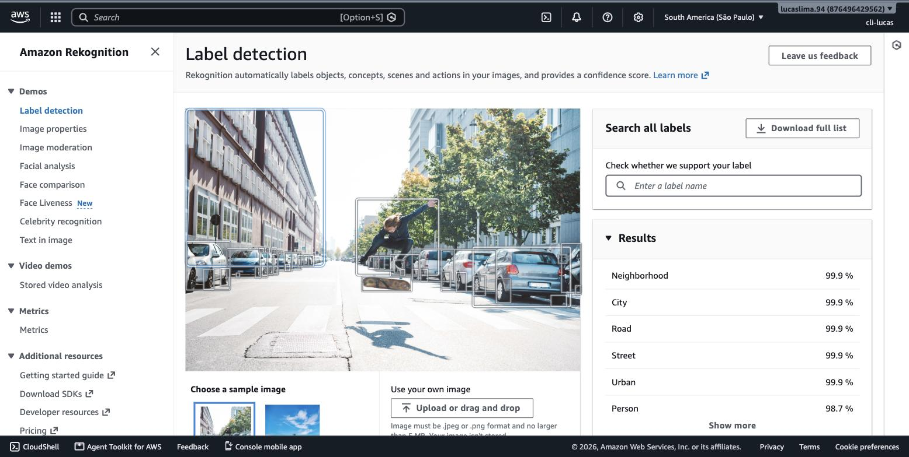
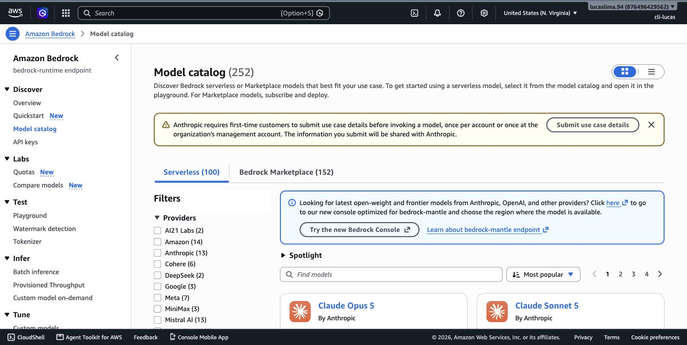
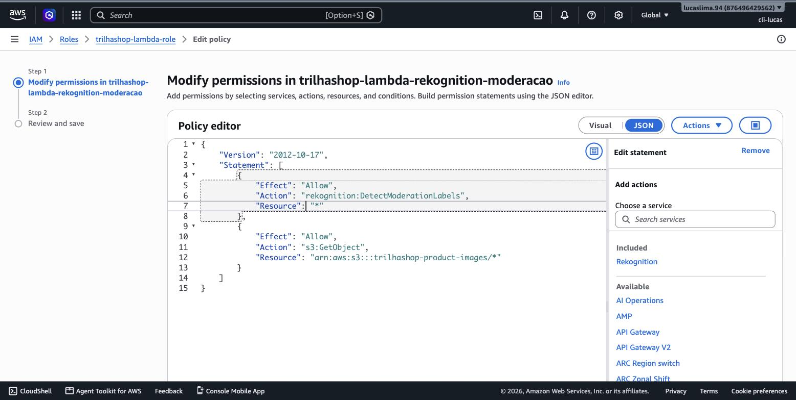
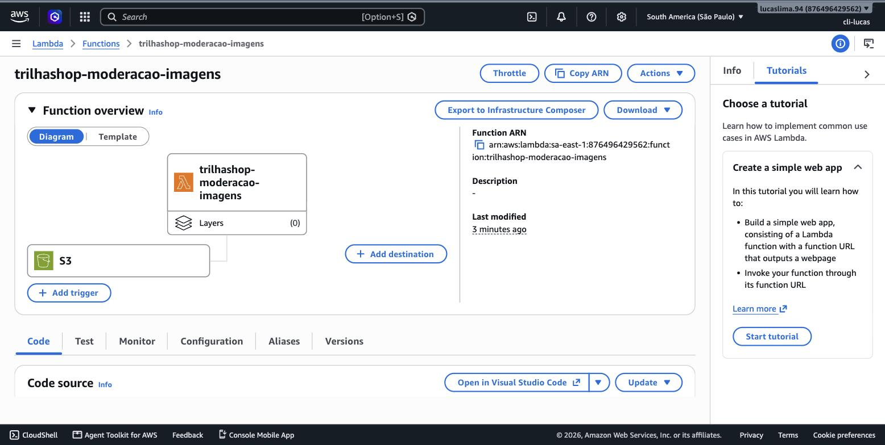

# Módulo 15 — IA e Machine Learning na AWS

> **Objetivo**: reconhecer o catálogo de serviços de IA/ML e analytics que o exame realmente cobra — no nível de "o que cada um resolve", testando alguns deles ao vivo — e entender com clareza onde termina o escopo do Cloud Practitioner e começa o de uma certificação diferente, a AWS Certified AI Practitioner.
>
> **Pré-requisitos**: módulo 01 (modelos de serviço — os serviços de IA/ML aqui são, em sua maioria, exemplos de PaaS bem gerenciado: você usa a capacidade sem treinar nada do zero) e módulo 14 (Lambda — vários desses serviços de IA/ML costumam ser chamados de dentro de uma função Lambda em arquiteturas reais).
>
> **Tempo de referência (não prazo)**: uma semana em ritmo moderado.
>
> Este módulo corresponde à Task Statement 3.7 do **Domínio 3 — Cloud Technology and Services** (34%), que cobra "entender serviços de IA/ML e as tarefas que eles realizam" e "identificar os serviços para analytics de dados". Página oficial: https://docs.aws.amazon.com/aws-certification/latest/cloud-practitioner-02/cloud-practitioner-02-domain3.html. Trilha sobre o CLF-C02 vigente, não o CLF-C01 (aposentado em 18/09/2023).

---

## Por que este módulo existe, e o que ele deliberadamente não cobre

Esta trilha nasceu de uma ementa inspirada num curso corporativo de 14 tópicos clássicos — a mesma estrutura do AWS Academy Cloud Foundations. Esse módulo 15 foi adicionado depois, porque o exame CLF-C02 atual cobra reconhecimento de serviços de IA/ML explicitamente (Task 3.7), e um material desatualizado facilmente ignora isso. Mas vale ser preciso sobre o tamanho desse escopo: para o Cloud Practitioner, IA/ML é **catálogo de serviços**, não profundidade técnica — você precisa saber que o Amazon Rekognition faz análise de imagem e para que serve, não como uma rede neural convolucional funciona por dentro. Se você chegou a este módulo interessado especificamente em IA generativa e em agentes de IA (o que a AWS chama de *agentic AI*), isso é conteúdo de uma certificação **diferente e paralela**, a **AWS Certified AI Practitioner (AIF-C01)** — não uma continuação desta trilha. Vamos delimitar exatamente essa fronteira ao longo do módulo.

## O catálogo de serviços de IA/ML gerenciados

A AWS oferece uma família de serviços de IA/ML **pré-treinados**, prontos para uso via API, sem que você precise treinar um modelo do zero nem entender machine learning profundamente — você envia um dado (uma imagem, um texto, um documento) e recebe de volta uma análise estruturada.

O **Amazon Rekognition** analisa imagens e vídeos: detecta objetos, cenas, rostos (incluindo comparação e reconhecimento facial) e texto dentro de imagens, e sinaliza conteúdo potencialmente impróprio. Vamos ver isso funcionando ao vivo, com uma imagem de exemplo, sem escrever nenhum código.


> `[PRINT]` Passo a passo para capturar: abrir o Rekognition direto em https://console.aws.amazon.com/rekognition/home?region=sa-east-1 (ou buscar "Rekognition" na barra de busca do Console). Localizar a seção de demonstração (geralmente "Demos" no menu lateral, com opções como "Object and scene detection" ou "Facial analysis"). Selecionar "Object and scene detection", usar uma das imagens de amostra fornecidas pela própria AWS (ou enviar uma imagem própria simples). Capturar a tela mostrando a imagem com as detecções marcadas e a lista de labels com percentual de confiança ao lado.

> `[CLI]` Detecção de labels numa imagem já hospedada num bucket S3 (envie antes uma imagem `.jpg` qualquer com `aws s3 cp`, reaproveitando o bucket do módulo 12):
> ```bash
> aws s3 cp foto-exemplo.jpg s3://trilha-cloud-aws-lab12-<número>/foto-exemplo.jpg
>
> aws rekognition detect-labels \
>   --image '{"S3Object":{"Bucket":"trilha-cloud-aws-lab12-<número>","Name":"foto-exemplo.jpg"}}' \
>   --region sa-east-1
> ```
> Resultado esperado: um JSON com a lista `Labels`, cada uma com `Name` e `Confidence`. Documentação: https://docs.aws.amazon.com/cli/latest/reference/rekognition/detect-labels.html

O **Amazon Comprehend** faz processamento de linguagem natural (NLP) sobre texto: identifica sentimento (positivo, negativo, neutro), extrai entidades nomeadas (pessoas, lugares, organizações mencionadas num texto) e identifica frases-chave, sem que você precise treinar um modelo de NLP.


> `[PRINT]` Passo a passo para capturar: abrir o Comprehend direto em https://console.aws.amazon.com/comprehend/v2/home?region=sa-east-1 (ou buscar "Comprehend" na barra de busca do Console). Localizar "Real-time analysis" (ou "Launch Amazon Comprehend"). Colar um texto de exemplo em português ou inglês (por exemplo, uma frase de avaliação de produto) na caixa de entrada e rodar a análise. Capturar a tela mostrando as abas de resultado — "Insights", "Entities", "Key phrases", "Sentiment" — com o sentimento detectado visível.

> `[CLI]` Análise de sentimento de um texto direto no terminal, sem Console (o parâmetro `--language-code` aceita `pt` para português):
> ```bash
> aws comprehend detect-sentiment \
>   --text "Produto excelente, chegou antes do prazo, super recomendo!" \
>   --language-code pt \
>   --region sa-east-1
> ```
> Resultado esperado: um JSON com `"Sentiment": "POSITIVE"` e o objeto `SentimentScore` com as probabilidades por categoria. Documentação: https://docs.aws.amazon.com/cli/latest/reference/comprehend/detect-sentiment.html

O **Amazon Textract** extrai texto e dados estruturados de documentos escaneados ou fotografados — vai além de um OCR simples porque entende a estrutura do documento, extraindo tabelas e pares de campo/valor (por exemplo, "CPF: 123.456.789-00" reconhecido como um par estruturado, não só como texto solto). O **Amazon Lex** é o serviço por trás de chatbots e assistentes de voz — o mesmo motor de compreensão de linguagem natural que alimenta a Alexa, disponibilizado como serviço para quem quer construir sua própria interface conversacional. O **Amazon Kendra** é um serviço de busca inteligente, capaz de responder perguntas em linguagem natural consultando uma base de documentos internos de uma empresa, indo além de uma busca por palavra-chave tradicional.

> `[TEORIA]` Para a prova: associar cada serviço à tarefa que resolve — Rekognition (imagem/vídeo), Comprehend (texto/NLP), Textract (extração de documentos), Lex (chatbot/voz), Kendra (busca inteligente empresarial). A prova costuma dar um cenário de negócio curto (por exemplo, "extrair automaticamente valores de notas fiscais escaneadas") e pedir para identificar o serviço certo — nesse exemplo, Textract.

## O motor por trás de tudo isso: Amazon SageMaker

Enquanto os serviços acima são pré-treinados e prontos para uso, o **Amazon SageMaker AI** é a plataforma completa para quem precisa construir, treinar e implantar **modelos próprios** de machine learning — para cientistas de dados e equipes de ML que têm um problema específico demais para um serviço pré-treinado resolver. SageMaker cobre o ciclo completo: preparação de dados, treinamento, ajuste de hiperparâmetros, e hospedagem do modelo treinado como um endpoint consultável.

> `[TEORIA]` Para a prova: a distinção central é SageMaker (construir e treinar modelos próprios, para quem tem conhecimento de ciência de dados) vs. os serviços pré-treinados como Rekognition/Comprehend/Textract/Lex/Kendra (usar capacidade de IA já pronta via API, sem conhecimento de ML necessário). Não é esperado saber operar o SageMaker em profundidade para o Cloud Practitioner — só reconhecer seu papel na família de serviços de IA/ML.

## Serviços de analytics: preparar, mover e visualizar dados em escala

A mesma Task Statement 3.7 do exame agrupa IA/ML com **analytics de dados**, e vale reconhecer os principais nomes. O **Amazon Athena** permite rodar consultas SQL diretamente sobre arquivos armazenados no S3, sem precisar carregar esses dados num banco de dados tradicional primeiro. O **Amazon Kinesis** captura e processa dados em **streaming**, em tempo real (por exemplo, cliques de usuário numa aplicação, ou leituras de sensores IoT), diferente do processamento em lote tradicional. O **AWS Glue** é um serviço de **ETL (Extract, Transform, Load)** gerenciado, que prepara e transforma dados de um formato para outro antes de eles serem analisados. O **Amazon QuickSight** é a ferramenta de business intelligence da AWS, transformando dados em dashboards visuais interativos para consumo por pessoas de negócio, não só por engenheiros.

> `[TEORIA]` Para a prova: Athena (SQL direto sobre S3), Kinesis (streaming em tempo real), Glue (ETL gerenciado), QuickSight (BI/dashboards). Reconhecer o nome e o propósito de cada um é o suficiente.

## Uma primeira aproximação ao Amazon Bedrock

O **Amazon Bedrock** é o serviço da AWS para acessar **modelos de fundação** (foundation models) de IA generativa — modelos de linguagem grandes, prontos, mantidos por diferentes empresas (incluindo a própria AWS e parceiros), acessíveis via API única, sem que você precise treinar ou hospedar a infraestrutura desses modelos por conta própria. Um modelo de fundação é um modelo de propósito geral, treinado sobre um volume massivo de dados, capaz de ser adaptado (via prompt ou ajuste fino) para uma variedade grande de tarefas — geração de texto, resumo, resposta a perguntas — em vez de um modelo treinado para uma única tarefa específica, como os serviços pré-treinados vistos acima.


> `[PRINT]` Passo a passo para capturar: abrir o Bedrock direto em https://console.aws.amazon.com/bedrock/home?region=sa-east-1 (ou buscar "Bedrock" na barra de busca do Console). No menu lateral, clicar em "Model catalog" (ou "Model access"). Capturar a tela mostrando a lista de modelos de fundação disponíveis, agrupados por provedor, sem precisar solicitar acesso a nenhum modelo ou invocar nada — só visualizar o catálogo.

> `[CLI]` Listagem dos modelos de fundação disponíveis no catálogo, sem solicitar acesso a nenhum:
> ```bash
> aws bedrock list-foundation-models --region sa-east-1 --query 'modelSummaries[].modelId'
> ```
> Resultado esperado: uma lista de IDs de modelos (por exemplo, `amazon.titan-text-express-v1`), agrupáveis por provedor filtrando a saída. Documentação: https://docs.aws.amazon.com/cli/latest/reference/bedrock/list-foundation-models.html

> `[TEORIA]` Para a prova: reconhecer o Bedrock como o serviço de acesso a modelos de fundação de IA generativa da AWS, e "modelo de fundação" como um modelo de propósito geral pré-treinado, adaptável a múltiplas tarefas — esse é o nível de profundidade que o Cloud Practitioner exige sobre o assunto.

## Onde a fronteira com o AI Practitioner realmente está

O motivo de este módulo existir foi justamente uma pergunta legítima levantada durante a construção desta trilha: "isso inclui *agentic AI*?" A resposta, com a distinção agora mais clara: **não**. *Agentic AI* — sistemas de IA que planejam, tomam decisões autônomas e usam ferramentas (tools) para executar tarefas de múltiplas etapas sem supervisão humana constante — é um tópico que a própria AWS reconhece como avançado o suficiente para merecer sua própria certificação. A **AWS Certified AI Practitioner (AIF-C01)** cobre, em profundidade, fundamentos de IA/ML, fundamentos de IA generativa, aplicação prática de modelos de fundação (incluindo RAG — Retrieval-Augmented Generation — e Bedrock Agents), diretrizes de IA responsável, e segurança/governança de IA. É uma certificação **irmã** da Cloud Practitioner — outra porta de entrada "fundamentals" da AWS, focada especificamente em IA — não um próximo passo depois desta trilha, nem um pré-requisito para ela.

`[APROFUNDAMENTO]` Se, depois de terminar esta trilha e passar no Cloud Practitioner, você quiser seguir especificamente para IA, o caminho natural é estudar diretamente para o AIF-C01, usando a mesma lógica desta trilha (ementa oficial do exame, laboratórios práticos, apostila por módulo) — mas isso seria uma trilha nova e separada, não uma extensão desta.

## Práticas

### Prática isolada

As demonstrações do Rekognition e do Comprehend feitas acima já são a prática isolada deste módulo. Vale um passo a mais no Comprehend: rode a análise de sentimento duas vezes, uma com um texto claramente positivo ("Produto excelente, chegou antes do prazo, super recomendo!") e outra com um claramente negativo ("Péssima experiência, produto veio quebrado e o suporte não respondeu"). Compare os dois resultados de sentimento e os scores de confiança — é a melhor forma de ver como o serviço reage a sinais opostos, sem precisar entender nada do modelo por trás.

### Contribuição ao projeto integrador

O TrilhaShop ganha sua primeira função de IA real: moderação automática de imagens de produto, disparada assim que alguém envia uma foto para o bucket `trilhashop-product-images` (módulo 12).

Primeiro, adicione à `trilhashop-lambda-role` (módulo 3, já usada no módulo 14) a permissão para chamar o Rekognition e ler do bucket de imagens:


> `[PRINT]` Passo a passo para capturar: "IAM" → "Roles" → `trilhashop-lambda-role` → "Add permissions" → "Create inline policy" → JSON. Conceder `rekognition:DetectModerationLabels` (sem restrição de recurso, já que o Rekognition não usa ARNs de recurso para essa ação) e `s3:GetObject` restrito a `arn:aws:s3:::trilhashop-product-images/*`. Nomear como `trilhashop-lambda-rekognition-moderacao`. Capturar antes de salvar.

> `[CLI]` A mesma policy inline, via terminal:
> ```bash
> cat > /tmp/lambda-rekognition-policy.json <<'EOF'
> {
>   "Version": "2012-10-17",
>   "Statement": [
>     { "Effect": "Allow", "Action": "rekognition:DetectModerationLabels", "Resource": "*" },
>     { "Effect": "Allow", "Action": "s3:GetObject", "Resource": "arn:aws:s3:::trilhashop-product-images/*" }
>   ]
> }
> EOF
>
> aws iam put-role-policy \
>   --role-name trilhashop-lambda-role \
>   --policy-name trilhashop-lambda-rekognition-moderacao \
>   --policy-document file:///tmp/lambda-rekognition-policy.json
> ```
> Resultado esperado: `aws iam list-role-policies --role-name trilhashop-lambda-role` lista `trilhashop-lambda-rekognition-moderacao` junto com a policy do módulo 14. Documentação: https://docs.aws.amazon.com/cli/latest/reference/iam/put-role-policy.html

Crie a função `trilhashop-moderacao-imagens`, usando a `trilhashop-lambda-role`:

```python
import boto3

rekognition = boto3.client("rekognition")

def lambda_handler(event, context):
    registro = event["Records"][0]["s3"]
    bucket = registro["bucket"]["name"]
    chave = registro["object"]["key"]

    resposta = rekognition.detect_moderation_labels(
        Image={"S3Object": {"Bucket": bucket, "Name": chave}}
    )

    labels = resposta.get("ModerationLabels", [])
    if labels:
        print(f"IMAGEM SINALIZADA: {chave} -- {[l['Name'] for l in labels]}")
    else:
        print(f"Imagem aprovada: {chave}")

    return {"labels": labels}
```

Configure o **trigger** dessa função como um evento do próprio bucket `trilhashop-product-images`, para o tipo de evento "PUT" (novo objeto criado):


> `[PRINT]` Passo a passo para capturar: dentro da função Lambda, "Add trigger" → S3 → bucket `trilhashop-product-images` → tipo de evento "All object create events". Capturar a tela antes de confirmar. Como alternativa, o mesmo trigger pode ser configurado a partir do próprio Console do S3, em "Properties" → "Event notifications".

> `[CLI]` Empacotamento e criação da função, seguida da concessão de permissão ao S3 para invocá-la e da configuração do trigger de evento no bucket:
> ```bash
> mkdir -p /tmp/trilhashop-moderacao && cd /tmp/trilhashop-moderacao
> cat > lambda_function.py <<'EOF'
> import boto3
>
> rekognition = boto3.client("rekognition")
>
> def lambda_handler(event, context):
>     registro = event["Records"][0]["s3"]
>     bucket = registro["bucket"]["name"]
>     chave = registro["object"]["key"]
>     resposta = rekognition.detect_moderation_labels(
>         Image={"S3Object": {"Bucket": bucket, "Name": chave}}
>     )
>     labels = resposta.get("ModerationLabels", [])
>     if labels:
>         print(f"IMAGEM SINALIZADA: {chave} -- {[l['Name'] for l in labels]}")
>     else:
>         print(f"Imagem aprovada: {chave}")
>     return {"labels": labels}
> EOF
> zip lambda.zip lambda_function.py
> cd -
>
> LAMBDA_ROLE_ARN=$(aws iam get-role --role-name trilhashop-lambda-role --query 'Role.Arn' --output text)
>
> aws lambda create-function \
>   --function-name trilhashop-moderacao-imagens \
>   --runtime python3.13 \
>   --handler lambda_function.lambda_handler \
>   --role $LAMBDA_ROLE_ARN \
>   --zip-file fileb:///tmp/trilhashop-moderacao/lambda.zip \
>   --region sa-east-1
>
> FUNCTION_ARN=$(aws lambda get-function --function-name trilhashop-moderacao-imagens --query 'Configuration.FunctionArn' --output text)
>
> aws lambda add-permission \
>   --function-name trilhashop-moderacao-imagens \
>   --statement-id s3-invoke \
>   --action lambda:InvokeFunction \
>   --principal s3.amazonaws.com \
>   --source-arn arn:aws:s3:::trilhashop-product-images
>
> cat > /tmp/notification.json <<EOF
> {
>   "LambdaFunctionConfigurations": [{
>     "LambdaFunctionArn": "$FUNCTION_ARN",
>     "Events": ["s3:ObjectCreated:*"]
>   }]
> }
> EOF
>
> aws s3api put-bucket-notification-configuration \
>   --bucket trilhashop-product-images \
>   --notification-configuration file:///tmp/notification.json
> ```
> Resultado esperado: `aws s3api get-bucket-notification-configuration --bucket trilhashop-product-images` mostra a configuração salva apontando para a função. Documentação: https://docs.aws.amazon.com/cli/latest/reference/s3api/put-bucket-notification-configuration.html

Teste enviando uma imagem qualquer para o bucket (pelo Console do S3, como no módulo 12) e depois consulte os logs da função no CloudWatch (módulo 6/14) — a linha "Imagem aprovada" ou "IMAGEM SINALIZADA" deve aparecer, confirmando que o upload disparou a função e a função chamou o Rekognition de verdade, sem nenhuma intervenção manual depois do upload.

`[CUSTO]` Rekognition tem Free Tier de 5.000 imagens processadas por mês nos primeiros 12 meses da conta — poucos testes ficam bem dentro disso. A função Lambda e o trigger de S3 não têm custo por existirem parados, só por execução. Nada a pausar aqui.

## Erros comuns nesta fase

O erro mais comum é tentar ir fundo demais neste módulo — estudar arquitetura de redes neurais, comparar hiperparâmetros de treinamento, ou se aprofundar em prompt engineering — quando o exame exige, para este tópico específico, apenas reconhecimento de catálogo. Esse esforço extra não é perdido, mas pertence à trilha do AI Practitioner, não a esta. O segundo erro é confundir Rekognition/Comprehend/Textract (serviços pré-treinados, uso direto via API) com SageMaker (plataforma para treinar modelos próprios) — são categorias diferentes dentro do mesmo domínio de IA/ML.

## Conexão com os módulos seguintes

| Conceito deste módulo | Aparece novamente em |
|---|---|
| Serviços de IA/ML pré-treinados | Padrões de integração via Lambda, retomando o módulo 14 |
| Bedrock / modelos de fundação | Fronteira explícita com a trilha de AI Practitioner, fora do escopo deste material |
| Serviços de analytics (Athena, Kinesis, Glue, QuickSight) | Revisão consolidada de catálogo de serviços — módulo 16 |

## `[REFERÊNCIA]`

- AWS — Domínio 3 do exame CLF-C02, Task 3.7: https://docs.aws.amazon.com/aws-certification/latest/cloud-practitioner-02/cloud-practitioner-02-domain3.html
- AWS — *Amazon Rekognition*: https://aws.amazon.com/rekognition/
- AWS — *Amazon Comprehend*: https://aws.amazon.com/comprehend/
- AWS — *Amazon SageMaker AI*: https://aws.amazon.com/sagemaker/
- AWS — *Amazon Bedrock*: https://aws.amazon.com/bedrock/
- AWS — *AWS Certified AI Practitioner (AIF-C01) Exam Guide* (a certificação-irmã para quem quiser seguir em IA generativa e agentic AI): https://docs.aws.amazon.com/aws-certification/latest/ai-practitioner-01/ai-practitioner-01.html

## Checklist de saída

Você está pronto para o módulo 16 quando consegue, sem consultar:

- [ ] Associar cada serviço pré-treinado (Rekognition, Comprehend, Textract, Lex, Kendra) à tarefa que ele resolve.
- [ ] Diferenciar um serviço de IA/ML pré-treinado do SageMaker (treinar modelo próprio).
- [ ] Nomear os quatro serviços de analytics citados (Athena, Kinesis, Glue, QuickSight) e o propósito de cada um.
- [ ] Explicar o que é um modelo de fundação e o papel do Bedrock em relação a ele.
- [ ] Explicar por que *agentic AI* e IA generativa em profundidade pertencem à AWS Certified AI Practitioner, não a esta trilha.
- [ ] Ter testado, no Console real, ao menos uma demonstração do Rekognition e uma do Comprehend.
- [ ] Ter comparado sentimento positivo vs. negativo no Comprehend.
- [ ] Ter criado a função real `trilhashop-moderacao-imagens`, disparada por upload no bucket, e confirmado a execução nos logs do CloudWatch.
