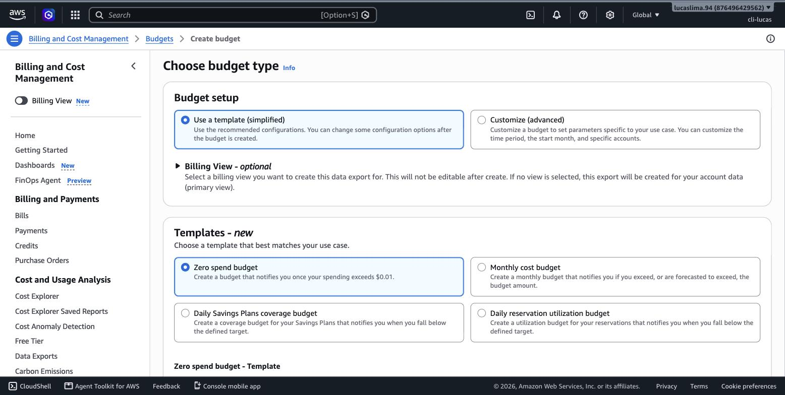
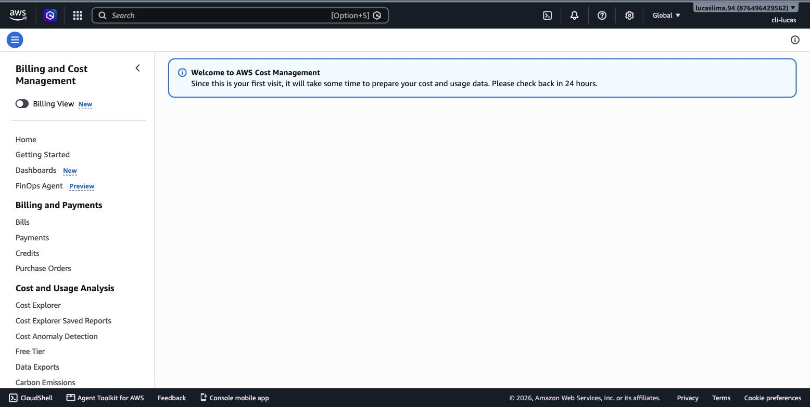
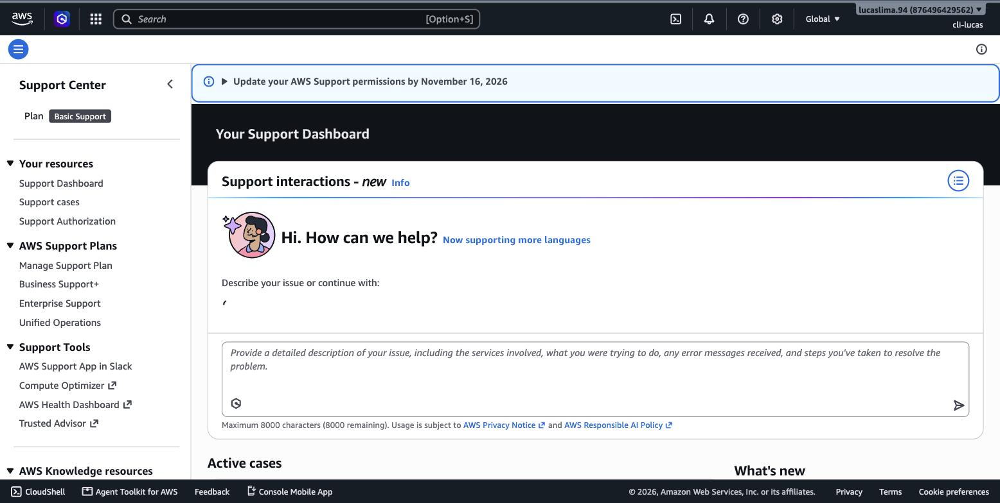

# Módulo 16 — Projeto Final e Preparação para Certificação

> **Objetivo**: fechar o último domínio ainda não coberto (Billing, Pricing e Support), amarrar os quinze módulos anteriores num projeto único que você constrói com as próprias mãos, e sair com um plano de revisão organizado exatamente como o exame CLF-C02 está estruturado.
>
> **Pré-requisitos**: todos os módulos 01 a 15 — este é, deliberadamente, o módulo que assume o resto da trilha inteira como base.
>
> **Tempo de referência (não prazo)**: duas a três semanas, incluindo o projeto prático e simulados.
>
> Este módulo fecha o **Domínio 4 — Billing, Pricing, and Support** (12% do conteúdo pontuado), o único ainda não coberto em profundidade — o módulo 9 tocou nos modelos de compra (Task 4.1) ao falar de EC2, mas as Tasks 4.2 e 4.3 (ferramentas de billing e planos de suporte) ficaram para aqui. Página oficial: https://docs.aws.amazon.com/aws-certification/latest/cloud-practitioner-02/cloud-practitioner-02-domain4.html. Trilha construída sobre o CLF-C02 vigente, não o CLF-C01 (aposentado em 18/09/2023).

---

## Fechando o domínio que faltava: Billing, Pricing e Support

## Ferramentas de acompanhamento de custo

Você já usa duas dessas ferramentas desde o módulo 1: o **Billing and Cost Management** (o painel geral) e a **AWS Pricing Calculator** (estimativas antes de criar algo). Faltam duas peças para completar o quadro. O **AWS Cost Explorer** visualiza, retroativamente, para onde o dinheiro já foi gasto — com gráficos filtráveis por serviço, por período, por tag — respondendo "o que eu já gastei e em quê", diferente da Pricing Calculator, que responde "quanto algo vai custar antes de existir". O **AWS Budgets** vai além do billing alarm simples que você configurou na preparação da conta: permite definir orçamentos por serviço, por tag, ou por conta inteira, com alertas configuráveis em múltiplos limiares (por exemplo, avisar em 50%, 80% e 100% do orçamento previsto), e até ações automáticas quando um limite é ultrapassado.


> `[PRINT]` Passo a passo para capturar: abrir direto em https://console.aws.amazon.com/billing/home#/budgets (ou, dentro de "Billing and Cost Management", clicar em "Budgets" no menu lateral) e depois em "Create budget". Escolher o template "Zero spend budget" (que avisa em qualquer gasto acima de zero — apropriado para uma conta de estudo) ou "Customize" para configurar um valor manual. Capturar a tela mostrando os campos de configuração antes de concluir. Pode concluir a criação — um budget não gera custo algum por existir.

> `[CLI]` Criação de um budget de gasto zero, com alerta por e-mail em 100% do limite (ajuste `<sua-conta-id>` e `<seu-email>`):
> ```bash
> cat > /tmp/budget.json <<'EOF'
> {
>   "BudgetName": "trilha-cloud-zero-spend",
>   "BudgetLimit": { "Amount": "0.01", "Unit": "USD" },
>   "TimeUnit": "MONTHLY",
>   "BudgetType": "COST"
> }
> EOF
> cat > /tmp/notifications.json <<'EOF'
> [{
>   "Notification": {
>     "NotificationType": "ACTUAL",
>     "ComparisonOperator": "GREATER_THAN",
>     "Threshold": 100
>   },
>   "Subscribers": [{ "SubscriptionType": "EMAIL", "Address": "<seu-email>" }]
> }]
> EOF
>
> aws budgets create-budget \
>   --account-id <sua-conta-id> \
>   --budget file:///tmp/budget.json \
>   --notifications-with-subscribers file:///tmp/notifications.json
> ```
> Resultado esperado: `aws budgets describe-budgets --account-id <sua-conta-id>` lista `trilha-cloud-zero-spend`. Documentação: https://docs.aws.amazon.com/cli/latest/reference/budgets/create-budget.html


> `[PRINT]` Passo a passo para capturar: abrir direto em https://console.aws.amazon.com/cost-management/home#/cost-explorer (ou, dentro de "Billing and Cost Management", clicar em "Cost Explorer") — pode ser necessário habilitar na primeira vez, sem custo. Capturar a tela mostrando o gráfico de gastos, mesmo que os valores sejam próximos de zero por a conta ser de estudo — o importante é a interface do gráfico e o filtro por serviço visível.

> `[CLI]` O mesmo dado retroativo, filtrado por serviço, direto no terminal:
> ```bash
> aws ce get-cost-and-usage \
>   --time-period Start=2026-08-01,End=2026-08-31 \
>   --granularity MONTHLY \
>   --metrics "UnblendedCost" \
>   --group-by Type=DIMENSION,Key=SERVICE \
>   --region us-east-1
> ```
> Resultado esperado: um JSON com o gasto agrupado por nome de serviço (por exemplo, `Amazon Relational Database Service`, `Amazon Elastic Compute Cloud`) no período informado. Documentação: https://docs.aws.amazon.com/cli/latest/reference/ce/get-cost-and-usage.html

Para organizações com múltiplas equipes ou projetos numa mesma conta, **cost allocation tags** permitem marcar recursos (uma instância EC2, um bucket S3) com metadados como `projeto: trilha-cloud` ou `equipe: financeiro`, que depois aparecem como colunas filtráveis no **AWS Cost and Usage Report** — o relatório mais granular de billing que a AWS oferece, usado tipicamente por ferramentas de análise financeira automatizada, não lido manualmente linha a linha.

> `[TEORIA]` Para a prova: Cost Explorer = análise retroativa visual de gastos já ocorridos. Pricing Calculator = estimativa prospectiva antes de criar algo. Budgets = alertas e limites configuráveis, incluindo ações automáticas. Cost and Usage Report = o relatório mais detalhado, geralmente consumido por ferramentas, não por leitura manual. Cost allocation tags = a forma de atribuir gasto a projetos/equipes dentro de uma conta compartilhada.

## Planos de suporte da AWS

A AWS oferece múltiplos níveis de suporte técnico, e a prova espera que você reconheça a escada completa. O plano **Basic** vem incluído automaticamente, sem custo, com qualquer conta AWS — dá acesso a documentação, fóruns e ao Trusted Advisor com um conjunto limitado de checagens, mas nenhum canal direto de suporte técnico. O plano **Developer** adiciona acesso a suporte técnico por e-mail durante horário comercial, indicado para quem está testando ou desenvolvendo, não para produção crítica. O plano **Business** adiciona suporte 24/7 por chat, telefone e e-mail, com tempo de resposta garantido conforme a severidade do problema, acesso completo às checagens do Trusted Advisor, e é o nível típico para cargas de trabalho de produção. O **Enterprise On-Ramp** e o **Enterprise Support** adicionam, progressivamente, um Technical Account Manager (TAM) dedicado (no Enterprise completo) e tempos de resposta ainda mais agressivos para incidentes críticos — voltados a organizações com operações de missão crítica na AWS.


> `[PRINT]` Passo a passo para capturar: abrir o AWS Support Center direto em https://console.aws.amazon.com/support/home (ou buscar "Support" na barra de busca do Console), ou acessar a página pública de planos de suporte (link nas referências abaixo). Capturar a tela de comparação dos planos, mostrando as colunas lado a lado com os recursos de cada nível.

> `[TEORIA]` Para a prova: a ordem crescente de plano de suporte é Basic (gratuito, sem contato direto) → Developer (e-mail, horário comercial) → Business (24/7, todos os canais, Trusted Advisor completo) → Enterprise On-Ramp → Enterprise (TAM dedicado). Um cenário que menciona "aplicação de missão crítica, precisa de resposta em minutos" aponta para Business ou Enterprise; um cenário de "aprendendo/testando" aponta para Basic ou Developer.

## Onde encontrar ajuda além do suporte pago

Além dos planos de suporte, a AWS mantém uma rede de recursos técnicos gratuitos: o **AWS Knowledge Center** responde perguntas frequentes específicas por serviço; o **AWS re:Post** é a comunidade de perguntas e respostas oficial da AWS (o sucessor dos antigos fóruns); o **AWS Prescriptive Guidance** oferece orientação estruturada e opinativa sobre como resolver padrões comuns de migração e modernização. A **AWS Partner Network (APN)** conecta clientes a empresas terceiras certificadas pela AWS — integradores de sistema e fornecedores de software independentes (ISVs) — que oferecem implementação, consultoria e software complementar, com benefícios como treinamento e descontos por volume para quem participa formalmente do programa como parceiro.

`[APROFUNDAMENTO]` Diferenciar em detalhe os tiers de parceria da AWS (Select, Advanced, Premier) e os benefícios específicos de cada um foge do escopo do Cloud Practitioner — para a prova, basta reconhecer que a APN existe e o papel geral de um parceiro (implementação e consultoria complementares ao suporte direto da AWS).

## Práticas

### Prática isolada

As explorações do AWS Budgets, do Cost Explorer e da comparação de planos de suporte, feitas acima, já são a prática isolada deste módulo — são ferramentas de conta, não peças do TrilhaShop, e não dependem de nada construído nos módulos anteriores.

### Contribuição final ao projeto integrador: a vitrine que amarra tudo

Depois de quinze módulos, o TrilhaShop já tem quase todas as peças: rede (módulo 4), IAM (módulo 3), catálogo em EC2 atrás de um ALB (módulos 6 e 9), carrinho em containers (módulo 10), banco relacional e NoSQL (módulo 13), API de pedidos serverless (módulo 14), moderação de imagem por IA (módulo 15), DNS com failover (módulo 11), staging via IaC (módulo 8). A única peça que falta é a que o usuário final efetivamente vê: uma página estática servindo como vitrine, hospedada em S3 e distribuída por CloudFront, que chama a API de pedidos já construída.

Crie um `index.html` simples, com um catálogo estático de dois ou três produtos e um formulário de pedido que chama a API do módulo 14 via `fetch()`:

```html
<!DOCTYPE html>
<html lang="pt-BR">
<head><meta charset="UTF-8"><title>TrilhaShop</title></head>
<body>
  <h1>TrilhaShop</h1>
  <form id="form-pedido">
    <input name="produto" placeholder="Produto" required />
    <input name="quantidade" type="number" value="1" min="1" required />
    <button type="submit">Comprar</button>
  </form>
  <p id="resultado"></p>
  <script>
    document.getElementById("form-pedido").addEventListener("submit", async (e) => {
      e.preventDefault();
      const dados = Object.fromEntries(new FormData(e.target));
      const resp = await fetch("https://<api-id>.execute-api.sa-east-1.amazonaws.com/pedidos", {
        method: "POST",
        headers: {"Content-Type": "application/json"},
        body: JSON.stringify(dados)
      });
      const json = await resp.json();
      document.getElementById("resultado").textContent = `Pedido criado: ${json.idPedido}`;
    });
  </script>
</body>
</html>
```

Envie esse arquivo para um novo bucket `trilhashop-frontend` (não o `trilhashop-product-images` do módulo 12, que continua com acesso bloqueado — esse novo bucket é público, propositalmente, porque é a vitrine), habilite hospedagem de site estático nas propriedades do bucket, e crie uma distribuição CloudFront apontando para ele como origem (o mesmo assistente já visto no módulo 4).


> `[PRINT]` Passo a passo para capturar: depois de criar a distribuição CloudFront com o bucket `trilhashop-frontend` como origem, capturar a tela de detalhes da distribuição já com status "Enabled" e o domínio `*.cloudfront.net` visível.

> `[CLI]` Criação do bucket público, upload do `index.html`, ativação de hospedagem de site estático e criação da distribuição CloudFront:
> ```bash
> aws s3api create-bucket \
>   --bucket trilhashop-frontend \
>   --region sa-east-1 \
>   --create-bucket-configuration LocationConstraint=sa-east-1
>
> aws s3api put-public-access-block \
>   --bucket trilhashop-frontend \
>   --public-access-block-configuration BlockPublicPolicy=false,RestrictPublicBuckets=false,BlockPublicAcls=false,IgnorePublicAcls=false
>
> cat > /tmp/bucket-policy.json <<'EOF'
> {
>   "Version": "2012-10-17",
>   "Statement": [{
>     "Effect": "Allow",
>     "Principal": "*",
>     "Action": "s3:GetObject",
>     "Resource": "arn:aws:s3:::trilhashop-frontend/*"
>   }]
> }
> EOF
> aws s3api put-bucket-policy --bucket trilhashop-frontend --policy file:///tmp/bucket-policy.json
>
> aws s3api put-bucket-website \
>   --bucket trilhashop-frontend \
>   --website-configuration '{"IndexDocument":{"Suffix":"index.html"}}'
>
> aws s3 cp index.html s3://trilhashop-frontend/index.html
>
> WEBSITE_ENDPOINT="trilhashop-frontend.s3-website-sa-east-1.amazonaws.com"
>
> aws cloudfront create-distribution \
>   --origin-domain-name $WEBSITE_ENDPOINT \
>   --default-root-object index.html
> ```
> Resultado esperado: `aws cloudfront list-distributions --query 'DistributionList.Items[].DomainName'` mostra o domínio `*.cloudfront.net` gerado, e o campo `Status` da distribuição chega a `Deployed` em alguns minutos. Documentação: https://docs.aws.amazon.com/cli/latest/reference/cloudfront/create-distribution.html

Acesse o domínio CloudFront gerado, preencha o formulário e confirme que um pedido é de fato gravado na tabela `trilhashop-pedidos` (módulo 13) — o mesmo teste feito por `curl` no módulo 14, agora através de uma interface real. Depois, feche o ciclo aberto no módulo 11: volte ao registro de failover do Route 53 e troque o valor placeholder `203.0.113.10` pelo endpoint de site estático do bucket `trilhashop-frontend` (visível nas propriedades do bucket, em "Static website hosting") — agora o TrilhaShop tem um secundário de failover real, não mais um endereço de exemplo.

Para fechar, volte à revisão "TrilhaShop" no Well-Architected Tool (módulo 5) e atualize as respostas dos pilares de Confiabilidade e Segurança contra a arquitetura completa — compare a lista de riscos com a que existia logo depois do módulo 4, quando só a rede existia. A queda no número de riscos identificados é a evidência mais concreta de como cada módulo desta trilha fechou uma lacuna real.

`[CUSTO]` O bucket `trilhashop-frontend` e a distribuição CloudFront ficam dentro do Free Tier para o volume de tráfego de um projeto de estudo. A partir daqui, o TrilhaShop está funcionalmente completo — o próximo passo é a desmontagem, na seção seguinte, para quem termina os estudos por aqui.

## Desmontando o TrilhaShop

Se você chegou até aqui e não pretende manter o TrilhaShop rodando, esta seção é o roteiro inverso de tudo que os módulos 3 a 16 construíram — **a ordem importa**, porque vários recursos dependem de outros e a AWS recusa excluir algo que ainda tem uma dependência viva.

1. **CloudFront (módulo 16)**: desabilitar a distribuição primeiro (leva alguns minutos para propagar), depois excluí-la.
2. **Route 53 (módulo 11)**: excluir os registros de failover (primário e secundário), o health check, e por fim a hosted zone.
3. **API Gateway (módulo 14)**: excluir a API `trilhashop-pedidos-api`.
4. **Funções Lambda (módulos 14, 15)**: excluir `trilhashop-pedidos-api` e `trilhashop-moderacao-imagens`.
5. **ECS (módulo 10)**: reduzir o `trilhashop-carrinho-service` para 0 e excluí-lo, depois excluir o `trilhashop-cluster`.
6. **RDS (módulo 13)**: excluir a instância `trilhashop-catalogo-db` (desmarcar a criação de snapshot final, a menos que queira preservar os dados).
7. **DynamoDB (módulo 13)**: excluir a tabela `trilhashop-pedidos`.
8. **Auto Scaling Group e Load Balancer (módulos 6, 9)**: reduzir o `trilhashop-catalogo-asg` para 0 (as instâncias terminam sozinhas), excluir o ASG, excluir o `trilhashop-alb`, excluir o target group, excluir o launch template.
9. **Buckets S3 (módulos 12, 16)**: esvaziar (incluindo todas as versões) e excluir `trilhashop-frontend` e `trilhashop-product-images`.
10. **CloudFormation (módulo 8)**: excluir a stack `trilhashop-staging` (remove a VPC de staging inteira de uma vez).
11. **VPC (módulo 4)**: excluir o(s) NAT Gateway(s) primeiro, depois liberar os Elastic IPs associados a eles (se sobrarem, geram cobrança mesmo sem NAT Gateway anexado), depois excluir a VPC inteira — isso remove automaticamente subnets, route tables, Internet Gateway e Security Groups associados.
12. **IAM (módulo 3)**: excluir as roles `trilhashop-ec2-role` e `trilhashop-lambda-role`, o grupo `trilhashop-operadores`, e qualquer usuário de teste remanescente.

`[ATENÇÃO]` O passo mais frequentemente esquecido é o Elastic IP do NAT Gateway: excluir o NAT Gateway não libera automaticamente o IP associado a ele, e um Elastic IP não associado a nenhum recurso ativo é cobrado por hora — um dos poucos casos na AWS em que "não estar sendo usado" ainda gera custo, precisamente para desencorajar reservar endereços IPv4 públicos sem necessidade.

> `[CLI]` A mesma sequência de desmontagem, na mesma ordem, via terminal — o roteiro completo é mais rápido de auditar e reexecutar em lote do que clicar recurso por recurso no Console:
> ```bash
> # 1. CloudFront
> DIST_ID=$(aws cloudfront list-distributions --query "DistributionList.Items[?Comment=='' || contains(Origins.Items[0].DomainName, 'trilhashop-frontend')].Id" --output text)
> aws cloudfront get-distribution-config --id $DIST_ID > /tmp/dist-config.json
> ETAG=$(jq -r '.ETag' /tmp/dist-config.json)
> jq '.DistributionConfig | .Enabled = false' /tmp/dist-config.json > /tmp/dist-disabled.json
> aws cloudfront update-distribution --id $DIST_ID --distribution-config file:///tmp/dist-disabled.json --if-match $ETAG
> aws cloudfront wait distribution-deployed --id $DIST_ID
> NEW_ETAG=$(aws cloudfront get-distribution-config --id $DIST_ID --query ETag --output text)
> aws cloudfront delete-distribution --id $DIST_ID --if-match $NEW_ETAG
>
> # 2. Route 53
> aws route53 change-resource-record-sets --hosted-zone-id $ZONE_ID --change-batch file:///tmp/delete-records.json
> aws route53 delete-health-check --health-check-id $HC_ID
> aws route53 delete-hosted-zone --id $ZONE_ID
>
> # 3-4. API Gateway e Lambda
> aws apigatewayv2 delete-api --api-id $API_ID
> aws lambda delete-function --function-name trilhashop-pedidos-api
> aws lambda delete-function --function-name trilhashop-moderacao-imagens
>
> # 5. ECS
> aws ecs update-service --cluster trilhashop-cluster --service trilhashop-carrinho-service --desired-count 0
> aws ecs delete-service --cluster trilhashop-cluster --service trilhashop-carrinho-service
> aws ecs delete-cluster --cluster trilhashop-cluster
>
> # 6. RDS (sem snapshot final)
> aws rds delete-db-instance --db-instance-identifier trilhashop-catalogo-db --skip-final-snapshot
> aws rds wait db-instance-deleted --db-instance-identifier trilhashop-catalogo-db
>
> # 7. DynamoDB
> aws dynamodb delete-table --table-name trilhashop-pedidos
>
> # 8. Auto Scaling Group e Load Balancer
> aws autoscaling update-auto-scaling-group --auto-scaling-group-name trilhashop-catalogo-asg --desired-capacity 0 --min-size 0
> aws autoscaling delete-auto-scaling-group --auto-scaling-group-name trilhashop-catalogo-asg
> aws elbv2 delete-load-balancer --load-balancer-arn $ALB_ARN
> aws elbv2 delete-target-group --target-group-arn $TG_ARN
>
> # 9. Buckets S3 (esvaziar todas as versões antes de excluir)
> aws s3api delete-objects --bucket trilhashop-frontend --delete "$(aws s3api list-object-versions --bucket trilhashop-frontend --query '{Objects: Versions[].{Key:Key,VersionId:VersionId}}')"
> aws s3api delete-bucket --bucket trilhashop-frontend
> aws s3api delete-objects --bucket trilhashop-product-images --delete "$(aws s3api list-object-versions --bucket trilhashop-product-images --query '{Objects: Versions[].{Key:Key,VersionId:VersionId}}')"
> aws s3api delete-bucket --bucket trilhashop-product-images
>
> # 10. CloudFormation
> aws cloudformation delete-stack --stack-name trilhashop-staging
> aws cloudformation wait stack-delete-complete --stack-name trilhashop-staging
>
> # 11. VPC — NAT Gateway, depois o Elastic IP associado a ele
> aws ec2 delete-nat-gateway --nat-gateway-id $NAT_GW_ID
> aws ec2 wait nat-gateway-deleted --nat-gateway-ids $NAT_GW_ID
> aws ec2 release-address --allocation-id $EIP_ALLOC_ID
> aws ec2 delete-vpc --vpc-id $VPC_ID
>
> # 12. IAM
> aws iam delete-role --role-name trilhashop-ec2-role
> aws iam delete-role --role-name trilhashop-lambda-role
> aws iam delete-group --group-name trilhashop-operadores
> ```
> Resultado esperado: ao final, `aws resourcegroupstaggingapi get-resources --tag-filters Key=projeto,Values=trilhashop` (se as tags foram aplicadas ao longo da trilha) não retorna nenhum recurso — confirmação de que nada do TrilhaShop ficou cobrando. Documentação: https://docs.aws.amazon.com/cli/latest/reference/cloudfront/delete-distribution.html

## Revisão organizada pelos quatro domínios do exame

| Domínio | Peso | O que revisar, módulo por módulo |
|---|---|---|
| **1. Cloud Concepts** | 24% | Módulo 1 (definição de nuvem, CAPEX/OPEX, benefícios), módulo 2 (infraestrutura global), módulo 5 (Well-Architected, seis pilares) |
| **2. Security and Compliance** | 30% | Módulo 3 inteiro — Shared Responsibility Model, IAM, MFA, criptografia, GuardDuty/Inspector/Macie/Security Hub, Organizations/SCPs |
| **3. Cloud Technology and Services** | 34% | Módulos 4, 6, 7, 8, 9, 10, 11, 12, 13, 14, 15 — o domínio mais amplo, cobrindo rede, compute, containers, storage, banco de dados, serverless e IA/ML |
| **4. Billing, Pricing, and Support** | 12% | Módulo 9 (modelos de compra) e este módulo 16 (ferramentas de billing, planos de suporte) |

Uma boa forma de revisar antes da prova é percorrer, para cada módulo, apenas a seção de checklist de saída e os blocos `[TEORIA]` — eles concentram exatamente o que cada módulo julgou como "exigido pela prova, sem contrapartida visual", o material mais denso de fatos a ter na ponta da língua.

## Simulados e estratégia de prova

Fazer simulados antes da prova real cumpre um papel diferente de estudar conteúdo: ele treina o formato — 65 perguntas, 90 minutos, questões de múltipla escolha e de múltipla resposta — e revela lacunas específicas de conteúdo que a releitura passiva não revela. A própria AWS oferece um exame oficial de prática (pago, mas com o formato mais fiel ao exame real) através do AWS Skill Builder; a plataforma também mantém um conjunto de perguntas de amostra gratuitas.

Durante a prova em si, para questões de múltipla resposta (mais de uma alternativa correta), a interface do exame sempre indica quantas respostas são esperadas — não é preciso adivinhar. Para questões em que duas alternativas parecem plausíveis, volte ao vocabulário exato dos task statements desta trilha: a AWS costuma testar a definição precisa de um termo (como você viu repetidamente nos blocos `[TEORIA]`), então a alternativa que usa a terminologia oficial correta geralmente vence sobre uma que está "quase certa" em espírito, mas erra o termo técnico.

## Próximos passos além do Cloud Practitioner

Ao concluir esta trilha e obter a certificação, dois caminhos naturais se abrem, dependendo do interesse. Para quem quer aprofundar em arquitetura técnica — desenhar sistemas de verdade, não só reconhecer serviços — o próximo passo é a **AWS Certified Solutions Architect Associate (SAA)**, que retoma praticamente todo o vocabulário desta trilha (VPC, EC2, RDS, Lambda, Well-Architected) num nível de profundidade prática muito maior, exigindo desenhar arquiteturas completas, não apenas reconhecê-las. Para quem se interessou especificamente pelo módulo 15 e quer seguir em IA generativa, agentes de IA e aplicações de modelos de fundação, o caminho é a **AWS Certified AI Practitioner (AIF-C01)** — como já visto, uma certificação "fundamentals" irmã desta, não uma continuação dela.

## `[REFERÊNCIA]`

- AWS — Domínio 4 do exame CLF-C02 (Billing, Pricing, and Support): https://docs.aws.amazon.com/aws-certification/latest/cloud-practitioner-02/cloud-practitioner-02-domain4.html
- AWS — *AWS Cost Management*: https://aws.amazon.com/aws-cost-management/
- AWS — *Compare AWS Support Plans*: https://aws.amazon.com/premiumsupport/plans/
- AWS — *AWS Certified Cloud Practitioner (CLF-C02) Exam Guide* (página raiz, revisão final): https://docs.aws.amazon.com/aws-certification/latest/cloud-practitioner-02/cloud-practitioner-02.html
- AWS Skill Builder — *Exam Prep: AWS Certified Cloud Practitioner*: https://explore.skillbuilder.aws/learn/course/external/view/elearning/134/aws-cloud-practitioner-essentials
- AWS — *AWS Certified Solutions Architect – Associate (SAA-C03) Exam Guide*: https://docs.aws.amazon.com/aws-certification/latest/solutions-architect-associate-03/solutions-architect-associate-03.html

## Checklist final da trilha

Antes de agendar o exame, confirme que você consegue, sem consultar nenhum módulo:

- [ ] Recitar os quatro domínios do exame e seus pesos (24/30/34/12).
- [ ] Diferenciar Cost Explorer, Pricing Calculator, Budgets e Cost and Usage Report.
- [ ] Listar os cinco planos de suporte da AWS em ordem crescente e o que cada um adiciona.
- [ ] Ter completado a vitrine do TrilhaShop (S3 + CloudFront) conectada à API de pedidos, e atualizado o registro de failover do módulo 11 com o endpoint real.
- [ ] Ter atualizado a revisão do Well-Architected Tool contra a arquitetura completa e comparado com a versão do módulo 5.
- [ ] Se for encerrar os estudos por aqui: ter seguido o roteiro de "Desmontando o TrilhaShop" na ordem descrita, incluindo a liberação do Elastic IP do NAT Gateway.
- [ ] Ter revisado o checklist de saída e os blocos `[TEORIA]` de todos os módulos 01 a 15.
- [ ] Ter feito ao menos um simulado completo, no formato de 65 perguntas em 90 minutos.
- [ ] Saber para qual certificação seguir depois — Solutions Architect Associate ou AI Practitioner — dependendo do seu interesse.
